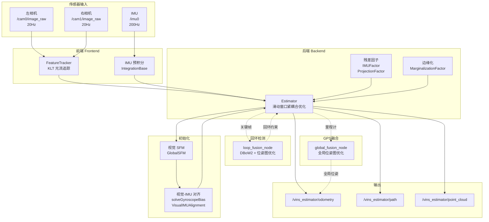
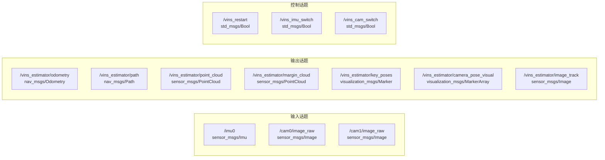
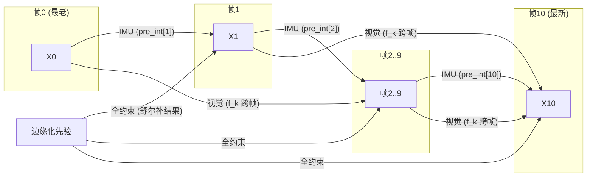
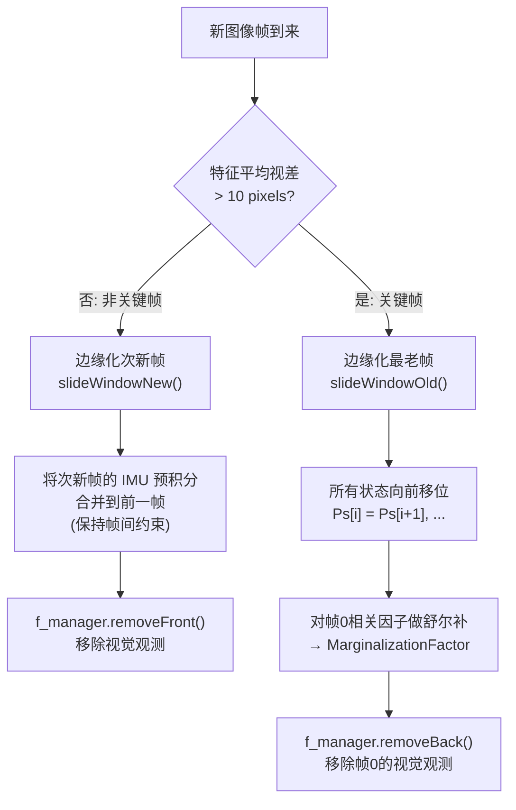
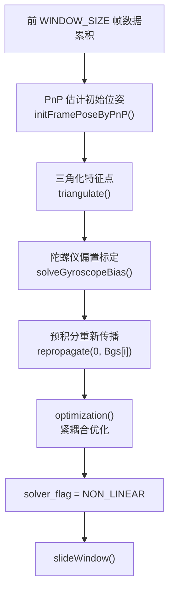
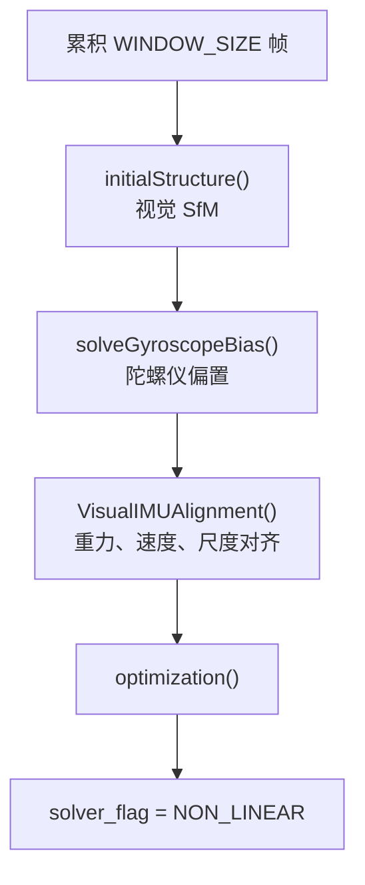
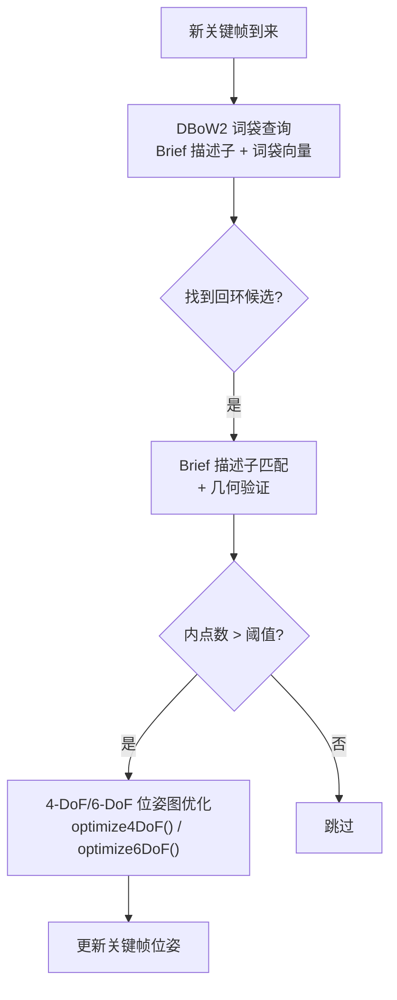
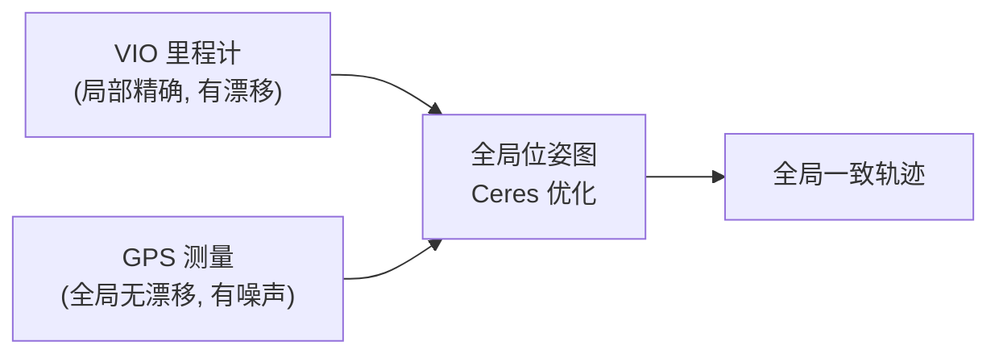
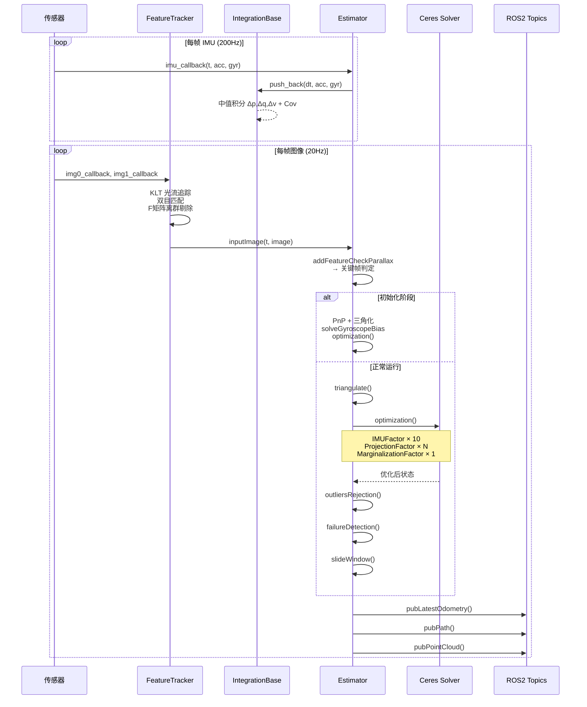

# VINS-Fusion-ROS2 系统架构

## 1. 系统总览

VINS-Fusion 是一个**紧耦合、基于优化的多传感器融合 SLAM** 框架，支持视觉-惯性里程计 (VIO)、回环检测与全局位姿图优化、GPS 全局融合。



---

## 2. ROS2 节点与话题

### 2.1 主节点 `vins_node`

源码: `vins/src/rosNodeTest.cpp:246`

```cpp
int main(int argc, char **argv)
{
    rclcpp::init(argc, argv);
    auto n = rclcpp::Node::make_shared("vins_estimator");

    // 读取配置文件路径
    auto non_ros_args = rclcpp::remove_ros_arguments(argc, argv);
    readParameters(non_ros_args[1]);  // → parameters.cpp

    // 订阅 IMU
    auto imu_sub = n->create_subscription<sensor_msgs::msg::Imu>(
        IMU_TOPIC, 2000, imu_callback);

    // 订阅特征点 (前端追踪结果)
    auto feature_sub = n->create_subscription<sensor_msgs::msg::PointCloud>(
        "/feature_tracker/feature", 1000, feature_callback);

    // 订阅左相机图像 + 右相机图像
    auto image0_sub = n->create_subscription<sensor_msgs::msg::Image>(
        IMAGE0_TOPIC, 100, img0_callback);
    auto image1_sub = n->create_subscription<sensor_msgs::msg::Image>(
        IMAGE1_TOPIC, 100, img1_callback);

    // 同步线程: 双目对齐 → 光流追踪 → 输入估计器
    std::thread sync_thread{sync_process};
    ...
}
```

### 2.2 话题拓扑



---

## 3. 前端: 特征检测与光流追踪

### 3.1 KLT 光流追踪流程

源码: `vins/src/featureTracker/feature_tracker.h:51`

```cpp
class FeatureTracker {
public:
    // 核心入口: 接收双目图像，返回追踪到的特征点
    map<int, vector<pair<int, Eigen::Matrix<double, 7, 1>>>> 
        trackImage(double _cur_time, const cv::Mat &_img, const cv::Mat &_img1);

    // 关键步骤
    void setMask();              // 设置特征点分布 mask，保证均匀分布
    void addPoints();            // 检测新角点 (goodFeaturesToTrack)
    void rejectWithF();          // F 矩阵 RANSAC 剔除误匹配
    void undistortedPoints();    // 去畸变
    vector<cv::Point2f> ptsVelocity(...);  // 计算特征点速度 (用于卷帘快门补偿)
};
```

完整追踪管线:

```mermaid
flowchart TD
    A["输入: 左右目图像"] --> B["equalizeHist 直方图均衡化"]
    B --> C{"prev_img 为空?<br/>(第一帧)"}
    C -->|是| D["goodFeaturesToTrack<br/>检测 Shi-Tomasi 角点<br/>(max_cnt=150, min_dist=30)"]
    C -->|否| E["calcOpticalFlowPyrLK<br/>前向 KLT 光流追踪"]
    E --> F["reduceVector<br/>剔除追踪失败的点 (status=0)"]
    F --> G["rejectWithF<br/>F 矩阵 RANSAC 剔除离群"]
    G --> H["setMask<br/>设置特征均匀分布 mask"]
    H --> I{"点数 < max_cnt?"}
    I -->|是| J["addPoints<br/>在空区域检测新角点"]
    I -->|否| K["undistortedPoints<br/>相机模型去畸变"]
    J --> K
    K --> L["ptsVelocity<br/>计算特征点在图像上的运动速度"]
    L --> M["输出: 特征点 map<br/>{feature_id: [(cam_id, [x,y,z,u,v,vx,vy])]"}
```

### 3.2 关键代码: 光流追踪

```cpp
// feature_tracker.cpp: trackImage()
// 前向光流
cv::calcOpticalFlowPyrLK(
    prev_img, cur_img, prev_pts, cur_pts, 
    status, err, 
    cv::Size(21, 21), 3  // 窗口大小 21×21, 3 层金字塔
);

// 反向光流验证 (flow_back=1)
if(FLOW_BACK) {
    cv::calcOpticalFlowPyrLK(
        cur_img, prev_img, cur_pts, reverse_pts, 
        reverse_status, err, 
        cv::Size(21, 21), 1, 
        cv::TermCriteria(...), 
        cv::OPTFLOW_USE_INITIAL_FLOW  // 使用前向结果作为初始值
    );
    // 双向误差 > 阈值 (0.5 pixel) → 剔除
}
```

### 3.3 关键代码: F 矩阵离群剔除

```cpp
// feature_tracker.cpp: rejectWithF()
// 使用 8 点法 + RANSAC 计算基础矩阵
cv::findFundamentalMat(un_prev_pts, un_cur_pts, cv::FM_RANSAC, 
                        F_THRESHOLD, 0.99, status);
// F_THRESHOLD = 1.0 pixel — 内点阈值
// 超出阈值的匹配视为误匹配，直接剔除
```

### 3.4 特征点均匀分布

```cpp
// feature_tracker.cpp: setMask()
// 将图像划分为网格，每个网格保留最多 max_pts_per_grid 个特征点
// 保证特征在整幅图像上均匀分布，避免局部过密
int grid_cols = col / MIN_DIST;  // MIN_DIST = 30 pixels
int grid_rows = row / MIN_DIST;
// 对每个网格内特征点按跟踪次数排序，保留最优的几个
```

### 3.5 特征点速度 (卷帘快门补偿)

```cpp
// feature_tracker.cpp: ptsVelocity()
// 速度 = (当前归一化坐标 - 上一帧归一化坐标) / 时间间隔
pts_velocity.push_back(
    (cur_un_pts[i] - prev_un_pts_map[ids[i]]) / (cur_time - prev_time)
);
// 速度用于 projectionTwoFrameOneCamFactor 中的卷帘快门时间偏移补偿
```

### 3.6 特征点数据结构

每个特征点包含 7 个值 `[x, y, z, u, v, vx, vy]`:

| 字段 | 含义 | 用途 |
|------|------|------|
| `x, y, z` | 归一化平面坐标 (z=1) | 重投影 |
| `u, v` | 像素坐标 | 可视化 |
| `vx, vy` | 归一化平面上的运动速度 (pixel/s) | 卷帘快门/td 补偿 |

---

## 4. IMU 预积分

### 4.1 数据流

```mermaid
sequenceDiagram
    participant IMU as IMU 传感器 200Hz
    participant Node as rosNodeTest
    participant Est as Estimator
    participant Int as IntegrationBase
    participant Opt as Ceres Solver

    IMU->>Node: imu_callback(t, acc, gyr)
    Node->>Est: inputIMU(t, acc, gyr)
    
    alt 第一帧 IMU
        Est->>Est: first_imu=true<br/>缓存 acc_0, gyr_0
    end
    
    Est->>Int: push_back(dt, acc, gyr)
    Int->>Int: propagate() → midPointIntegration()
    Note over Int: 中值积分: Δp, Δq, Δv<br/>误差传播: F·J, F·Σ·F^T+V·N·V^T
    
    Est->>Est: 前向传播: Ps[frame], Vs[frame], Rs[frame]
    Note over Est: 为下一帧优化提供初值
    
    Note over Est,Opt: 图像帧到来时...
    Opt->>Int: evaluate(Pi,Qi,Vi,Bai,Bgi, Pj,Qj,Vj,Baj,Bgj)
    Int->>Opt: 15D 残差 → IMUFactor::Evaluate()
```

### 4.2 关键代码: IMU 数据进入

```cpp
// rosNodeTest.cpp:149 — IMU 回调
void imu_callback(const sensor_msgs::msg::Imu::SharedPtr imu_msg)
{
    double t = imu_msg->header.stamp.sec + imu_msg->header.stamp.nanosec * (1e-9);
    Vector3d acc(dx, dy, dz);
    Vector3d gyr(rx, ry, rz);
    estimator.inputIMU(t, acc, gyr);
}

// estimator.cpp:418 — processIMU
void Estimator::processIMU(double t, double dt, 
                            const Vector3d &linear_acceleration, 
                            const Vector3d &angular_velocity)
{
    if (!pre_integrations[frame_count])
        pre_integrations[frame_count] = new IntegrationBase{acc_0, gyr_0, 
                                                     Bas[frame_count], Bgs[frame_count]};
    if (frame_count != 0) {
        pre_integrations[frame_count]->push_back(dt, linear_acceleration, 
                                                  angular_velocity);
        // 同时做前向传播，为下一帧位姿提供初值
        Rs[j] *= Utility::deltaQ(un_gyr * dt).toRotationMatrix();
        Ps[j] += dt * Vs[j] + 0.5 * dt * dt * un_acc;
        Vs[j] += dt * un_acc;
    }
    acc_0 = linear_acceleration;   // 缓存本次测量
    gyr_0 = angular_velocity;      // 供下一个 IMU 数据的中值积分使用
}
```

---

## 5. 后端: 因子图优化

### 5.1 优化问题结构

```mermaid
flowchart TB
    subgraph 滑动窗口 (WINDOW_SIZE=10, 共11帧)
        X0["X0<br/>Pose+SB"]
        X1["X1<br/>Pose+SB"]
        X2["X2<br/>Pose+SB"]
        XDOTS["..."]
        X10["X10<br/>Pose+SB"]
    end

    subgraph 因子
        IMU_01["IMUFactor<br/>(15D 残差)"]
        IMU_12["IMUFactor"]
        MARG_F["MarginalizationFactor<br/>(先验)"]
        VIS_F1["ProjectionFactor<br/>(2D 残差)"]
        VIS_F2["ProjectionFactor"]
        VIS_F3["ProjectionFactor"]
    end

    subgraph 路标点
        L1["λ1 (inv_depth)"]
        L2["λ2 (inv_depth)"]
        L3["λ3 (inv_depth)"]
    end

    X0 --- IMU_01 --- X1 --- IMU_12 --- X2 --- XDOTS --- X10
    MARG_F --- X0
    MARG_F --- X1
    VIS_F1 --- X0 & X3 --- L1
    VIS_F2 --- X1 & X4 --- L2
    VIS_F3 --- X2 & X5 --- L3

    style MARG_F fill:#ff9999
    style IMU_01 fill:#99ccff
    style VIS_F1 fill:#99ff99
```

### 5.2 因子图构建代码

源码: `estimator.cpp:1058-1206`

```cpp
void Estimator::optimization()
{
    vector2double();  // Eigen 状态 → Ceres double 数组

    ceres::Problem problem;
    ceres::LossFunction *loss_function = new ceres::HuberLoss(1.0);

    // ① 添加位姿参数块 (带 SE(3) 局部参数化)
    for (int i = 0; i < frame_count + 1; i++) {
        problem.AddParameterBlock(para_Pose[i], SIZE_POSE, 
                                   new PoseLocalParameterization());
        if(USE_IMU)
            problem.AddParameterBlock(para_SpeedBias[i], SIZE_SPEEDBIAS);
    }

    // ② 添加外参参数块
    for (int i = 0; i < NUM_OF_CAM; i++) {
        problem.AddParameterBlock(para_Ex_Pose[i], SIZE_POSE, 
                                   new PoseLocalParameterization());
    }

    // ③ 边缘化先验因子
    if (last_marginalization_info && last_marginalization_info->valid) {
        MarginalizationFactor *marg_factor = 
            new MarginalizationFactor(last_marginalization_info);
        problem.AddResidualBlock(marg_factor, NULL,
                                 last_marginalization_parameter_blocks);
    }

    // ④ IMU 预积分因子 — 相邻帧之间的约束
    if(USE_IMU) {
        for (int i = 0; i < frame_count; i++) {
            int j = i + 1;
            if (pre_integrations[j]->sum_dt > 10.0) continue;
            IMUFactor* imu_factor = new IMUFactor(pre_integrations[j]);
            problem.AddResidualBlock(imu_factor, NULL, 
                                     para_Pose[i], para_SpeedBias[i],
                                     para_Pose[j], para_SpeedBias[j]);
        }
    }

    // ⑤ 视觉重投影因子 — 特征点与观测帧之间的约束
    for (auto &it_per_id : f_manager.feature) {
        if (it_per_id.used_num < 4) continue;  // 至少4帧观测
        ++feature_index;

        int imu_i = it_per_id.start_frame;
        Vector3d pts_i = it_per_id.feature_per_frame[0].point;

        for (auto &it_per_frame : it_per_id.feature_per_frame) {
            imu_j = imu_i + 观测帧偏移;
            if (imu_i != imu_j) {
                // 两帧单目因子
                ProjectionTwoFrameOneCamFactor *f = 
                    new ProjectionTwoFrameOneCamFactor(pts_i, pts_j, ...);
                problem.AddResidualBlock(f, loss_function, 
                    para_Pose[imu_i], para_Pose[imu_j], 
                    para_Ex_Pose[0], para_Feature[feature_index], para_Td[0]);
            }
            if(STEREO && it_per_frame.is_stereo) {
                // 双目因子
                if(imu_i != imu_j)
                    → ProjectionTwoFrameTwoCamFactor
                else
                    → ProjectionOneFrameTwoCamFactor
            }
        }
    }

    // ⑥ 求解
    ceres::Solver::Options options;
    options.linear_solver_type = ceres::DENSE_SCHUR;
    options.trust_region_strategy_type = ceres::DOGLEG;
    options.max_num_iterations = NUM_ITERATIONS;  // 8
    options.max_solver_time_in_seconds = SOLVER_TIME;  // 0.04s
    ceres::Solve(options, &problem, &summary);

    double2vector();  // 优化结果写回
}
```

### 5.3 因子汇总

| 因子 | 残差维度 | 参数块 | 约束关系 | 说明 |
|------|---------|--------|----------|------|
| `IMUFactor` | 15 | `[Pose_i, SB_i, Pose_j, SB_j]` (7+9+7+9) | **相邻帧** i→i+1 | IMU 预积分残差，协方差加权 |
| `ProjectionTwoFrameOneCamFactor` | 2 | `[Pose_i, Pose_j, Ext0, inv_depth, td]` (7+7+7+1+1) | **特征点** 跨两帧 | 单目重投影残差，含 td 在线估计 |
| `ProjectionTwoFrameTwoCamFactor` | 2 | `[Pose_i, Pose_j, Ext0, Ext1, inv_depth, td]` (7+7+7+7+1+1) | **特征点** 左i→右j | 双目跨帧重投影 |
| `ProjectionOneFrameTwoCamFactor` | 2 | `[Ext0, Ext1, inv_depth, td]` (7+7+1+1) | **特征点** 左→右(同帧) | 单帧双目重投影 |
| `MarginalizationFactor` | 动态 | 保留的参数块 | **先验** (滑窗全约束) | 边缘化产生的先验残差 |
| `ProjectionFactor` | 2 | `[Pose_i, Pose_j, Ext, inv_depth]` (7+7+7+1) | **特征点** 跨两帧 | 基础重投影因子 (无 td) |

---

## 6. 约束判定: 两个顶点之间何时存在因子

### 6.1 IMU 因子: 相邻帧之间始终存在

```cpp
// estimator.cpp:1108 — IMU 因子创建条件
for (int i = 0; i < frame_count; i++) {
    int j = i + 1;
    if (pre_integrations[j]->sum_dt > 10.0)  // 跳过预积分时间过长 (>10s)
        continue;
    // 相邻帧之间 100% 创建 IMU 因子
    IMUFactor* imu_factor = new IMUFactor(pre_integrations[j]);
}
```

**判定规则**: 滑动窗口内所有相邻帧对 (i, i+1) 之间都会创建 IMU 约束，除非预积分总时长超过 10 秒。

### 6.2 视觉因子: 同特征点 ≥ 4 帧观测 + 同帧左右目

```cpp
// estimator.cpp:1120-1162 — 视觉因子创建条件
for (auto &it_per_id : f_manager.feature) {
    // 条件 1: 特征点至少在 4 帧中被观测到
    if (it_per_id.used_num < 4) continue;

    int imu_i = it_per_id.start_frame;  // 首次观测帧

    for (auto &it_per_frame : it_per_id.feature_per_frame) {
        if (imu_i != imu_j) {
            // 条件 2: 不同帧之间 → 两帧单目因子
            → ProjectionTwoFrameOneCamFactor
        }
        if(STEREO && it_per_frame.is_stereo) {
            // 条件 3: 双目模式下，该特征在右目也被观测到
            if(imu_i != imu_j)
                → ProjectionTwoFrameTwoCamFactor  // 左i→右j
            else
                → ProjectionOneFrameTwoCamFactor   // 同帧 左→右
        }
    }
}
```

**判定规则**:

```
特征点 F_k 被观测到于 {(帧 i, 左), (帧 i, 右), (帧 j, 左), (帧 j, 右), ...}

约束创建:
  ∀ 观测对 (帧a, 帧b), a≠b:
    → ProjectionTwoFrameOneCamFactor(左_a → 左_b)
    → ProjectionTwoFrameTwoCamFactor(左_a → 右_b)  [if 右_b 存在]
  
  ∀ 同帧对 (帧a):
    → ProjectionOneFrameTwoCamFactor(左_a → 右_a)  [if 右_a 存在]
```

### 6.3 边缘化因子: 滑窗移除帧时产生

```cpp
// estimator.cpp:1209 — 边缘化触发条件
if (marginalization_flag == MARGIN_OLD) {
    // 条件: 最老帧被移出滑窗
    // 1. 上一轮边缘化先验中与帧0相关的项被 drop
    // 2. IMU 因子 pre_integrations[1] (帧0→帧1) 被边缘化
    // 3. 首次观测帧=0 的特征点的视觉因子被边缘化
    → 产生 MarginalizationFactor
}
else {
    // 条件: 次新帧被移出 (非关键帧)
    // 视觉因子中与次新帧相关的项被边缘化
    → 产生 MarginalizationFactor
}
```

### 6.4 约束图总结



---

## 7. 关键帧判定与滑动窗口

### 7.1 关键帧判定

源码: `feature_manager.cpp: addFeatureCheckParallax()`

```cpp
bool FeatureManager::addFeatureCheckParallax(int frame_count, 
    const map<int, vector<pair<int, Eigen::Matrix<double, 7, 1>>>> &image, 
    double td)
{
    // 1. 计算倒数第二帧和倒数第三帧之间的特征点视差
    double parallax_sum = 0;
    int parallax_num = 0;
    last_track_num = 0;
    last_average_parallax = 0;
    new_feature_num = 0;
    long_track_num = 0;

    for (auto &id_pts : image) {
        // 统计长期追踪的特征点 (在倒数第二帧也出现了)
        // 计算归一化平面上的位移 = 视差
        double parallax = compensatedParallax2(per_id, frame_count);
        // parallax = (un_pts[cur] - un_pts[prev]).norm()
    }

    // 2. 判定: 视差 > 阈值 → 关键帧
    if (parallax_num >= MIN_PARALLAX_NUM && 
        average_parallax > MIN_PARALLAX) {  // MIN_PARALLAX = 10.0 pixels
        return true;  // → MARGIN_OLD (边缘化最老帧)
    } else {
        return false; // → MARGIN_SECOND_NEW (边缘化次新帧)
    }
}
```

**判定规则**: 当前帧与上一帧之间的**平均视差 > 10 pixels** 且 **足够多 (>MIN_PARALLAX_NUM) 的特征点**存在足够视差 → 标记为关键帧。

### 7.2 滑动窗口边缘化



---

## 8. 初始化

### 8.1 双目 + IMU 初始化



关键代码 (`estimator.cpp:530-553`):

```cpp
if(STEREO && USE_IMU) {
    f_manager.initFramePoseByPnP(frame_count, Ps, Rs, tic, ric);
    f_manager.triangulate(frame_count, Ps, Rs, tic, ric);
    if (frame_count == WINDOW_SIZE) {
        // 1. 陀螺仪偏置估计
        solveGyroscopeBias(all_image_frame, Bgs);
        // 2. 用新 Bgs 重新积分
        for (int i = 0; i <= WINDOW_SIZE; i++)
            pre_integrations[i]->repropagate(Vector3d::Zero(), Bgs[i]);
        // 3. 紧耦合优化
        optimization();
        updateLatestStates();
        solver_flag = NON_LINEAR;
        slideWindow();
    }
}
```

### 8.2 单目 + IMU 初始化



---

## 9. 回环检测

### 9.1 节点: `loop_fusion_node`

源码: `loop_fusion/src/pose_graph_node.cpp`

```cpp
// 订阅 VIO 关键帧信息
sub_key_poses       ← /vins_estimator/key_poses
sub_camera_pose     ← /vins_estimator/camera_pose
sub_keyframe_point  ← /vins_estimator/keyframe_point
sub_extrinsic       ← /vins_estimator/extrinsic

// 发布回环结果
pub_loop_path       → /pose_graph/loop_path
pub_camera_pose     → /pose_graph/camera_pose_visual
pub_match_img       → /pose_graph/match_image
```

### 9.2 回环检测流程



关键结构: `loop_fusion/src/keyframe.h`

```cpp
class KeyFrame {
    double time_stamp;
    Vector3d T_w_i;          // 平移
    Matrix3d R_w_i;          // 旋转
    cv::Mat image;            // 图像 (用于提取特征)
    vector<cv::KeyPoint> keypoints;   // 特征点
    vector<BRIEF::bitset> brief_descriptors;  // Brief 描述子
    DBoW2::BowVector bow_vector;       // 词袋向量 (用于快速检索)
};
```

---

## 10. GPS 全局融合

### 10.1 节点: `global_fusion_node`

源码: `global_fusion/src/globalOptNode.cpp`

```cpp
// 订阅
sub_vio     ← /vins_estimator/odometry
sub_gps     ← /gps (sensor_msgs/NavSatFix)

// 发布
pub_global_odom → /global_odometry
pub_global_path → /global_path
```

### 10.2 GPS 融合优化



---

## 11. 状态变量汇总

### 11.1 滑动窗口状态 (per-frame × 11)

```cpp
// estimator.h:120-125
Vector3d Ps[(WINDOW_SIZE + 1)];    // 位置      (3 × 11 = 33)
Vector3d Vs[(WINDOW_SIZE + 1)];    // 速度      (3 × 11 = 33)
Matrix3d Rs[(WINDOW_SIZE + 1)];    // 姿态      (3 × 3 × 11 = 99)
Vector3d Bas[(WINDOW_SIZE + 1)];   // acc bias  (3 × 11 = 33)
Vector3d Bgs[(WINDOW_SIZE + 1)];   // gyr bias  (3 × 11 = 33)
double td;                          // 时间偏移  (1)
```

### 11.2 Ceres 优化变量 (总计 ~230+ 维)

| 变量 | 维度 | 数量 | 总维度 |
|------|------|------|--------|
| `para_Pose[i]` | 7 | 11 | 77 |
| `para_SpeedBias[i]` | 9 | 11 | 99 |
| `para_Feature[k]` | 1 | ≤1000 | ≤1000 |
| `para_Ex_Pose[c]` | 7 | 2 | 14 |
| `para_Td` | 1 | 1 | 1 |

---

## 12. 完整数据处理链路



---

## 13. 关键文件索引

| 模块 | 文件 | 核心类/函数 |
|------|------|------------|
| **入口** | `vins/src/rosNodeTest.cpp` | `main()`, `imu_callback`, `img0_callback`, `sync_process` |
| **前端** | `vins/src/featureTracker/feature_tracker.h` | `FeatureTracker::trackImage()` |
| **IMU 预积分** | `vins/src/factor/integration_base.h` | `IntegrationBase::midPointIntegration()`, `evaluate()` |
| **因子** | `vins/src/factor/imu_factor.h` | `IMUFactor::Evaluate()` |
| **因子** | `vins/src/factor/projectionTwoFrameOneCamFactor.h` | 两帧单目重投影 |
| **因子** | `vins/src/factor/projectionTwoFrameTwoCamFactor.h` | 两帧双目重投影 |
| **因子** | `vins/src/factor/projectionOneFrameTwoCamFactor.h` | 单帧双目重投影 |
| **因子** | `vins/src/factor/marginalization_factor.h` | `MarginalizationFactor`, `MarginalizationInfo` |
| **参数化** | `vins/src/factor/pose_local_parameterization.h` | `PoseLocalParameterization` |
| **后端** | `vins/src/estimator/estimator.cpp` | `Estimator::optimization()`, `slideWindow()` |
| **特征管理** | `vins/src/estimator/feature_manager.h` | `FeatureManager::addFeatureCheckParallax()` |
| **初始化** | `vins/src/initial/initial_alignment.cpp` | `solveGyroscopeBias()`, `VisualIMUAlignment()` |
| **初始化** | `vins/src/initial/initial_sfm.h` | `GlobalSFM::construct()` |
| **初始化** | `vins/src/initial/initial_ex_rotation.h` | `InitialEXRotation::CalibrationExRotation()` |
| **参数** | `vins/src/estimator/parameters.h` | `WINDOW_SIZE=10`, 噪声参数 |
| **回环** | `loop_fusion/src/pose_graph.h` | `PoseGraph::optimize4DoF()`, `detectLoop()` |
| **GPS** | `global_fusion/src/globalOpt.h` | `GlobalOptimization::optimize()` |
| **配置** | `config/euroc/euroc_stereo_imu_config.yaml` | 传感器参数、特征参数、优化参数 |
| **发布器** | `scripts/euroc_publisher.py` | `EuRoCPublisher` — 数据集播放 |
