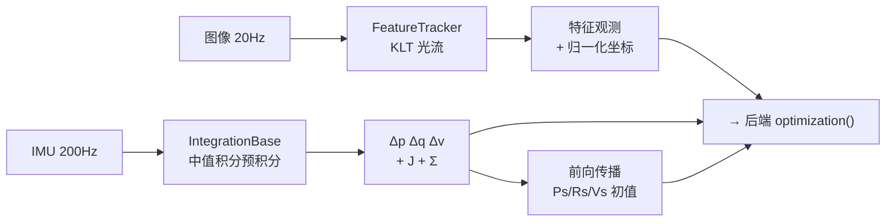
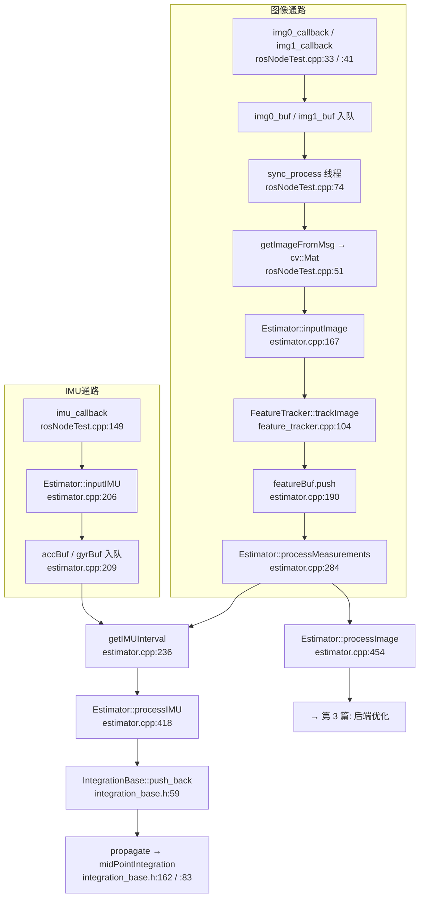
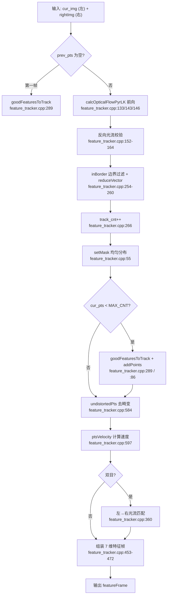

# 1. 测量预处理 (Measurement Preprocessing)

> **系列导航**：本文 → [2.系统初始化](2.systeminit.md) → [3.紧耦合VIO](3.tightvio.md) → [4.回环与重定位](4.relocalization.md) → [5.全局PGO](5.globalPGO.md)
>
> **文档名释义**：`meapreprocess` = **Mea**surement **Preprocess**（测量预处理）。这是整条 VINS 流水线的第 0 层——把"传感器原始数据"变成"后端可以直接吃的约束量"。
>
> 对应 VINS-Mono / VINS-Fusion 论文第 IV 节 *Measurement Preprocessing*。

---

## 0. 这一层要解决什么问题

后端优化器不认识图像，也不认识 IMU 的原始角速度，它只认识两种东西：

| 后端需要的东西 | 由谁生产 | 本文档对应章节 |
|---|---|---|
| 归一化平面上的**特征点观测** `(x, y)` | `FeatureTracker` 光流追踪 + 相机模型去畸变 | §2 |
| 帧间的 **IMU 相对运动量** `(Δp, Δq, Δv)` 及其协方差 | `IntegrationBase` 预积分 | §3 |

所以本层的产出是**三件事**：

1. `map<feature_id, vector<pair<cam_id, [x,y,z,u,v,vx,vy]>>>` —— 一帧图像的特征观测
2. `IntegrationBase* pre_integrations[i]` —— 第 i 帧到第 i+1 帧的预积分量 + 雅可比 + 协方差
3. 上一项顺带产出的**前向位姿初值**（`Ps/Rs/Vs`），供优化器当迭代起点



---

## 1. 处理流程总览

### 1.1 两条独立的数据通路



### 1.2 IMU 与图像的汇合点

IMU 以 200Hz 高频到达，图像以 20Hz 低频到达。两者的汇合发生在 `Estimator::processMeasurements()`（`estimator.cpp:284`）：

```cpp
// estimator.cpp:316 附近
getIMUInterval(prevTime, curTime, accVector, gyrVector);   // 取出图像间隔内的所有 IMU
for (i...) processIMU(dt, accVector[i], gyrVector[i]);     // 逐个积分 → 预积分量
processImage(feature.second, feature.first);               // 图像帧 → 后端
```

**核心思想**：图像帧是"锚点"，IMU 数据负责填满锚点之间的空隙。每到达一张图像，就把从上一张图像到本张图像之间的所有 IMU 数据积分成一个"相对运动增量"。

### 1.3 预积分的"移交"时刻（最容易看漏的一处）

```cpp
// estimator.cpp:479-481
imageframe.pre_integration = tmp_pre_integration;                 // 把累积好的预积分挂到本帧
tmp_pre_integration = new IntegrationBase{acc_0, gyr_0,
                                          Bas[frame_count],
                                          Bgs[frame_count]};      // 立刻开一个新的
```

理解方式：`tmp_pre_integration` 是"**正在累积中**"的预积分器。图像帧到来时，它累积的正好是"上一帧→本帧"这一段，于是被"结算"并挂到本帧；同时新建一个空的，开始累积"本帧→下一帧"。

---

## 2. 处理方式 A：特征追踪

### 2.1 完整管线（9 步）



### 2.2 逐步说明与核心代码

| 步骤 | 做什么 | 核心代码位置 |
|---|---|---|
| ① 前向光流 | 用 LK 金字塔光流把上一帧的点追踪到本帧 | `feature_tracker.cpp:133`, `:143`, `:146` |
| ② 反向校验 | 从本帧反向追踪回上一帧，双向误差 > 0.5px 则丢弃 | `feature_tracker.cpp:152-164` |
| ③ 边界过滤 | 丢弃贴边点（`BORDER_SIZE = 1`） | `feature_tracker.cpp:14-20`, `:254-260` |
| ④ 追踪计数 | 每个存活点的 `track_cnt++`（用于排序保优） | `feature_tracker.cpp:266-267` |
| ⑤ 均匀分布 | 按 `track_cnt` 降序排，用 mask 画圈保证最小间距 | `feature_tracker.cpp:55-84` |
| ⑥ 补充新点 | 点数不足时在 mask 空白区检测 Shi-Tomasi 角点 | `feature_tracker.cpp:289`, `:86-94` |
| ⑦ 去畸变 | 相机模型 `liftProjective` → 归一化平面坐标 | `feature_tracker.cpp:584-595` |
| ⑧ 计算速度 | `(cur_un_pt - prev_un_pt) / dt`，供 td/卷帘补偿 | `feature_tracker.cpp:597-635` |
| ⑨ 双目匹配 | 左目点用光流追踪到右目 + 反向校验 | `feature_tracker.cpp:360-371` |

### 2.3 关键算法细节

**① 前向光流（含预测加速）**

```cpp
// feature_tracker.cpp:122-146
if(hasPrediction) {
    cur_pts = predict_pts;                              // 用后端预测的位置当初始值
    cv::calcOpticalFlowPyrLK(prev_img, cur_img, prev_pts, cur_pts, status, err,
        cv::Size(21, 21), 1,                            // 金字塔 1 层
        cv::TermCriteria(COUNT+EPS, 30, 0.01),
        cv::OPTFLOW_USE_INITIAL_FLOW);                  // ← 用初值
    if (succ_num < 10)                                  // 成功点太少 → 退化
        cv::calcOpticalFlowPyrLK(prev_img, cur_img, prev_pts, cur_pts, status, err,
            cv::Size(21, 21), 3);                       // 金字塔 3 层
} else
    cv::calcOpticalFlowPyrLK(prev_img, cur_img, prev_pts, cur_pts, status, err, cv::Size(21, 21), 3);
```

`hasPrediction` 由 `setPrediction()`（`feature_tracker.cpp:693`）设置，预测点来自后端的 `predictPtsInNextFrame()`（`estimator.cpp:1542`）——这是 VINS 的提速技巧：用 IMU 预测特征会出现在哪，让光流少迭代。

**② 均匀分布 setMask（决定特征质量的关键）**

```cpp
// feature_tracker.cpp:55-84
void FeatureTracker::setMask() {
    mask = cv::Mat(row, col, CV_8UC1, cv::Scalar(255));
    // 按 track_cnt 降序：跟踪越久的老点优先级越高（更可靠、更可能已三角化）
    sort(cnt_pts_id.begin(), cnt_pts_id.end(),
         [](const ... &a, const ... &b) { return a.first > b.first; });
    for (auto &it : cnt_pts_id) {
        if (mask.at<uchar>(it.second.first) == 255) {   // 该位置还没被占用
            cur_pts.push_back(...); ids.push_back(...);
            cv::circle(mask, it.second.first, MIN_DIST, 0, -1);  // 画黑圈，禁止附近再选点
        }
    }
}
```

**③ 去畸变（借相机模型库）**

```cpp
// feature_tracker.cpp:584-595
vector<cv::Point2f> FeatureTracker::undistortedPts(vector<cv::Point2f> &pts, camodocal::CameraPtr cam) {
    for (unsigned int i = 0; i < pts.size(); i++) {
        Eigen::Vector2d a(pts[i].x, pts[i].y);
        Eigen::Vector3d b;
        cam->liftProjective(a, b);                      // 像素 → 归一化射线
        un_pts.push_back(cv::Point2f(b.x() / b.z(), b.y() / b.z()));   // 归一化平面 z=1
    }
}
```

相机模型实现在 `camera_models/`（camodocal）。EuRoC 用 MEI 模型 → `camera_models/src/camera_models/CataCamera.cc:556`（`liftProjective`）、`:766`（`distortion`）。

### 2.4 双目处理

本移植版的双目匹配**不是极线搜索**，而是**光流追踪**：

```cpp
// feature_tracker.cpp:360-371
cv::calcOpticalFlowPyrLK(cur_img, rightImg, cur_pts, cur_right_pts, status, err, cv::Size(21,21), 3);  // 左→右
if(FLOW_BACK) {
    cv::calcOpticalFlowPyrLK(rightImg, cur_img, cur_right_pts, reverseLeftPts, statusRightLeft, err, cv::Size(21,21), 3);
    for(size_t i = 0; i < status.size(); i++) {
        if(status[i] && statusRightLeft[i] && inBorder(cur_right_pts[i])
           && distance(cur_pts[i], reverseLeftPts[i]) <= 0.5)   // 双向一致
            status[i] = 1;
        else status[i] = 0;
    }
}
```

> ⚠️ 原版 VINS-Fusion 的 `stereoMatch()`（极线搜索）在**本 ROS2 移植版中不存在**（全仓库 grep 无命中），已改为上面的光流方案。

### 2.5 输出数据结构：7 维特征向量

类型：`map<int, vector<pair<int, Eigen::Matrix<double,7,1>>>>`
- 外层 key：**特征点 id**（`n_id` 全局递增，`feature_tracker.h:98`）
- `pair.first`：`camera_id`（0=左目，1=右目）
- `pair.second`：7 维向量 `[x, y, z, p_u, p_v, vx, vy]`

| 字段 | 含义 | 左目填充行 | 右目填充行 |
|---|---|---|---|
| `x, y` | 去畸变后归一化坐标 | `:458-459` | `:480-481` |
| `z` | 恒为 1 | `:460` | `:482` |
| `p_u, p_v` | 原始像素坐标 | `:462-463` | `:484-485` |
| `vx, vy` | 归一化坐标速度 | `:466-467` | `:488-489` |

---

## 3. 处理方式 B：IMU 预积分

### 3.1 为什么需要预积分

IMU 200Hz，图像 20Hz —— 两帧图像之间有 ~10 个 IMU 数据。如果直接在优化里展开这 10 步积分，每次迭代都要重算，代价极高。预积分把这段积分**预先算成一个不依赖起始状态的相对量** `(Δp, Δq, Δv)`，优化时只做一次一阶修正。

### 3.2 中值积分（名义状态）

```cpp
// integration_base.h:94-101   —— 全篇最核心的 8 行
Vector3d un_acc_0 = delta_q * (_acc_0 - linearized_ba);                 // R_k (a_k - b_a)
Vector3d un_gyr   = 0.5 * (_gyr_0 + _gyr_1) - linearized_bg;            // ω̄ = ½(ω_k + ω_{k+1}) - b_g
result_delta_q = delta_q * Quaterniond(1, un_gyr(0)*_dt/2,
                                          un_gyr(1)*_dt/2,
                                          un_gyr(2)*_dt/2);             // q_{k+1} = q_k ⊗ [1, ω̄Δt/2]
Vector3d un_acc_1 = result_delta_q * (_acc_1 - linearized_ba);          // R_{k+1} (a_{k+1} - b_a)
Vector3d un_acc   = 0.5 * (un_acc_0 + un_acc_1);                        // ā = ½(R_k a_k + R_{k+1} a_{k+1})
result_delta_p = delta_p + delta_v * _dt + 0.5 * un_acc * _dt * _dt;    // p += vΔt + ½āΔt²
result_delta_v = delta_v + un_acc * _dt;                                // v += āΔt
```

对应数学公式：

$$
\begin{aligned}
\bar{\boldsymbol{\omega}} &= \tfrac{1}{2}(\boldsymbol{\omega}_k + \boldsymbol{\omega}_{k+1}) - \mathbf{b}_g \\
\mathbf{q}_{k+1} &= \mathbf{q}_k \otimes \begin{bmatrix}1 \\ \tfrac{1}{2}\bar{\boldsymbol{\omega}}\Delta t\end{bmatrix} \\
\bar{\mathbf{a}} &= \tfrac{1}{2}\left(\mathbf{R}_k(\mathbf{a}_k - \mathbf{b}_a) + \mathbf{R}_{k+1}(\mathbf{a}_{k+1} - \mathbf{b}_a)\right) \\
\boldsymbol{\Delta}\mathbf{p} &\mathrel{+}= \boldsymbol{\Delta}\mathbf{v}\Delta t + \tfrac{1}{2}\bar{\mathbf{a}}\Delta t^2, \qquad
\boldsymbol{\Delta}\mathbf{v} \mathrel{+}= \bar{\mathbf{a}}\Delta t
\end{aligned}
$$

### 3.3 误差状态传播（协方差与雅可比）

预积分不只算一个数，还要算**这个数的可信度**（协方差 Σ）和**它对 bias 的敏感度**（雅可比 J）。

```cpp
// integration_base.h:122-137   误差状态转移矩阵 F (15×15)
MatrixXd F = MatrixXd::Zero(15, 15);
F.block<3, 3>(0, 0) = Matrix3d::Identity();
F.block<3, 3>(0, 3) = -0.25 * delta_q.toRotationMatrix() * R_a_0_x * _dt * _dt + ...;
F.block<3, 3>(0, 6) = MatrixXd::Identity(3,3) * _dt;
F.block<3, 3>(0, 9) = -0.25 * (delta_q.toRotationMatrix() + result_delta_q.toRotationMatrix()) * _dt * _dt;
F.block<3, 3>(0, 12) = -0.25 * result_delta_q.toRotationMatrix() * R_a_1_x * _dt * _dt * -_dt;
F.block<3, 3>(3, 3)  = Matrix3d::Identity() - R_w_x * _dt;
F.block<3, 3>(3, 12) = -1.0 * MatrixXd::Identity(3,3) * _dt;
F.block<3, 3>(6, 3)  = -0.5 * delta_q.toRotationMatrix() * R_a_0_x * _dt + ...;
F.block<3, 3>(6, 6)  = Matrix3d::Identity();
F.block<3, 3>(6, 9)  = -0.5 * (delta_q.toRotationMatrix() + result_delta_q.toRotationMatrix()) * _dt;
F.block<3, 3>(6, 12) = -0.5 * result_delta_q.toRotationMatrix() * R_a_1_x * _dt * -_dt;
F.block<3, 3>(9, 9)  = Matrix3d::Identity();
F.block<3, 3>(12, 12)= Matrix3d::Identity();
```

```cpp
// integration_base.h:140-152   噪声映射矩阵 V (15×18)
MatrixXd V = MatrixXd::Zero(15,18);
V.block<3, 3>(0, 0) =  0.25 * delta_q.toRotationMatrix() * _dt * _dt;
V.block<3, 3>(0, 6) =  0.25 * result_delta_q.toRotationMatrix() * _dt * _dt;
V.block<3, 3>(3, 3) =  0.5 * MatrixXd::Identity(3,3) * _dt;
V.block<3, 3>(6, 0) =  0.5 * delta_q.toRotationMatrix() * _dt;
V.block<3, 3>(6, 6) =  0.5 * result_delta_q.toRotationMatrix() * _dt;
V.block<3, 3>(9, 12) = MatrixXd::Identity(3,3) * _dt;
V.block<3, 3>(12, 15)= MatrixXd::Identity(3,3) * _dt;
```

```cpp
// integration_base.h:156-157   递推公式 —— 只有两行，但是整个预积分的心脏
jacobian   = F * jacobian;                                                // J_{k+1} = F J_k
covariance = F * covariance * F.transpose() + V * noise * V.transpose();  // Σ_{k+1} = FΣFᵀ + VNVᵀ
```

**18 维噪声向量**（`integration_base.h:49-55`）：`[n_a(k), n_g(k), n_a(k+1), n_g(k+1), n_ba, n_bg]`

| 索引 | 内容 | 参数 |
|---|---|---|
| 0-2 / 6-8 | 加速度计白噪声（k、k+1 时刻） | `ACC_N` |
| 3-5 / 9-11 | 陀螺仪白噪声（k、k+1 时刻） | `GYR_N` |
| 12-14 | 加速度计 bias 随机游走 | `ACC_W` |
| 15-17 | 陀螺仪 bias 随机游走 | `GYR_W` |

### 3.4 残差计算（供后端使用）

```cpp
// integration_base.h:208-216
// 第一步：用当前 bias 对预积分量做一阶修正（泰勒展开）
corrected_delta_q = delta_q * Utility::deltaQ(dq_dbg * dbg);
corrected_delta_v = delta_v + dv_dba * dba + dv_dbg * dbg;
corrected_delta_p = delta_p + dp_dba * dba + dp_dbg * dbg;
// 第二步：与状态量推出的"应然值"相减
residuals.block<3,1>(O_P, 0)  = Qi.inverse()*(0.5*G*sum_dt*sum_dt + Pj - Pi - Vi*sum_dt) - corrected_delta_p;
residuals.block<3,1>(O_R, 0)  = 2 * (corrected_delta_q.inverse() * (Qi.inverse() * Qj)).vec();
residuals.block<3,1>(O_V, 0)  = Qi.inverse() * (G*sum_dt + Vj - Vi) - corrected_delta_v;
residuals.block<3,1>(O_BA, 0) = Baj - Bai;      // bias 随机游走先验
residuals.block<3,1>(O_BG, 0) = Bgj - Bgi;
```

`O_P/O_R/O_V/O_BA/O_BG` 定义在 `parameters.h:87-94`，把 15 维残差分成 `[δp(3), δθ(3), δv(3), δba(3), δbg(3)]` 五块。

### 3.5 repropagate：bias 变了怎么办

预积分量是用**线性化时的 bias**（`linearized_ba/bg`）算的。当后端把 bias 优化得变化较大时，一阶修正不够准，需要**重播**：

```cpp
// integration_base.h:67-81
void repropagate(const Eigen::Vector3d &_linearized_ba, const Eigen::Vector3d &_linearized_bg) {
    sum_dt = 0.0; acc_0 = linearized_acc; gyr_0 = linearized_gyr;
    delta_p.setZero(); delta_q.setIdentity(); delta_v.setZero();
    linearized_ba = _linearized_ba; linearized_bg = _linearized_bg;
    jacobian.setIdentity(); covariance.setZero();
    for (int i = 0; i < static_cast<int>(dt_buf.size()); i++)
        propagate(dt_buf[i], acc_buf[i], gyr_buf[i]);   // 用缓存的原始 IMU 数据从头再算一遍
}
```

这就是为什么 `push_back` 必须把原始 `dt/acc/gyr` 存进 `dt_buf/acc_buf/gyr_buf`（`integration_base.h:61-63`）。触发重播的地方在 `imu_factor.h:82`（bias 漂移超阈值时）。

---

## 4. 核心代码在哪里

### 4.1 文件职责表

| 文件 | 职责 | 核心函数（行号） |
|---|---|---|
| `vins/src/rosNodeTest.cpp` | ROS2 入口：收数据、同步、喂给 Estimator | `imu_callback:149`, `img0_callback:33`, `sync_process:74` |
| `vins/src/featureTracker/feature_tracker.cpp` | **前端特征追踪**（本层左半部分） | `trackImage:104`, `setMask:55`, `addPoints:86`, `rejectWithF:501`, `undistortedPts:584`, `ptsVelocity:597` |
| `vins/src/factor/integration_base.h` | **IMU 预积分**（本层右半部分） | `push_back:59`, `repropagate:67`, `midPointIntegration:83`, `propagate:162`, `evaluate:192` |
| `vins/src/estimator/estimator.cpp` | 调度：汇合两路数据、驱动预积分 | `processIMU:418`, `processMeasurements:284`, `inputImage:167` |
| `camera_models/src/camera_models/CataCamera.cc` | 相机模型去畸变 | `liftProjective:556`, `distortion:766` |
| `vins/src/estimator/parameters.h` | 参数与枚举 | `StateOrder:87-94`, `NoiseOrder:96-102` |

### 4.2 调用链（照这个顺序读代码）

```
rosNodeTest.cpp:33   img0_callback                       ← 起点1：图像进来
  └ rosNodeTest.cpp:74   sync_process                    ← 左右目同步（0.05s 容差）
      └ estimator.cpp:167    Estimator::inputImage
          └ feature_tracker.cpp:104  FeatureTracker::trackImage   ★核心
              ├ :122-146  calcOpticalFlowPyrLK 前向
              ├ :152-164  反向校验
              ├ :254-260  inBorder + reduceVector
              ├ :55-84    setMask                     ★核心
              ├ :289      goodFeaturesToTrack
              ├ :584-595  undistortedPts → CataCamera.cc:556
              └ :597-635  ptsVelocity
          └ estimator.cpp:190    featureBuf.push

rosNodeTest.cpp:149  imu_callback                        ← 起点2：IMU 进来
  └ estimator.cpp:206    Estimator::inputIMU
      └ estimator.cpp:209    accBuf/gyrBuf.push

estimator.cpp:284    Estimator::processMeasurements      ← 两路汇合
  ├ estimator.cpp:316       getIMUInterval               ← 取图像间隔内的 IMU
  ├ estimator.cpp:328-338   processIMU 循环
  │   └ estimator.cpp:418     Estimator::processIMU
  │       └ integration_base.h:59    push_back
  │           └ integration_base.h:162  propagate
  │               └ integration_base.h:83  midPointIntegration  ★核心
  │                   ├ :94-101   中值积分（名义状态）
  │                   ├ :122-137  F 矩阵
  │                   ├ :140-152  V 矩阵
  │                   └ :156-157  雅可比/协方差递推
  ├ estimator.cpp:479    预积分移交（结算上一帧→本帧）
  ├ estimator.cpp:481    新建预积分器
  └ estimator.cpp:343    processImage → 进入第 3 篇
```

### 4.3 开发者如何快速定位核心代码

```bash
cd /home/ros/ros_ws/VINS_ROS2/src/VINS_ROS2

# ① 光流调用的全部位置（7 处，前 4 处是时序追踪，后 2 处是双目匹配）
grep -n "calcOpticalFlowPyrLK" vins/src/featureTracker/feature_tracker.cpp
# → 133 143 146 152 154 360 364

# ② 角点检测
grep -n "goodFeaturesToTrack\|createGoodFeaturesToTrackDetector" vins/src/featureTracker/feature_tracker.cpp
# → 289 315

# ③ 前端所有方法定义（一览全貌）
grep -n "FeatureTracker::" vins/src/featureTracker/feature_tracker.cpp

# ④ 预积分所有关键方法
grep -n "void push_back\|void repropagate\|void propagate\|void midPointIntegration\|evaluate" \
     vins/src/factor/integration_base.h
# → 59 67 83 162 192

# ⑤ 找协方差递推（预积分的心脏）
grep -n "covariance = F \* covariance" vins/src/factor/integration_base.h
# → 157

# ⑥ 估计器两个入口
grep -n "void Estimator::inputImage\|void Estimator::inputIMU\|void Estimator::processIMU" \
     vins/src/estimator/estimator.cpp

# ⑦ 找参数读取位置（改参数前先确认从哪读）
grep -n "MAX_CNT\|MIN_DIST\|F_THRESHOLD\|FLOW_BACK\|ACC_N\|GYR_N" vins/src/estimator/parameters.cpp

# ⑧ 相机模型
grep -rn "liftProjective" camera_models/src/camera_models/*.cc
```

### 4.4 推荐断点与观察变量

| 想看什么 | 断点 | 观察变量 |
|---|---|---|
| 一帧图像进来 | `feature_tracker.cpp:104` | `cur_img.size()`, `prev_pts.size()` |
| 光流成功多少点 | `feature_tracker.cpp:254` | `cur_pts.size()` vs `prev_pts.size()` |
| 反向校验丢了多少 | `feature_tracker.cpp:157` | `status` 中被置 0 的比例 |
| 补充了多少新点 | `feature_tracker.cpp:334` | `n_pts.size()` |
| 双目匹配率 | `feature_tracker.cpp:360` | `cur_right_pts.size()` vs `cur_pts.size()` |
| 预积分单步（找 bug 必看） | `integration_base.h:96` | `un_gyr`, `result_delta_q` |
| 协方差是否爆炸 | `integration_base.h:157` | `covariance` 对角线数值量级 |
| 预积分移交 | `estimator.cpp:479` | `tmp_pre_integration->sum_dt`（应 ≈ 图像间隔） |
| 重播是否被触发 | `imu_factor.h:82` | `dba.norm()`, `dbg.norm()` |

**调试建议**：`sum_dt` 是第一现场指标。正常应约等于两帧图像的间隔（EuRoC 约 0.05s）。若某帧 `sum_dt` 异常大或为 0，说明 IMU 丢包或时间戳错乱。

---

## 5. 参数与配置速查

配置文件：`config/euroc/euroc_stereo_imu_config.yaml`

| 参数 | 默认值 | 含义 |
|---|---|---|
| `max_cnt` | 150 | 单帧最大特征数 |
| `min_dist` | 30 | 特征最小间距（px） |
| `F_threshold` | 1.0 | F 矩阵 RANSAC 阈值 |
| `flow_back` | 1 | 是否反向光流校验 |
| `acc_n` | 0.1 | 加速度计白噪声 |
| `gyr_n` | 0.01 | 陀螺仪白噪声 |
| `acc_w` | 0.001 | 加速度计随机游走 |
| `gyr_w` | 0.0001 | 陀螺仪随机游走 |
| `use_gpu` | 0 | GPU 光流（需 OpenCV CUDA） |

编译期常量（`vins/src/estimator/parameters.h`）：
- `FOCAL_LENGTH = 460.0`（`:27`）—— **注意**：这是虚拟焦距，仅用于可视化与 `rejectWithF`，**不是**真实内参
- `WINDOW_SIZE = 10`（`:28`）
- `NUM_OF_F = 1000`（`:29`）

---

## 6. 本移植版与原版的差异 / 常见坑

阅读源码时这几处最容易困惑，提前说明：

| # | 现象 | 真相 |
|---|---|---|
| 1 | `equalizeHist` / CLAHE 找不到 | **已被注释**（`feature_tracker.cpp:112-119`）。当前前端**不做**直方图均衡化。需要时取消注释即可。 |
| 2 | `rejectWithF()` 定义了却没被调用 | **调用点被注释**（`feature_tracker.cpp:271`）。基础矩阵外点剔除默认**关闭**。 |
| 3 | 找不到 `stereoMatch()` | 本移植版**不存在**该函数，双目改为光流追踪（`feature_tracker.cpp:360`）。 |
| 4 | `NoiseOrder` 枚举没人用 | 历史遗留（`parameters.h:96-102`）。当前 18 维噪声在 `integration_base.h:49-55` 硬编码，该枚举无生效引用。 |
| 5 | 左目点集在双目匹配后没被裁剪 | 有意为之：`feature_tracker.cpp:426-432` 的 `reduceVector(cur_pts,...)` 被注释，**只裁剪右目点集，左目点不删**——无右目匹配的左目点仍以单目观测进入后端。 |
| 6 | `undistortedPoints()` 有声明无实现 | `feature_tracker.h:61` 是**死声明**，实际用的是 `undistortedPts()`（带 s）。 |
| 7 | `dt_buf` 占内存但好像没用 | 它是 `repropagate` 的基础（`integration_base.h:67-81`），删不得。 |

---

## 7. 自测清单

读完本文档，应能回答：

- [ ] 特征点 7 维向量 `[x,y,z,u,v,vx,vy]` 中，`z` 为什么恒为 1？
- [ ] `setMask()` 为什么要按 `track_cnt` 降序排序？
- [ ] 预积分的 `covariance` 有什么物理意义？后端怎么用它？
- [ ] `repropagate()` 在什么条件下被触发？为什么必须缓存原始 IMU 数据？
- [ ] 为什么本版本双目匹配用光流而不是极线搜索？

**参考答案要点**：③ 协方差是预积分量的不确定度，后端用 `covariance.inverse()` 作信息矩阵对 IMU 残差做马氏加权（`imu_factor.h:90`）——协方差越大，该约束越"不可信"，在优化中权重越低。
