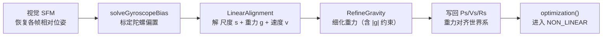
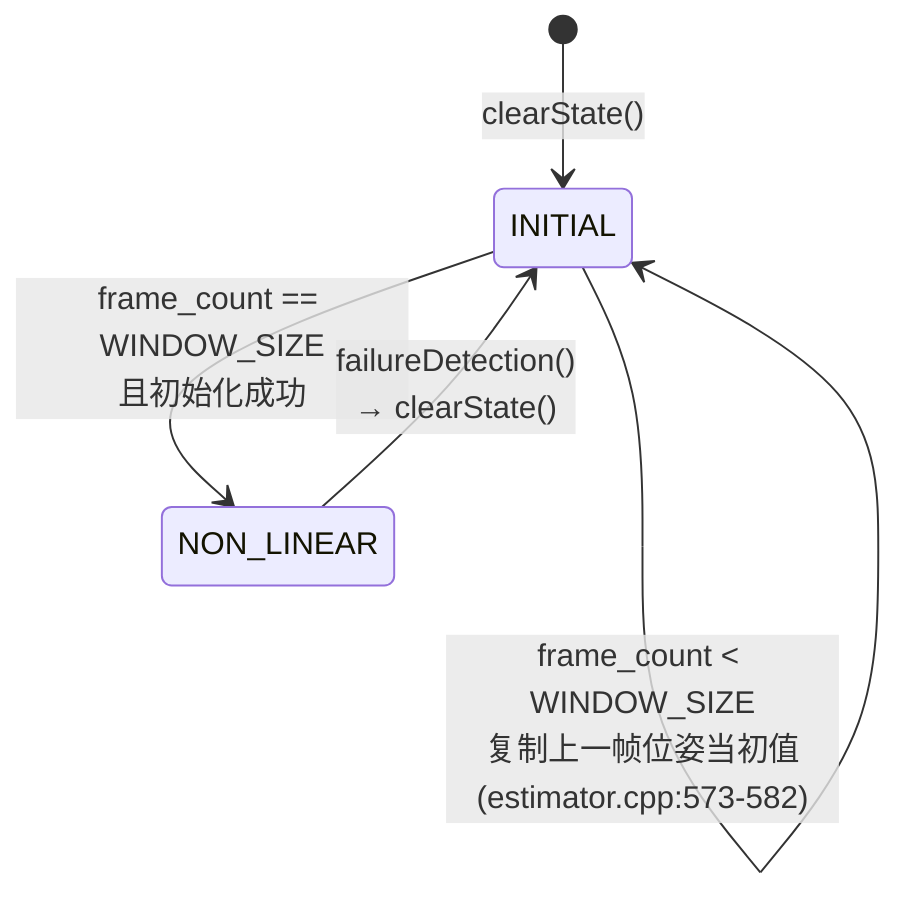
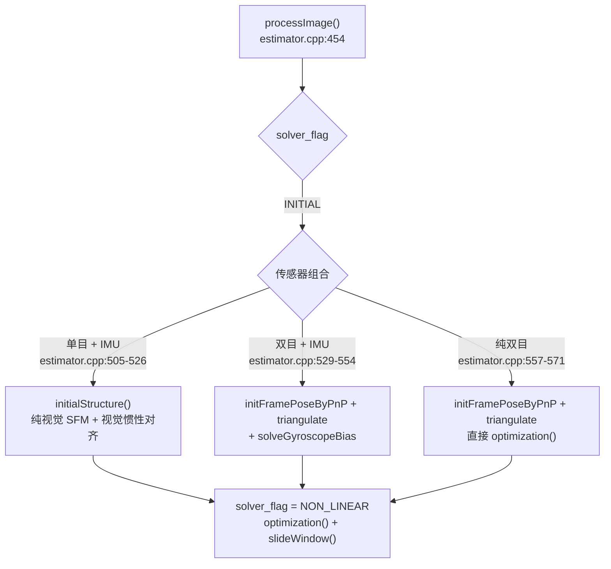
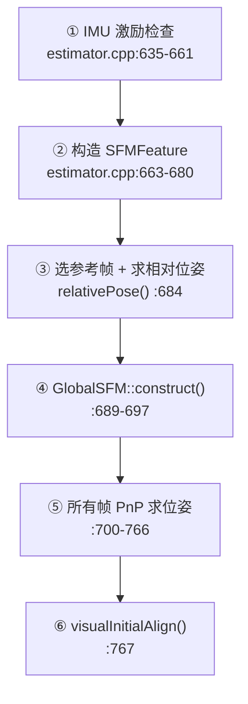

# 2. 系统初始化 (System Initialization)

> **系列导航**：[1.测量预处理](1.meapreprocess.md) → **本文** → [3.紧耦合VIO](3.tightvio.md) → [4.回环与重定位](4.relocalization.md) → [5.全局PGO](5.globalPGO.md)
>
> **文档定位**：VIO 启动后不能立刻做紧耦合优化——因为单目有**尺度未知**、IMU 有**偏置未知和重力方向未知**、视觉与 IMU 之间的**外参可能未标定**。初始化就是把这四件事一次性解出来，给后端一个能收敛的起点。
>
> 对应 VINS-Mono / VINS-Fusion 论文第 V 节 *Estimator Initialization*。

---

## 0. 这一层要解决什么问题

| 未知量 | 为什么未知 | 谁来解决 | 本文档章节 |
|---|---|---|---|
| 尺度 $s$ | 单目相机无法从图像恢复绝对尺寸 | `LinearAlignment` 联合求 $s$ | §4.1 |
| 重力方向 $\mathbf{g}$ | IMU 加速度计测的是比力，含重力分量；初始姿态未知 | `LinearAlignment` + `RefineGravity` | §4 |
| 陀螺仪偏置 $\mathbf{b}_g$ | 偏置会让预积分旋转随时间漂移，不先去掉则重力方向永远解不对 | `solveGyroscopeBias` | §3 |
| 视觉-IMU 外参 $\mathbf{R}_{ic}$ | 出厂标定可能不准或缺失 | `CalibrationExRotation` | §5 |
| 初始位姿/速度 | 需要各帧相对位姿作为优化初值 | `GlobalSFM` / `initFramePoseByPnP` | §2 / §6 |

**核心依赖顺序**（这个顺序不能颠倒）：



为什么必须先标定陀螺偏置？因为 `LinearAlignment` 里的重力是从**预积分旋转**推出来的，旋转错了重力就错了。

---

## 1. 处理流程总览

### 1.1 状态机与触发条件

`Estimator` 用 `solver_flag`（`estimator.h:113`，枚举定义 `estimator.h:87-91`）区分两个阶段：

```cpp
// estimator.cpp:75-76  clearState() 中
frame_count = 0;
solver_flag = INITIAL;      // 启动时处于初始化阶段
```

触发初始化的统一条件是 **滑动窗口攒满 10 帧**：`frame_count == WINDOW_SIZE`（`WINDOW_SIZE = 10`，`parameters.h:28`）。



`processImage()` 中 `solver_flag == INITIAL` 的分支入口在 `estimator.cpp:502`，下面按传感器组合分成三条路径。

### 1.2 三条初始化路径



### 1.3 路径 A：单目 + IMU（`!STEREO && USE_IMU`）

代码块 `estimator.cpp:505-526`：

```cpp
if (frame_count == WINDOW_SIZE)                                    // :507  攒满 10 帧
{
    bool result = false;
    if(ESTIMATE_EXTRINSIC != 2 && (header - initial_timestamp) > 0.1)   // :510 门控
    {
        result = initialStructure();                               // :512  ★ 核心
        initial_timestamp = header;
    }
    if(result)
    {
        optimization();                                            // :517
        updateLatestStates();
        solver_flag = NON_LINEAR;                                  // :519  ← 状态切换
        slideWindow();
    }
    else
        slideWindow();                                             // 失败则继续攒帧重试
}
```

> `(header - initial_timestamp) > 0.1` 是一个**限流**：初始化失败后至少等 0.1 秒再重试，避免每帧都跑一遍昂贵的 SFM。

### 1.4 路径 B：双目 + IMU

代码块 `estimator.cpp:529-554`：

| 步骤 | 位置 | 内容 |
|---|---|---|
| 1 | `:531` | 每帧 `f_manager.initFramePoseByPnP(...)` |
| 2 | `:532` | 每帧 `f_manager.triangulate(...)` |
| 3 | `:533` | `if (frame_count == WINDOW_SIZE)` 触发 |
| 4 | `:537-542` | 把 `Rs[i]/Ps[i]` 写回 `all_image_frame` |
| 5 | `:543` | `solveGyroscopeBias(all_image_frame, Bgs)` ★ |
| 6 | `:544-547` | 逐帧 `pre_integrations[i]->repropagate(Vector3d::Zero(), Bgs[i])` |
| 7 | `:548-551` | `optimization(); updateLatestStates(); solver_flag = NON_LINEAR; slideWindow()` |

**双目路径比单目简单得多**：双目可以直接三角化得到**绝对尺度**，所以不需要 SFM，也不需要 `LinearAlignment` 解尺度——只需标定陀螺偏置。

### 1.5 路径 C：纯双目（`STEREO && !USE_IMU`）

代码块 `estimator.cpp:557-571`：每帧 PnP + 三角化，满 10 帧后直接 `optimization()`（`estimator.cpp:563-568`）。没有 IMU，自然跳过所有偏置/重力/尺度对齐。

### 1.6 前置：进入初始化之前的准备工作

`processMeasurements()`（`estimator.cpp:284-385`）在图像帧到来前先做完这些：

| 步骤 | 位置 | 内容 |
|---|---|---|
| 等 IMU 数据到位 | `estimator.cpp:300` | 保证有足够 IMU 覆盖图像间隔 |
| 初始化首帧 IMU 姿态 | `estimator.cpp:326-327` | 调 `initFirstIMUPose()`（定义 `:388-407`） |
| 逐条 IMU 预积分/传播 | `estimator.cpp:337` | `processIMU()` |
| 交给图像处理 | `estimator.cpp:343` | `processImage()` |

`initFirstIMUPose()` 用**前 10 个加速度计读数的平均值**估计重力方向，从而得到初始姿态 `Rs[0]`（调 `Utility::g2R`）。这是整个系统"世界上方向"的第一个锚点。

---

## 2. 处理方式 A：单目视觉 SFM

`Estimator::initialStructure()` 定义于 `estimator.cpp:631-775`，是整个初始化里最长的一段。

### 2.1 六个阶段



| 阶段 | 位置 | 说明 |
|---|---|---|
| ① IMU 激励检查 | `:635-661` | 统计相邻帧加速度均值方差，`var < 0.25` 时警告 "IMU excitation not enough" |
| ② 构造 SFMFeature | `:663-680` | 把 `f_manager.feature` 每条 track 转成 `SFMFeature`（观测为 `(帧号, 归一化uv)`） |
| ③ 求相对位姿 | `:684` | `relativePose()`，选出参考帧 `l` |
| ④ 纯视觉 SFM | `:689-697` | `GlobalSFM::construct()` |
| ⑤ 全帧位姿 | `:700-766` | 关键帧直接用 `Q[i]/T[i]`，其余用 `cv::solvePnP`（`:752`） |
| ⑥ 视觉惯性对齐 | `:767` | `visualInitialAlign()` |

> ⚠️ **坑**：①处的 `return false` **被注释掉了**（`estimator.cpp:658`）。也就是说 IMU 激励不足**不会真正阻止初始化**，只打印一条日志。这意味着在静止或匀速场景下初始化仍然会"成功"，但结果可能很差。调试初始化失败时这是第一个要检查的地方。

### 2.2 参考帧选择 relativePose()

定义于 `estimator.cpp:838-867`。遍历 `i = 0..WINDOW_SIZE-1` 与最新帧 `WINDOW_SIZE`：

```cpp
// estimator.cpp:838-861 附近
getCorresponding(l, WINDOW_SIZE, corres);         // :838-844 取对应点
if (corres.size() <= 20) continue;                // :845   点太少
...
if (average_parallax * 460 > 30)                  // :858   视差足够大（460 = FOCAL_LENGTH）
    if (m_estimator.solveRelativeRT(corres, relative_R, relative_T)) {
        ... l = i;  return true;                  // :860-861
    }
```

**为什么要求视差 > 30/FOCAL_LENGTH？** 视差太小意味着纯旋转（或静止），此时三角化退化、本质矩阵求解病态。这是初始化最常见的失败原因。

### 2.3 本质矩阵求解 solveRelativeRT()

定义于 `solve_5pts.cpp:204-238`：

```cpp
// solve_5pts.cpp:206-233
if (corres.size() >= 15) {
    ...
    cv::Mat E = cv::findFundamentalMat(ll, rr, cv::FM_RANSAC, 0.3 / 460, 0.99, mask);   // :215
    cv::Mat cameraMatrix = (cv::Mat_<double>(3,3) << 1,0,0, 0,1,0, 0,0,1);              // 已是归一化坐标
    int inlier_cnt = cv::recoverPose(E, ll, rr, cameraMatrix, rot, trans, mask);        // :218
    ...
    Rotation    =  R.transpose();              // :230
    Translation = -R.transpose() * T;           // :231
    if(inlier_cnt > 12) return true;            // :232  内点门槛
}
```

> **勘误**：`solve_5pts.h:36-42` 声明了 `MotionEstimator::testTriangulation` 和 `MotionEstimator::decomposeE`，但 `solve_5pts.cpp` 中**没有任何定义**（死声明）。实际分解用的是 OpenCV 的 `cv::recoverPose`（`:218`）。

### 2.4 GlobalSFM::construct() —— SFM 主体

定义于 `initial_sfm.cpp:128-323`。这是整个初始化里最"教科书"的一段：

| 阶段 | 位置 | 内容 |
|---|---|---|
| 初始两帧 | `:136-142` | `q[l] = 单位四元数, T[l] = 0`；`q[frame_num-1] = q[l] * relative_R` |
| 转相机系 | `:147-164` | 计算各帧 `c_Rotation/c_Translation/Pose` |
| **向前递推** | `:169-187` | `for i = l..frame_num-2`：`solveFrameByPnP`（`:176`）→ `triangulateTwoFrames(i, frame_num-1)`（`:186`） |
| 补充三角化 | `:189-190` | `triangulateTwoFrames(l, i)`，`i = l+1..frame_num-2` |
| **向后递推** | `:193-207` | `for i = l-1..0`：`solveFrameByPnP`（`:198`）→ `triangulateTwoFrames(i, l)`（`:206`） |
| 剩余点三角化 | `:209-228` | 用首末观测 `triangulatePoint(Pose[frame_0], Pose[frame_1])`（`:221`） |
| **全局 BA** | `:244-290` | Ceres 精化所有位姿与路标点 |
| 收敛判定 | `:292` | `CONVERGENCE \|\| final_cost < 5e-03` |
| 写回 | `:301-315` | `q[i] = q[i].inverse()`（`:307`），`T[i] = -q[i] * c_translation[i]`（`:313`） |
| 输出地图点 | `:316-320` | `sfm_tracked_points[id]` |

关键代码：

```cpp
// initial_sfm.cpp:136-142  初始两帧（把参考帧设为原点）
q[l].w() = 1; q[l].x() = 0; q[l].y() = 0; q[l].z() = 0;
T[l].setZero();
q[frame_num - 1] = q[l] * Quaterniond(relative_R);
T[frame_num - 1] = relative_T;
```

```cpp
// initial_sfm.cpp:169-187  向前递推（PnP 求位姿 → 三角化新点）
for (int i = l; i < frame_num - 1 ; i++)
{
    if (i > l)
    {
        Matrix3d R_initial = c_Rotation[i - 1];
        Vector3d P_initial = c_Translation[i - 1];
        if(!solveFrameByPnP(R_initial, P_initial, i, sfm_f))   // :176  用已知 3D 点解当前帧位姿
            return false;
        c_Rotation[i] = R_initial;  c_Translation[i] = P_initial;
    }
    triangulateTwoFrames(i, Pose[i], frame_num - 1, Pose[frame_num - 1], sfm_f);  // :186  三角化新点
}
```

```cpp
// initial_sfm.cpp:286-292  全局 BA 配置与收敛判定
options.linear_solver_type = ceres::DENSE_SCHUR;
options.max_solver_time_in_seconds = 0.2;                      // :288  给 BA 200ms
ceres::Solve(options, &problem, &summary);
if (summary.termination_type == ceres::CONVERGENCE || summary.final_cost < 5e-03)   // :292
```

**理解"向前/向后递推"**：参考帧 `l` 和末帧 `frame_num-1` 是已知的（来自 `relativePose`）。以它们为骨架，向两侧扩展——每一步都"先用已有 3D 点 PnP 出下一帧位姿，再用新位姿三角化更多 3D 点"，像滚雪球一样把窗口里所有帧的位姿都求出来。

### 2.5 三角化实现（DLT + SVD）

`GlobalSFM::triangulatePoint()`（`initial_sfm.cpp:16-30`）与 `FeatureManager::triangulatePoint()`（`feature_manager.cpp:198-212`）是同一套实现：

```cpp
// initial_sfm.cpp:16-30
Eigen::Matrix4d design_matrix = Eigen::Matrix4d::Zero();
design_matrix.row(0) = point0[0] * Pose0.row(2) - Pose0.row(0);   // 叉乘消去深度 → 齐次方程
design_matrix.row(1) = point0[1] * Pose0.row(2) - Pose0.row(1);
design_matrix.row(2) = point1[0] * Pose1.row(2) - Pose1.row(0);
design_matrix.row(3) = point1[1] * Pose1.row(2) - Pose1.row(1);
Eigen::Vector4d triangulated_point =
    design_matrix.jacobiSvd(Eigen::ComputeFullV).matrixV().rightCols<1>();   // 最小奇异值向量 = 解
point_3d(0) = triangulated_point(0) / triangulated_point(3);   // 齐次归一化
```

原理：对观测 $\mathbf{x} \sim \mathbf{P}\mathbf{X}$，叉乘 $\mathbf{x} \times (\mathbf{P}\mathbf{X}) = 0$ 消去尺度，两帧共 4 个方程解 4 维齐次向量，取**最小奇异值对应的右奇异向量**（即 $\min \|\mathbf{A}\mathbf{X}\|$ 的解）。

---

## 3. 处理方式 B：陀螺仪偏置标定

定义于 `initial_aligment.cpp:14-47`。

### 3.1 目标函数

在窗口内，**相邻两帧之间由视觉推出的旋转**应当与**IMU 预积分推出的旋转**一致，差值对 $\mathbf{b}_g$ 的雅可比就是求解矩阵：

$$
\min_{\delta \mathbf{b}_g} \sum_{k \in \mathcal{B}} \left\| 2\left[ \left(\boldsymbol{\gamma}_{b_{k+1}}^{b_k}\right)^{-1} \otimes \mathbf{q}_{b_k}^{c_0} {}^{-1} \otimes \mathbf{q}_{b_{k+1}}^{c_0} \right]_{vec} - \mathbf{J}_{b_g}^{\mathbf{q}} \delta \mathbf{b}_g \right\|^2
$$

### 3.2 对应代码

```cpp
// initial_aligment.cpp:30-45
Eigen::Quaterniond q_ij(frame_i->second.R.transpose() * frame_j->second.R);                 // :30 视觉相对旋转
tmp_A = frame_j->second.pre_integration->jacobian.template block<3, 3>(O_R, O_BG);          // :31 预积分雅可比
tmp_b = 2 * (frame_j->second.pre_integration->delta_q.inverse() * q_ij).vec();               // :32 残差
A += tmp_A.transpose() * tmp_A;                                                              // :33 正规方程
b += tmp_A.transpose() * tmp_b;                                                              // :34
...
delta_bg = A.ldlt().solve(b);                                                                // :36 ★ LDLT 求解

for (int i = 0; i <= WINDOW_SIZE; i++)
    Bgs[i] += delta_bg;                                                                      // :39-40 更新偏置

for (frame_i = all_image_frame.begin(); next(frame_i) != all_image_frame.end(); frame_i++) {
    frame_j = next(frame_i);
    frame_j->second.pre_integration->repropagate(Vector3d::Zero(), Bgs[0]);                 // :45 ★ 重播
}
```

**两个必须注意的细节**：

1. **只解旋转，不解平移**：`tmp_A` 取的是 `jacobian.block<3,3>(O_R, O_BG)`（旋转对陀螺偏置的雅可比），所以只标定 $\mathbf{b}_g$，加速度计偏置 $\mathbf{b}_a$ 留给后面优化。
2. **`repropagate` 用的是 `Bgs[0]`**（`:45`）——所有帧统一用第一个偏置重播。而已知双目路径用的是逐帧 `Bgs[i]`（`estimator.cpp:546`）。这是单目路径的一个简化。

---

## 4. 处理方式 C：视觉惯性对齐

入口 `VisualIMUAlignment()`（`initial_aligment.cpp:209-217`）：

```cpp
// initial_aligment.cpp:209-217
bool VisualIMUAlignment(map<double, ImageFrame> &all_image_frame, Vector3d* Bgs, Vector3d &g, VectorXd &x)
{
    solveGyroscopeBias(all_image_frame, Bgs);            // :211 先标定陀螺偏置
    if(LinearAlignment(all_image_frame, g, x))           // :213 再线性对齐
        return true;
    return false;
}
```

### 4.1 LinearAlignment：一次线性求解出尺度、重力、速度

定义于 `initial_aligment.cpp:135-207`。

**状态向量**：$\mathbf{x} = [\mathbf{v}_0, \ldots, \mathbf{v}_n \ (3n), \ \mathbf{g}^{c_0} \ (3), \ s \ (1)]$，共 `n_state = 3n + 3 + 1`（`:138`）。

对每对相邻帧，从位置和速度的两个预积分方程各得 3 个约束，共 6 个方程：

```cpp
// initial_aligment.cpp:159-167
// —— 位置约束（预积分 Δp 方程）——
tmp_A.block<3, 3>(0, 0) = -dt * Matrix3d::Identity();                                     // 对 v_k
tmp_A.block<3, 3>(0, 6) = frame_i->second.R.transpose() * dt * dt / 2 * Matrix3d::Identity(); // 对 g
tmp_A.block<3, 1>(0, 9) = frame_i->second.R.transpose() * (frame_j->second.T - frame_i->second.T) / 100.0;  // 对 s（/100 缩放）
tmp_b.block<3, 1>(0, 0) = frame_j->second.pre_integration->delta_p
                        + frame_i->second.R.transpose() * frame_j->second.R * TIC[0] - TIC[0];

// —— 速度约束（预积分 Δv 方程）——
tmp_A.block<3, 3>(3, 0) = -Matrix3d::Identity();                                          // 对 v_k
tmp_A.block<3, 3>(3, 3) = frame_i->second.R.transpose() * frame_j->second.R;              // 对 v_{k+1}
tmp_A.block<3, 3>(3, 6) = frame_i->second.R.transpose() * dt * Matrix3d::Identity();      // 对 g
tmp_b.block<3, 1>(3, 0) = frame_j->second.pre_integration->delta_v;
```

> **`/100.0` 是数值技巧**：尺度 $s$ 的量级可能很大，除以 100 后再求解可改善矩阵条件数。后面 `:190` 和 `:200` 都乘回 100 还原。

```cpp
// initial_aligment.cpp:187-201
A = A * 1000.0;                                    // :187  整体缩放，改善条件数
b = b * 1000.0;                                    // :188
x = A.ldlt().solve(b);                             // :189  ★ LDLT 求解

double s = x(n_state - 1) / 100.0;                 // :190  ★ 尺度（还原 /100）
g = x.segment<3>(n_state - 4);                     // :192  ★ 重力向量

if(fabs(g.norm() - G.norm()) > 0.5 || s < 0)       // :194  合理性检查
    return false;

RefineGravity(all_image_frame, g, x);              // :199  ★ 重力细化
s = (x.tail<1>())(0) / 100.0;                      // :200  细化后的尺度
```

**`:194` 的合理性检查是初始化失败最常报的地方**。`|g|` 偏离 9.8 超过 0.5 说明速度/尺度解算已经崩了，通常意味着 IMU 激励不足或视觉视差不够。

### 4.2 RefineGravity：重力细化与 |g| 约束

定义于 `initial_aligment.cpp:65-133`。

**问题**：线性解出的 $\mathbf{g}$ 模长不严格等于 9.8，因为它在优化中是自由 3 维变量。

**解法**：把 $\mathbf{g}$ 参数化为**球面切空间上的 2 维增量**，每次迭代后重新归一化回球面——这样模长约束是"天然满足"的，不需要作为额外约束加入。

```cpp
// initial_aligment.cpp:67, 80-83
Vector3d g0 = g.normalized() * G.norm();      // :67  先投影到半径为 |G| 的球面上
for(int k = 0; k < 4; k++)                    // :80  迭代 4 次
{
    MatrixXd lxly(3, 2);
    lxly = TangentBasis(g0);                  // :83  取切空间基 [b, c]（3×2）
    ...
    tmp_A.block<3, 2>(0, 6) = frame_i->second.R.transpose() * dt*dt/2 * Matrix3d::Identity() * lxly;   // :98 对 2 维切向增量
    tmp_b.block<3, 1>(0, 0) = frame_j->second.pre_integration->delta_p
        + frame_i->second.R.transpose() * frame_j->second.R * TIC[0] - TIC[0]
        - frame_i->second.R.transpose() * dt * dt / 2 * g0;                                            // :100 减去已知部分
```

```cpp
// initial_aligment.cpp:125-132
A = A * 1000.0;
b = b * 1000.0;
x = A.ldlt().solve(b);                                 // :127  LDLT 求解
VectorXd dg = x.segment<2>(n_state - 3);               // :128  取 2 维切向增量
g0 = (g0 + lxly * dg).normalized() * G.norm();         // :129  ★ |g| 约束在此施加
}
g = g0;                                                // :132
```

**切空间基的构造** `TangentBasis()`（`initial_aligment.cpp:50-63`）：

```cpp
MatrixXd TangentBasis(Vector3d &g0) {
    Vector3d b, c;
    Vector3d a = g0.normalized();
    Vector3d tmp(0, 0, 1);
    if(a == tmp) tmp << 1, 0, 0;                          // 避免与 z 轴平行导致退化
    b = (tmp - a * (a.transpose() * tmp)).normalized();    // 把 z 轴投影到切平面并归一化
    c = a.cross(b);                                        // 与 a、b 正交
    ...  // 返回 3×2 矩阵 [b, c]
}
```

数学上：$\mathbf{g} = |\mathbf{g}| \cdot \frac{\mathbf{g}_0 + \mathbf{B}\delta\mathbf{g}}{\|\mathbf{g}_0 + \mathbf{B}\delta\mathbf{g}\|}$，其中 $\mathbf{B} = [\mathbf{b}, \mathbf{c}]$ 是切平面基。这一步把"3 维自由 + 1 个约束"降为"2 维自由"，是 VINS 初始化最优雅的设计之一。

**`|g|` 约束的确切施加点是 `:129`**（`G.norm()`，`G` 默认 `{0,0,9.8}`，`parameters.cpp:20`，并由 config 的 `g_norm` 覆盖于 `parameters.cpp:114`）。而 `:194` 只是第一次线性解后的粗检。

### 4.3 对齐结果写回（`visualInitialAlign()`）

定义于 `estimator.cpp:777-836`：

| 步骤 | 位置 | 内容 |
|---|---|---|
| 求 x / g / Bgs | `:782` | `VisualIMUAlignment(all_image_frame, Bgs, g, x)` |
| 写回 P/R | `:790-797` | `Ps[i] = Pi; Rs[i] = Ri`，标 `is_key_frame = true` |
| 取尺度 | `:799` | `s = (x.tail<1>())(0)` |
| 重传播 | `:800-803` | `pre_integrations[i]->repropagate(Vector3d::Zero(), Bgs[i])` |
| **尺度 + 原点对齐** | `:804-805` | 见下方代码 |
| **速度恢复** | `:806-815` | `Vs[kv] = frame_i->second.R * x.segment<3>(kv*3)` |
| 重力对齐旋转 | `:817-820` | `R0 = g2R(g)`，yaw 归零，`g = R0 * g` |
| 旋转整条轨迹 | `:822-828` | `Ps/Rs/Vs = rot_diff * ...` |
| 重三角化 | `:832-833` | `f_manager.clearDepth(); f_manager.triangulate(...)` |

```cpp
// estimator.cpp:799-805
double s = (x.tail<1>())(0);
for (int i = 0; i <= WINDOW_SIZE; i++)
    pre_integrations[i]->repropagate(Vector3d::Zero(), Bgs[i]);
for (int i = frame_count; i >= 0; i--)
    Ps[i] = s * Ps[i] - Rs[i] * TIC[0] - (s * Ps[0] - Rs[0] * TIC[0]);   // ★ 尺度缩放 + 相机→IMU 平移 + 原点归零
```

这一行的三个动作：① `s * Ps[i]` 把 SFM 的任意尺度轨迹缩放到真实尺度；② `- Rs[i] * TIC[0]` 从相机中心换到 IMU 中心；③ 减去首帧对应量，让轨迹从原点出发。

```cpp
// estimator.cpp:806-815  速度恢复
int kv = -1;
for (frame_i = all_image_frame.begin(); frame_i != all_image_frame.end(); frame_i++) {
    if(frame_i->second.is_key_frame) {
        kv++;
        Vs[kv] = frame_i->second.R * x.segment<3>(kv * 3);      // v^c0 → v^world
    }
}
```

```cpp
// estimator.cpp:817-828  重力对齐：把世界的 z 轴转到与重力方向一致
Matrix3d R0 = Utility::g2R(g);
double yaw = Utility::R2ypr(R0 * Rs[0]).x();
R0 = Utility::ypr2R(Eigen::Vector3d{-yaw, 0, 0}) * R0;    // yaw 归零（世界系 yaw 不可观，固定为 0）
g = R0 * g;
Matrix3d rot_diff = R0;
for (int i = 0; i <= frame_count; i++) {
    Ps[i] = rot_diff * Ps[i];
    Rs[i] = rot_diff * Rs[i];
    Vs[i] = rot_diff * Vs[i];
}
```

`Utility::g2R()`（`utility.cpp:12-22`）：用 `Quaterniond::FromTwoVectors(ng1, ng2)` 求把当前重力方向转到 `{0,0,1}` 的旋转，再把 yaw 归零——因为**世界系的 yaw 在 VIO 中不可观**，任意固定一个即可。

---

## 5. 处理方式 D：外参在线标定

类 `InitialEXRotation`（`initial_ex_rotation.h:31-51`），核心方法 `CalibrationExRotation()`（`initial_ex_rotation.cpp:22-78`）。

### 5.1 原理

对每一帧，视觉推出的相对旋转 $\mathbf{R}_c$ 与 IMU 推出的相对旋转 $\mathbf{R}_{imu}$ 应满足：

$$
\mathbf{R}_c \cdot \mathbf{R}_{ic} = \mathbf{R}_{ic} \cdot \mathbf{R}_{imu}
$$

写成四元数左乘/右乘矩阵的形式：$(\mathbf{L} - \mathbf{R})\mathbf{q}_{ic} = 0$，堆叠多帧后对 $\mathbf{A}$ 做 SVD，**最小奇异值对应的右奇异向量**即为 $\mathbf{q}_{ic}$。

### 5.2 代码

```cpp
// initial_ex_rotation.cpp:24-27  累积
frame_count++;
Rc.push_back(solveRelativeR(corres));                    // :25 视觉相对旋转
Rimu.push_back(delta_q_imu.toRotationMatrix());          // :26 IMU 相对旋转
Rc_g.push_back(ric.inverse() * delta_q_imu * ric);       // :27

// :41  鲁棒权重：旋转过大时降权（外点抑制）
double huber = angular_distance > 5.0 ? 5.0 / angular_distance : 1.0;
...
A.block<4, 4>((i - 1) * 4, 0) = huber * (L - R);         // :60  填入 A（L、R 由 :45-58 构造）

JacobiSVD<MatrixXd> svd(A, ComputeFullU | ComputeFullV);  // :63  ★ SVD
Matrix<double, 4, 1> x = svd.matrixV().col(3);            // :64  最小奇异值右奇异向量
Quaterniond estimated_R(x);
ric = estimated_R.toRotationMatrix().inverse();           // :66  ★ 更新 ric

Vector3d ric_cov = svd.singularValues().tail<3>();
if (frame_count >= WINDOW_SIZE && ric_cov(1) > 0.25) {    // :71  收敛判定：次小奇异值要够大
    calib_ric_result = ric;
    return true;
}
```

### 5.3 写回与配置分支

```cpp
// estimator.cpp:483-499
if(ESTIMATE_EXTRINSIC == 2)                               // :483  只有 2 才做在线标定
{
    if (frame_count != 0) {
        vector<pair<Vector3d, Vector3d>> corres =
            f_manager.getCorresponding(frame_count - 1, frame_count);                  // :488
        Matrix3d calib_ric;
        if (initial_ex_rotation.CalibrationExRotation(corres,
                pre_integrations[frame_count]->delta_q, calib_ric)) {                  // :490
            ric[0] = calib_ric;                            // :494
            RIC[0] = calib_ric;                            // :495
            ESTIMATE_EXTRINSIC = 1;                        // :496  标定成功 → 切换为"在线优化"
        }
    }
}
```

`estimate_extrinsic` 三个取值的含义（`parameters.cpp:133-157`）：

| 值 | 含义 | 行为 |
|---|---|---|
| `0` | 信任标定结果 | 固定外参，读取 `body_T_cam0`（`:148-156`） |
| `1` | 有初值，在线优化 | 读取 `body_T_cam0` 作初值，在优化中微调 |
| `2` | 无先验 | `RIC = Identity, TIC = Zero`（`:137-138`）→ 触发上面的在线标定 |

> ⚠️ **两点注意**：
> 1. **只标定旋转**：`CalibrationExRotation` 成功仅写 `ric[0]` / `RIC[0]`（`:494-495`），**平移 `TIC[0]` 不更新**，保持初值（0）。
> 2. 纯视觉模式（`!USE_IMU`）会强制 `ESTIMATE_EXTRINSIC = 0`（`parameters.cpp:209-213`）。

---

## 6. 处理方式 E：双目路径的位姿递推

双目初始化不用 SFM，改用 PnP 逐帧递推。

### 6.1 initFramePoseByPnP()

定义于 `feature_manager.cpp:259-300`：

```cpp
// feature_manager.cpp:273-293
// ① 用已有深度的特征构造 3D 点
Vector3d ptsInCam   = ric[0] * (it_per_id.feature_per_frame[0].point * it_per_id.estimated_depth) + tic[0];
Vector3d ptsInWorld = Rs[it_per_id.start_frame] * ptsInCam + Ps[it_per_id.start_frame];
...
// ② 用上一帧位姿作初值
RCam = Rs[frameCnt - 1] * ric[0];
PCam = Rs[frameCnt - 1] * tic[0] + Ps[frameCnt - 1];
if(solvePoseByPnP(RCam, PCam, pts2D, pts3D))          // :289
{
    Rs[frameCnt] =  RCam * ric[0].transpose();        // :292  相机系 → IMU 系 + 世界系
    Ps[frameCnt] = -RCam * ric[0].transpose() * tic[0] + PCam;
}
```

`FeatureManager::solvePoseByPnP()`（`feature_manager.cpp:215-257`）内部调 `cv::solvePnP`（`:237`），点数 `< 4` 直接失败（`:226`）。

### 6.2 triangulate()

定义于 `feature_manager.cpp:302-431`，三条分支：

| 分支 | 位置 | 说明 |
|---|---|---|
| 已有深度则跳过 | `:306-307` | `estimated_depth > 0` → continue |
| **双目** | `:309-347` | 左右相机位姿 `leftPose/rightPose`，`triangulatePoint`（`:333`），`depth > 0` 写入否则 `INIT_DEPTH`（`:337-340`） |
| 单目两帧 | `:348-382` | 用 `start_frame` 与 `start_frame+1` 两帧三角化（`:368`） |
| 多视图 SVD | `:383-430` | 见下方 |

```cpp
// feature_manager.cpp:417-428  多视图三角化（观测多于 2 帧时更准）
Eigen::Vector4d svd_V = Eigen::JacobiSVD<Eigen::MatrixXd>(svd_A, Eigen::ComputeThinV).matrixV().rightCols<1>();
double svd_method = svd_V[2] / svd_V[3];               // :418  深度
it_per_id.estimated_depth = svd_method;
if (it_per_id.estimated_depth < 0.1)                   // :425  深度太小 → 用先验兜底
    it_per_id.estimated_depth = INIT_DEPTH;            // INIT_DEPTH = 5.0
```

---

## 7. 核心代码在哪里

### 7.1 文件职责表

| 文件 | 职责 | 核心函数（行号） |
|---|---|---|
| `vins/src/estimator/estimator.cpp` | 初始化总调度 + 状态机 | `initialStructure:631`, `visualInitialAlign:777`, `relativePose:838` |
| `vins/src/initial/initial_sfm.cpp` | 单目纯视觉 SFM | `construct:128`, `solveFrameByPnP:33`, `triangulateTwoFrames:85`, `triangulatePoint:16` |
| `vins/src/initial/solve_5pts.cpp` | 本质矩阵相对位姿 | `solveRelativeRT:204` |
| `vins/src/initial/initial_aligment.cpp` | 陀螺偏置 + 视觉惯性对齐 | `solveGyroscopeBias:14`, `LinearAlignment:135`, `RefineGravity:65`, `VisualIMUAlignment:209` |
| `vins/src/initial/initial_alignment.h` | 对齐函数声明 | — |
| `vins/src/initial/initial_ex_rotation.cpp` | 外参旋转在线标定 | `CalibrationExRotation:22` |
| `vins/src/estimator/feature_manager.cpp` | 双目 PnP + 三角化 | `initFramePoseByPnP:259`, `triangulate:302`, `solvePoseByPnP:215` |
| `vins/src/utility/utility.cpp` | 重力-旋转转换 | `g2R:12` |

> ⚠️ **文件名拼写不一致**（读代码时别找错）：头文件是 `initial_alignment.h`（带 `n`），而源文件是 `initial_aligment.cpp`（少一个 `n`，是历史拼写错误）。源文件里 `#include "initial_alignment.h"` 是正确的。

### 7.2 调用链

```
estimator.cpp:454   processImage()
  └ estimator.cpp:502   if (solver_flag == INITIAL)

   ── 单目 + IMU ────────────────────────────────────────────
   └ estimator.cpp:512   initialStructure()                      ★核心
       ├ :635-661  IMU 激励检查（return false 被注释）
       ├ :684      relativePose()  → estimator.cpp:838
       │    └ solve_5pts.cpp:204  solveRelativeRT()
       │        ├ :215  cv::findFundamentalMat
       │        └ :218  cv::recoverPose
       ├ :689      GlobalSFM::construct() → initial_sfm.cpp:128  ★核心
       │    ├ :136-142  初始两帧
       │    ├ :169-187  向前递推 (solveFrameByPnP :176)
       │    ├ :193-207  向后递推
       │    └ :244-290  全局 BA
       └ :767      visualInitialAlign() → estimator.cpp:777
            ├ :782   VisualIMUAlignment() → initial_aligment.cpp:209
            │    ├ :211  solveGyroscopeBias() → :14   ★ LDLT :36
            │    └ :213  LinearAlignment()   → :135  ★ 尺度/重力 :189-192
            │         └ :199  RefineGravity() → :65  ★ |g| 约束 :129
            ├ :800-803  repropagate
            ├ :804-805  尺度 + 原点对齐
            ├ :806-815  速度恢复
            └ :817-828  重力对齐旋转

   ── 双目 + IMU ────────────────────────────────────────────
   └ estimator.cpp:531-532  initFramePoseByPnP + triangulate（每帧）
       └ estimator.cpp:543  solveGyroscopeBias()
           └ estimator.cpp:544-547  repropagate(Bgs[i])
```

### 7.3 开发者如何快速定位核心代码

```bash
cd /home/ros/ros_ws/VINS_ROS2/src/VINS_ROS2/vins/src

# ① 初始化触发点与状态机
grep -n "solver_flag\|frame_count == WINDOW_SIZE\|initialStructure\|visualInitialAlign\|relativePose" \
     estimator/estimator.cpp

# ② 三个核心求解器（LDLT / SVD）—— 初始化的数学心脏
grep -n "ldlt\|JacobiSVD\|jacobiSvd" initial/initial_aligment.cpp initial/initial_ex_rotation.cpp initial/initial_sfm.cpp
# → initial_aligment.cpp:36   (陀螺偏置)
# → initial_aligment.cpp:127  (重力细化)
# → initial_aligment.cpp:189  (尺度+重力线性解)
# → initial_ex_rotation.cpp:63 (外参 SVD)
# → initial_sfm.cpp:26,27     (三角化 SVD)

# ③ 重力模长约束在哪施加（问得最多的问题）
grep -n "G.norm()" initial/initial_aligment.cpp
# → :129 (RefineGravity 每次迭代重新归一化)  :194 (线性解后的粗检)

# ④ 外参更新位置
grep -n "RIC\[0\]\|ric\[0\]\|calib_ric\|ESTIMATE_EXTRINSIC" estimator/estimator.cpp estimator/parameters.cpp

# ⑤ 关键常量
grep -n "WINDOW_SIZE\|FOCAL_LENGTH\|INIT_DEPTH\|MIN_PARALLAX" estimator/parameters.h estimator/parameters.cpp
```

### 7.4 推荐断点与观察变量

| 断点 | 观察变量 | 验证什么 |
|---|---|---|
| `estimator.cpp:512` | `frame_count`, `all_image_frame.size()` | 单目是否满足触发条件 |
| `estimator.cpp:684` | `l`, `corres.size()`, `relative_R/T` | 参考帧选得好不好 |
| `estimator.cpp:690`（`construct` 后） | `Q[i]`, `T[i]`, `sfm_tracked_points.size()` | 纯视觉 SFM 是否成功 |
| `initial_aligment.cpp:36` | `delta_bg`, `A`, `b` | 陀螺偏置解是否合理（量级应很小） |
| `initial_aligment.cpp:190` | `s`, `g` | 尺度是否为正、重力模长是否接近 9.8 |
| **`initial_aligment.cpp:194`** | `fabs(g.norm()-G.norm())`, `s` | **初始化失败的第一现场** |
| `initial_aligment.cpp:129` | `g0`, `lxly`, `dg` | 重力细化是否收敛 |
| `initial_ex_rotation.cpp:64` | `x`, `ric`, `ric_cov` | 外参标定是否收敛 |
| `estimator.cpp:804-805` | `s`, `Ps[i]` | 尺度是否正确应用 |
| `estimator.cpp:806-815` | `Vs[kv]` | 速度恢复是否合理（不应异常大） |
| `feature_manager.cpp:418` | `svd_V`, `svd_method` | 双目三角化深度是否合理 |

---

## 8. 初始化失败排查清单

初始化失败（系统长时间不进入 `NON_LINEAR`）是最常见的实战问题，按以下顺序排查：

| 现象 | 可能原因 | 检查点 |
|---|---|---|
| 卡在 `INITIAL` 不切换 | IMU 激励不足（静止/匀速） | `estimator.cpp:656` 的 `var` 值；**注意此处不会 return false，只会警告** |
| `initialStructure()` 反复返回 false | 视差不够（纯旋转运动） | `estimator.cpp:858` 的 `average_parallax * 460`，需要 > 30 |
| `relativePose` 失败 | 对应点太少 | `estimator.cpp:845` 的 `corres.size()`，需要 > 20 |
| `solveRelativeRT` 失败 | 本质矩阵内点不足 | `solve_5pts.cpp:232` 的 `inlier_cnt`，需要 > 12 |
| `LinearAlignment` 返回 false | 尺度为负 / 重力模长偏差 > 0.5 | **`initial_aligment.cpp:194`** |
| 初始化"成功"但轨迹立刻飞掉 | 陀螺偏置标定不准 | `initial_aligment.cpp:36` 的 `delta_bg` 量级 |
| 时序对但尺度明显不对 | 双目基线/外参配置错误 | `config/*.yaml` 的 `body_T_cam0/cam1` |

**通用建议**：初始化一定要有**充分的激励**——手持设备做一段"8 字"运动，或让无人机起飞后做平移+旋转机动。静止启动是初始化失败的头号原因。

---

## 9. 自测清单

- [ ] 为什么必须先标定陀螺仪偏置，再做视觉惯性对齐？
- [ ] `LinearAlignment` 的状态向量包含哪三部分？各多少维？
- [ ] `RefineGravity` 为什么要把重力参数化到 2 维切空间？`|g|` 约束在哪一行施加？
- [ ] `estimator.cpp:805` 那一行 `Ps[i] = s*Ps[i] - Rs[i]*TIC[0] - (...)` 三个动作分别是什么？
- [ ] 双目路径为什么不需要 `LinearAlignment`？
- [ ] `ESTIMATE_EXTRINSIC == 2` 时系统会做什么？标定结果只更新了旋转还是也更新了平移？

**参考答案要点**：① 因为重力的方向是从预积分**旋转**推出来的，而陀螺偏置会让旋转随时间线性漂移；不先去掉偏置，重力方向必然错。⑥ 只更新**旋转** `RIC[0]`，平移 `TIC[0]` 保持初值（`estimator.cpp:494-495`）。
