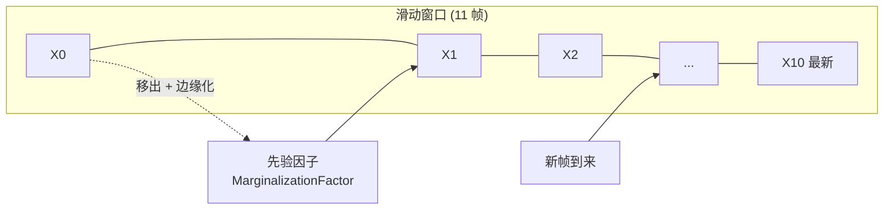
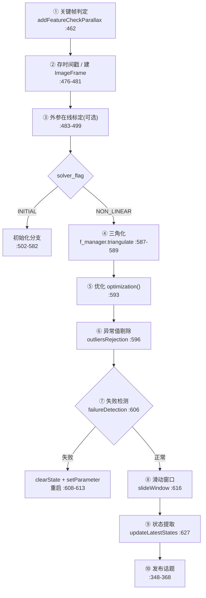
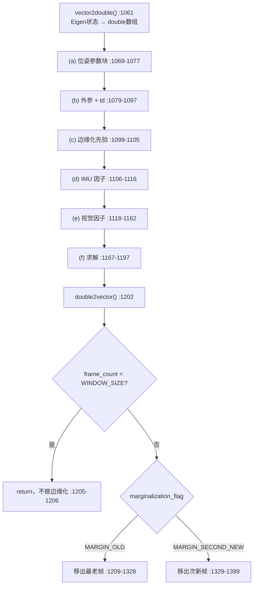
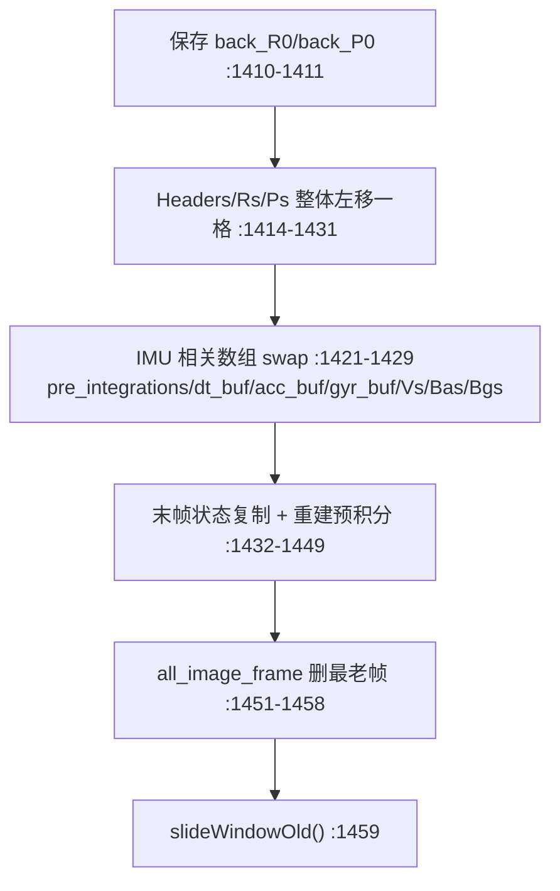

# 3. 紧耦合 VIO 后端 (Tightly-coupled VIO)

> **系列导航**：[1.测量预处理](1.meapreprocess.md) → [2.系统初始化](2.systeminit.md) → **本文** → [4.回环与重定位](4.relocalization.md) → [5.全局PGO](5.globalPGO.md)
>
> **文档定位**：整个 VINS 系统的**心脏**。前面两篇把数据准备好了，这一篇用**滑动窗口 + 因子图 + Ceres** 把视觉和 IMU 放进同一个优化问题里联合求解。
>
> 对应 VINS-Mono / VINS-Fusion 论文第 VI 节 *Tightly-Coupled Monocular VIO*。

---

## 0. 这一层的核心思想

"紧耦合"三个字是与"松耦合"相对立的：

| | 松耦合 | **紧耦合（本系统）** |
|---|---|---|
| 做法 | 视觉算一个位姿、IMU 算一个位姿，再融合两个结果 | 把视觉残差和 IMU 残差**同时**放进一个优化问题 |
| 信息利用 | 视觉的内部约束被丢弃 | 每个特征点的每次观测都是独立约束 |
| 实现 | 卡尔曼滤波融合 | **因子图 + 非线性最小二乘** |

本层产出的东西：每一帧的 **位姿、速度、IMU 偏置**，以及每个特征点的 **逆深度**。

### 0.1 为什么需要滑动窗口

完整的批量优化（BA）代价随帧数增长而爆炸。VINS 采用**固定长度滑动窗口**（`WINDOW_SIZE = 10`，即 11 帧）：
- 新帧进来 → 最老/次新帧被移出
- 移出时要**保留它携带的信息** → 这就是**边缘化**



---

## 1. 处理流程总览

### 1.1 单帧完整流程（10 步）

`Estimator::processImage()`（`estimator.cpp:454`）是后端总入口。



| 步骤 | 位置 | 说明 |
|---|---|---|
| ① 关键帧判定 | `:462-471` | 调 `addFeatureCheckParallax()` 得到 `marginalization_flag` |
| ② 建 ImageFrame | `:476-481` | 存头时间戳，把预积分挂到本帧，新建预积分器 |
| ③ 外参标定 | `:483-499` | 仅 `ESTIMATE_EXTRINSIC == 2` 时（见第 2 篇 §5） |
| ④ 三角化 | `:587-589` | 无 IMU 时先 `initFramePoseByPnP()` |
| ⑤ **优化** | `:593` | `optimization()` ★核心 |
| ⑥ 异常值剔除 | `:596-603` | `outliersRejection()` + `f_manager.removeOutlier()` |
| ⑦ 失败检测 | `:606-614` | `failureDetection()` —— **注意当前恒为 false**，见 §6 |
| ⑧ 滑动窗口 | `:616-617` | `slideWindow()` + `f_manager.removeFailures()` |
| ⑨ 状态提取 | `:619-627` | `updateLatestStates()`，含 IMU 快速预测 |
| ⑩ 发布 | `:348-368` | 里程计/路径/点云/关键帧 |

### 1.2 关键帧判定（决定边缘化策略）

`FeatureManager::addFeatureCheckParallax()`（`feature_manager.cpp:52`）的返回值直接决定滑窗策略：

```cpp
// feature_manager.cpp:95-96
if (frame_count < 2 || last_track_num < 20 || long_track_num < 40 || new_feature_num > 0.5 * last_track_num)
    return true;                     // ← 直接判为关键帧 → MARGIN_OLD
...
// feature_manager.cpp:117
return parallax_sum / parallax_num >= MIN_PARALLAX;   // ← 视差够大才是关键帧
```

| 返回值 | `marginalization_flag` | 动作 |
|---|---|---|
| `true` | `MARGIN_OLD = 0` | 关键帧 → 移出**最老帧** |
| `false` | `MARGIN_SECOND_NEW = 1` | 非关键帧 → 移出**次新帧** |

**设计逻辑**：如果新帧与上一帧视差很小（几乎是原地），说明它没带来新信息，那就把**上一帧**丢出去、保留新帧；反之则把最老帧丢出去。这样窗口里始终保留信息量最大的帧。

`MIN_PARALLAX` 的换算在 `parameters.cpp:119-120`（`keyframe_parallax / FOCAL_LENGTH`）。

---

## 2. optimization() 逐段拆解

`Estimator::optimization()`（`estimator.cpp:1058-1402`）共约 350 行，是全项目最长的函数。结构上分成 **6 个部分 + 2 条边缘化分支**。



### (a) 位姿参数块

```cpp
// estimator.cpp:1069-1077
for (int i = 0; i < frame_count + 1; i++)
{
    ceres::LocalParameterization *local_parameterization = new PoseLocalParameterization();
    problem.AddParameterBlock(para_Pose[i], SIZE_POSE, local_parameterization);   // 7 维，带流形
    if(USE_IMU)
        problem.AddParameterBlock(para_SpeedBias[i], SIZE_SPEEDBIAS);             // 9 维
}
if(!USE_IMU)
    problem.SetParameterBlockConstant(para_Pose[0]);      // :1076-1077 无 IMU 时固定首帧
```

| 参数块 | 维度 | 布局 |
|---|---|---|
| `para_Pose[i]` | `SIZE_POSE = 7` | `[px, py, pz, qx, qy, qz, qw]` |
| `para_SpeedBias[i]` | `SIZE_SPEEDBIAS = 9` | `[vx, vy, vz, bax, bay, baz, bgx, bgy, bgz]` |
| `para_Feature[k]` | `SIZE_FEATURE = 1` | 逆深度 |
| `para_Ex_Pose[c]` | `SIZE_POSE = 7` | IMU→相机外参 |
| `para_Td` | `1` | 时间偏移 |

尺寸常量定义在 `parameters.h:80-85`。

**`PoseLocalParameterization`**（`pose_local_parameterization.cpp:12-28`）把 7 维四元数块映射到 6 维切空间，避免"四元数模长必须为 1"这个约束破坏最小二乘的线性化假设。

**为什么 `!USE_IMU` 时要固定首帧？** 纯视觉没有 IMU 提供的绝对重力/尺度参考，整个系统有一个不可观的全局自由度（4-DoF：3 平移 + 1 yaw）。固定第一帧来消除这个自由度。

### (b) 外参 + 时间偏移

```cpp
// estimator.cpp:1079-1097
for (int i = 0; i < NUM_OF_CAM; i++)
{
    ceres::LocalParameterization *local_parameterization = new PoseLocalParameterization();
    problem.AddParameterBlock(para_Ex_Pose[i], SIZE_POSE, local_parameterization);
    if ((ESTIMATE_EXTRINSIC && frame_count == WINDOW_SIZE && Vs[0].norm() > 0.2) || openExEstimation)
        openExEstimation = 1;
    else
        problem.SetParameterBlockConstant(para_Ex_Pose[i]);      // :1091 外参固定
}
problem.AddParameterBlock(para_Td[0], 1);
if (!ESTIMATE_TD || Vs[0].norm() < 0.2)
    problem.SetParameterBlockConstant(para_Td[0]);               // :1097 td 固定
```

**门控条件 `Vs[0].norm() > 0.2`**：速度太小说明可能静止或运动不充分，此时外参/td 不可观，强行优化会发散。这是一个很实用的工程保护。

### (c) 边缘化先验

```cpp
// estimator.cpp:1099-1105
if (last_marginalization_info && last_marginalization_info->valid)
{
    MarginalizationFactor *marginalization_factor = new MarginalizationFactor(last_marginalization_info);
    problem.AddResidualBlock(marginalization_factor, NULL, last_marginalization_parameter_blocks);
}
```

> **注意这里传的是 `NULL` 而不是 `loss_function`**。先验因子代表的是已经线性化过的历史信息，**套不上鲁棒核**——套了反而会破坏 FEJ 一致性。

### (d) IMU 因子

```cpp
// estimator.cpp:1106-1116
if(USE_IMU)
{
    for (int i = 0; i < frame_count; i++)
    {
        int j = i + 1;
        if (pre_integrations[j]->sum_dt > 10.0)     // :1111 跳过异常长的预积分
            continue;
        IMUFactor* imu_factor = new IMUFactor(pre_integrations[j]);
        problem.AddResidualBlock(imu_factor, NULL, para_Pose[i], para_SpeedBias[i],
                                                 para_Pose[j], para_SpeedBias[j]);   // :1114
    }
}
```

**判定规则**：滑动窗口内**所有相邻帧对**都会建立 IMU 约束，除非预积分时长 > 10 秒（说明中间丢了数据，不可信）。

### (e) 视觉因子

```cpp
// estimator.cpp:1118-1162
int f_m_cnt = 0;
int feature_index = -1;
for (auto &it_per_id : f_manager.feature)
{
    it_per_id.used_num = it_per_id.feature_per_frame.size();
    if (it_per_id.used_num < 4)  continue;        // ★ 至少 4 帧观测
    ++feature_index;

    int imu_i = it_per_id.start_frame;
    int imu_j = imu_i - 1;
    Vector3d pts_i = it_per_id.feature_per_frame[0].point;

    for (auto &it_per_frame : it_per_id.feature_per_frame)
    {
        imu_j++;
        if (imu_i != imu_j) {
            // ★ 两帧单目因子 :1140
            ProjectionTwoFrameOneCamFactor *f = new ProjectionTwoFrameOneCamFactor(...);
            problem.AddResidualBlock(f, loss_function, para_Pose[imu_i], para_Pose[imu_j],
                                     para_Ex_Pose[0], para_Feature[feature_index], para_Td[0]);
        }
        if(STEREO && it_per_frame.is_stereo) {
            if(imu_i != imu_j)
                → ProjectionTwoFrameTwoCamFactor    // :1150 左i → 右j
            else
                → ProjectionOneFrameTwoCamFactor    // :1156 同帧 左→右
        }
        f_m_cnt++;
    }
}
```

**约束创建规则**：

```
特征点 F_k 的观测集合 = {(帧a, 左), (帧a, 右), (帧b, 左), (帧b, 右), ...}

∀ 跨帧观测对 (帧a, 帧b), a ≠ b:
    → ProjectionTwoFrameOneCamFactor(左_a → 左_b)          [条件: 该特征 ≥4 帧观测]
    → ProjectionTwoFrameTwoCamFactor(左_a → 右_b)          [if 右_b 存在]

∀ 同帧观测对 (帧a):
    → ProjectionOneFrameTwoCamFactor(左_a → 右_a)          [if 右_a 存在]
```

> **`used_num < 4` 是个硬门槛**：观测太少的特征逆深度不可观，强行优化会引入噪声。这是视觉因子数量与质量之间的平衡点。

### (f) 求解配置

```cpp
// estimator.cpp:1167-1197
ceres::Solver::Options options;

if (USE_GPU_CERES)
{
#if CERES_VERSION_MAJOR >= 3 || (CERES_VERSION_MAJOR >= 2 && CERES_VERSION_MINOR >= 1)
    options.dense_linear_algebra_library_type = ceres::CUDA;     // :1173  仅 Ceres ≥ 2.1
#else
    // Ceres < 2.1 does not support CUDA; fall back to DENSE_SCHUR
    options.linear_solver_type = ceres::DENSE_SCHUR;             // :1176  ★本环境走这里
#endif
}
else
    options.linear_solver_type = ceres::DENSE_SCHUR;             // :1181

options.trust_region_strategy_type = ceres::DOGLEG;              // :1184
options.max_num_iterations = NUM_ITERATIONS;                     // :1185  默认 8

if (marginalization_flag == MARGIN_OLD)
    options.max_solver_time_in_seconds = SOLVER_TIME * 4.0 / 5.0;   // :1192  关键帧给多点时间
else
    options.max_solver_time_in_seconds = SOLVER_TIME;               // :1194

ceres::Solve(options, &problem, &summary);                       // :1197
double2vector();                                                 // :1202 写回
if(frame_count < WINDOW_SIZE) return;                            // :1205-1206 未满窗不边缘化
```

| 配置项 | 值 | 理由 |
|---|---|---|
| 线性求解器 | `DENSE_SCHUR` | 滑窗问题天然稀疏，Schur 补加速 |
| 信赖域 | `DOGLEG` | 比 LM 更省内存，适合实时 |
| 最大迭代 | `NUM_ITERATIONS = 8` | 平衡精度与实时性 |
| 时间上限 | `SOLVER_TIME = 0.04s`（关键帧 ×0.8） | 硬性保证实时性 |

> **本环境特别注意**：`USE_GPU_CERES` 即使配成 1，Ceres 2.0 也不支持 `ceres::CUDA`，会走 `:1176` 回退到 `DENSE_SCHUR`。这就是 `docs/problem/005-ceres-cuda-not-available.md` 记录的问题。

### 2.1 6 个残差因子汇总

| 因子 | 残差维 | 参数块构成 | 残差表达式位置 | 求导 |
|---|---|---|---|---|
| `IMUFactor` | **15** | `(Pose_i7, SB_i9, Pose_j7, SB_j9)` | `imu_factor.h:87→integration_base.h:208-216` | 解析 |
| `ProjectionTwoFrameOneCamFactor` | **2** | `(Pose_i7, Pose_j7, Ex0_7, inv_depth1, td1)` | `projectionTwoFrameOneCamFactor.cpp:73` | 解析 |
| `ProjectionTwoFrameTwoCamFactor` | **2** | `(Pose_i7, Pose_j7, Ex0_7, Ex1_7, inv_depth1, td1)` | `projectionTwoFrameTwoCamFactor.cpp:77` | 解析 |
| `ProjectionOneFrameTwoCamFactor` | **2** | `(Ex0_7, Ex1_7, inv_depth1, td1)` | `projectionOneFrameTwoCamFactor.cpp:70` | 解析 |
| `MarginalizationFactor` | 动态 | 保留参数块 | `marginalization_factor.cpp:383` | 解析 |
| `ProjectionFactor` | **2** | `(Pose_i7, Pose_j7, Ex7, inv_depth1)` | `projection_factor.cpp:55` | 解析（**未被使用**） |

因子维度（基类声明，`grep SizedCostFunction` 可一次看全）：

```cpp
class IMUFactor                      : public ceres::SizedCostFunction<15, 7, 9, 7, 9>;        // imu_factor.h:37
class ProjectionTwoFrameOneCamFactor : public ceres::SizedCostFunction<2, 7, 7, 7, 1, 1>;        // projectionTwoFrameOneCamFactor.h:33
class ProjectionTwoFrameTwoCamFactor : public ceres::SizedCostFunction<2, 7, 7, 7, 7, 1, 1>;     // projectionTwoFrameTwoCamFactor.h:34
class ProjectionOneFrameTwoCamFactor : public ceres::SizedCostFunction<2, 7, 7, 1, 1>;           // projectionOneFrameTwoCamFactor.h:32
class ProjectionFactor               : public ceres::SizedCostFunction<2, 7, 7, 7, 1>;           // projection_factor.h:30
```

### 2.2 IMU 因子的实现细节

```cpp
// imu_factor.h:80-92
if ((Bai - pre_integration->linearized_ba).norm() > 0.10 ||
    (Bgi - pre_integration->linearized_bg).norm() > 0.01)
{
    pre_integration->repropagate(Bai, Bgi);          // :82  bias 漂移过大 → 重播
}

Eigen::Map<Eigen::Matrix<double, 15, 1>> residual(residuals);
residual = pre_integration->evaluate(Pi, Qi, Vi, Bai, Bgi,
                                     Pj, Qj, Vj, Baj, Bgj);      // :87-88
Eigen::Matrix<double, 15, 15> sqrt_info =
    Eigen::LLT<Eigen::Matrix<double, 15, 15>>(pre_integration->covariance.inverse()).matrixL().transpose();  // :90
residual = sqrt_info * residual;                                  // :92  ★马氏距离加权
```

**`:90` 是"紧耦合"的精髓之一**：用预积分协方差的 Cholesky 分解作为信息矩阵对残差加权。协方差小（IMU 数据可靠）→ 权重大 → 该约束在优化中说话更有分量。

`sqrt_info` 矩阵与"预积分协方差"的推导详见 [`docs/imu_factor.md`](../imu_factor.md)。

### 2.3 视觉因子的实现细节

```cpp
// projectionTwoFrameOneCamFactor.cpp:66-75
#ifdef UNIT_SPHERE_ERROR
    residual = tangent_base * (pts_camera_j.normalized() - pts_j_td.normalized());
#else
    double dep_j = pts_camera_j.z();
    residual = (pts_camera_j / dep_j).head<2>() - pts_j_td.head<2>();    // :73  ★归一化平面残差
#endif
residual = sqrt_info * residual;                                          // :75
```

其中 `pts_j_td` 含**时间偏移补偿**：

```cpp
// projectionTwoFrameOneCamFactor.cpp:60-61 附近
pts_i_td = pts_i - (td - td_i) * velocity_i;    // 卷帘快门 / 时间戳偏移补偿
pts_j_td = pts_j - (td - td_j) * velocity_j;
```

`sqrt_info` 在 `estimator.cpp:112-114` 由 `FOCAL_LENGTH / 1.5` 初始化，把"归一化平面上的残差"换算成"像素级残差"。

---

## 3. 边缘化（本层最难的部分）

### 3.1 为什么要边缘化

滑窗移动时，被移出的帧**不能直接删掉**——它和窗口内其他帧之间的约束包含了历史信息。直接删除会导致信息丢失，轨迹会在滑窗处"跳变"。

**解法**：用 Schur 补把被移出变量消掉，同时把它的信息**压缩成一个先验因子**加回优化问题。

### 3.2 数学原理

把优化问题按"要删的变量 $\mathbf{x}_m$"和"保留的变量 $\mathbf{x}_r$"分块：

$$
\begin{bmatrix} \mathbf{H}_{mm} & \mathbf{H}_{mr} \\ \mathbf{H}_{rm} & \mathbf{H}_{rr} \end{bmatrix}
\begin{bmatrix} \delta\mathbf{x}_m \\ \delta\mathbf{x}_r \end{bmatrix} =
\begin{bmatrix} \mathbf{b}_m \\ \mathbf{b}_r \end{bmatrix}
$$

消去 $\delta\mathbf{x}_m$ 得**舒尔补**：

$$
\underbrace{(\mathbf{H}_{rr} - \mathbf{H}_{rm}\mathbf{H}_{mm}^{-1}\mathbf{H}_{mr})}_{\mathbf{H}_{prior}} \delta\mathbf{x}_r
= \underbrace{\mathbf{b}_r - \mathbf{H}_{rm}\mathbf{H}_{mm}^{-1}\mathbf{b}_m}_{\mathbf{b}_{prior}}
$$

这个 $\mathbf{H}_{prior}$ 和 $\mathbf{b}_{prior}$ 就是被压缩的历史信息。

### 3.3 两条边缘化分支

**MARGIN_OLD**（`estimator.cpp:1209-1328`）—— 移出最老帧（关键帧情形）：

1. 把上一轮先验作为新 `ResidualBlockInfo` 加入，`drop_set` 指向 `para_Pose[0]` / `para_SpeedBias[0]`（`:1214-1229`）
2. 加入 `pre_integrations[1]` 的 IMU 因子，`drop_set = {0, 1}`（`:1231-1241`）
3. 加入 `start_frame == 0` 的视觉因子，`drop_set = {0,3}`（两帧单目）/ `{0,4}`（两帧双目）/ `{2}`（单帧双目）（`:1243-1296`）
4. `preMarginalize()`（`:1299`）→ **`marginalize()`（`:1303`）** ★
5. 构造 `addr_shift`：`para_Pose[i] → para_Pose[i-1]`（`:1306-1316`）
6. `getParameterBlocks(addr_shift)`（`:1318`）得到新先验的参数块，存为 `last_marginalization_info`（`:1320-1326`）

**MARGIN_SECOND_NEW**（`estimator.cpp:1329-1399`）—— 移出次新帧（非关键帧情形）：

```cpp
// estimator.cpp:1331-1333   只有次新帧已在先验中才执行
if (last_marginalization_info &&
    std::count(std::begin(last_marginalization_parameter_blocks),
               std::end(last_marginalization_parameter_blocks), para_Pose[WINDOW_SIZE - 1]))
```

`addr_shift` 中 `WINDOW_SIZE-1` 被跳过、`WINDOW_SIZE` 移到 `WINDOW_SIZE-1`（`:1365-1382`）。

### 3.4 Schur 补的核心实现

`MarginalizationInfo::marginalize()`（`marginalization_factor.cpp:188-316`）：

```cpp
// marginalization_factor.cpp:299-300   ★★ 全篇最核心的两行
A = Arr - Arm * Amm_inv * Amr;
b = brr - Arm * Amm_inv * bmm;
```

`Amm_inv` 用特征值分解求伪逆（带 `eps = 1e-8` 阈值截断），避免奇异：

```cpp
// marginalization_factor.cpp:302-310
Eigen::SelfAdjointEigenSolver<Eigen::MatrixXd> saes2(A);
Eigen::VectorXd S = Eigen::VectorXd((saes2.eigenvalues().array() > eps).select(saes2.eigenvalues().array(), 0));
Eigen::VectorXd S_inv = Eigen::VectorXd((saes2.eigenvalues().array() > eps).select(saes2.eigenvalues().array().inverse(), 0));
Eigen::VectorXd S_sqrt = S.cwiseSqrt();
Eigen::VectorXd S_inv_sqrt = S_inv.cwiseSqrt();

linearized_jacobians = S_sqrt.asDiagonal() * saes2.eigenvectors().transpose();            // :309
linearized_residuals = S_inv_sqrt.asDiagonal() * saes2.eigenvectors().transpose() * b;    // :310
```

`linearized_jacobians` / `linearized_residuals` 就是压缩后的先验，下一轮在 `optimization()` 的 `:1099-1105` 作为 `MarginalizationFactor` 重新加入。

### 3.5 FEJ（First-Estimate Jacobian）机制

边缘化有个著名陷阱：如果被边缘化的变量在不同轮次用了**不同的线性化点**，会产生虚假信息（information gain），导致系统过度自信。

本系统的应对（代码里没有 "FEJ" 注释，但机制存在）：

| 机制 | 位置 |
|---|---|
| 预积分雅可比固定在线性化 bias 处 | `integration_base.h:205-206`（`dba = Bai - linearized_ba`） |
| 先验残差相对保存的 `x0` 计算 `dx = x - x0` | `marginalization_factor.cpp:365-382` |
| 四元数取最短路径（`positify`）保证切空间一致 | `marginalization_factor.cpp:376-380` |

---

## 4. 异常值剔除

`Estimator::outliersRejection()`（`estimator.cpp:1589-1647`）：

```cpp
// estimator.cpp:1577-1587  reprojectionError() 计算单个观测的重投影误差
// estimator.cpp:1642-1644
double ave_err = err / errCnt;
if(ave_err * FOCAL_LENGTH > 3)          // ★ 平均重投影误差 > 3 像素 → 判为离群
    removeIndex.insert(it_per_id.feature_id);
```

| 步骤 | 位置 |
|---|---|
| 计算重投影误差 `reprojectionError()` | `estimator.cpp:1577-1587` |
| 累加所有观测的误差 | `:1610-1612`（单目）、`:1624-1639`（双目） |
| **阈值判定** | **`:1643`** —— `ave_err * FOCAL_LENGTH > 3` |
| 实际删除 | `f_manager.removeOutlier()`（`estimator.cpp:598` → `feature_manager.cpp:433-448`） |
| 同步删前端点 | `featureTracker.removeOutliers()`（`estimator.cpp:601`） |

**深度相关的剔除走另一条路**：`double2vector()` 把优化后的深度写回时调用 `f_manager.setDepth()`（`estimator.cpp:1000-1002`），`setDepth` 对 `estimated_depth < 0` 的特征置 `solve_flag = 2`（`feature_manager.cpp:151-158`），随后 `f_manager.removeFailures()`（`estimator.cpp:617`；实现 `feature_manager.cpp:162-171`）清除这些特征。

---

## 5. 滑动窗口 slideWindow()

`Estimator::slideWindow()`（`estimator.cpp:1404-1500`）。

### 5.1 MARGIN_OLD 分支（`:1407-1461`）



核心移位代码：`Ps/Rs` 移位 `:1417-1418`，`Vs/Bas/Bgs` 移位 `:1427-1429`，`Headers` 移位 `:1416`。

`slideWindowOld()`（`:1508-1525`）在 `NON_LINEAR` 时调 `f_manager.removeBackShiftDepth(R0, P0, R1, P1)`（`:1521`），把特征深度**随参考系变换迁移**到新参考帧（实现 `feature_manager.cpp:450-488`）。

### 5.2 MARGIN_SECOND_NEW 分支（`:1462-1499`）

与 OLD 的**关键区别**：不做状态整体移位，而是把被滑帧的**IMU 数据合并进前一帧**：

```cpp
// estimator.cpp:1472-1483  预积分合并
for (auto &it : dt_buf[frame_count])
    pre_integrations[frame_count - 1]->push_back(it, ...);
```

同时把 `Vs/Bas/Bgs` 从 `frame_count` 复制到 `frame_count-1`（`:1485-1487`），然后调 `slideWindowNew()`（`:1497` → `:1502-1506`），内部是 `f_manager.removeFront(frame_count)`。

**为什么要合并预积分？** 因为次新帧被删了，但"最老帧→次新帧→最新帧"的 IMU 约束必须保留，所以把两段预积分拼成一段。

---

## 6. 失败检测（当前已禁用）

```cpp
// estimator.cpp:1009-1011
bool Estimator::failureDetection()
{
    return false;                    // ★★ 第一行就返回！后面的判据全部不可达
    if (f_manager.last_track_num < 2)
    ...
}
```

**这是本移植版最重要的一处"坑"**。后面那些判据都还在，但**永远执行不到**：

| 判据 | 位置 | 状态 |
|---|---|---|
| `last_track_num < 2` | `:1012-1016` | 不可达 |
| `Bas[WINDOW_SIZE].norm() > 2.5` | `:1017-1021` | 不可达 |
| `Bgs[WINDOW_SIZE].norm() > 1.0` | `:1022-1026` | 不可达 |
| 位置跳变 > 5 | `:1034-1039` | 已注释 |
| z 向跳变 > 1 | `:1040-1044` | 已注释 |
| 姿态跳变 > 50° | `:1045-1054` | 已注释 |

调用点仍在：`processImage()` 中 `if (failureDetection())`（`:606`）→ `clearState(); setParameter(); return;`（`:608-613`）。**由于恒返回 false，系统实际上永远不会自动重启。**

> 实践中如果 VIO 发散（例如快速旋转、强光变化、遮挡），系统不会自愈。需要手动 `ros2 topic pub /vins_restart` 或重新启动节点。

---

## 7. 核心代码在哪里

### 7.1 文件职责表

| 文件 | 职责 | 核心函数（行号） |
|---|---|---|
| `vins/src/estimator/estimator.cpp` | **后端全部逻辑** | `optimization:1058`, `slideWindow:1404`, `processImage:454`, `outliersRejection:1589`, `failureDetection:1009`, `vector2double:869`, `double2vector:921` |
| `vins/src/estimator/estimator.h` | 状态定义、Ceres 参数数组 | `Ps/Vs/Rs/Bas/Bgs:120-124`, `pre_integrations:131`, `para_*:156-162`, `last_marginalization_*:166-167` |
| `vins/src/estimator/feature_manager.cpp` | 关键帧判定、三角化、滑窗维护 | `addFeatureCheckParallax:52`, `triangulate:302`, `setDepth:142`, `removeBackShiftDepth:450`, `removeFront:508` |
| `vins/src/factor/imu_factor.h` | IMU 残差因子 | `SizedCostFunction<15,7,9,7,9>:37`, `Evaluate:80-92` |
| `vins/src/factor/projection*.h/.cpp` | 四类视觉重投影因子 | 见 §2.1 表 |
| `vins/src/factor/marginalization_factor.cpp` | 边缘化 / Schur 补 | `marginalize:188`, **Schur 补:299-300** |
| `vins/src/factor/pose_local_parameterization.cpp` | SE(3) 流形 | `:12-28` |
| `vins/src/estimator/parameters.h` | 常量、枚举 | `WINDOW_SIZE:28`, `SIZE_*:80-85`, `StateOrder:87-94` |

### 7.2 调用链

```
estimator.cpp:454   processImage()
  ├ :462     f_manager.addFeatureCheckParallax()   → feature_manager.cpp:52
  │             └ :95-96  早退条件（直接判关键帧）
  │             └ :117    视差比较 → 决定 marginalization_flag
  ├ :587     f_manager.triangulate()               → feature_manager.cpp:302
  ├ :593     optimization()                        ★★★ 核心
  │    ├ :1061   vector2double()
  │    ├ :1069-1077  位姿参数块
  │    ├ :1079-1097  外参 + td
  │    ├ :1099-1105  边缘化先验
  │    ├ :1106-1116  IMU 因子（sum_dt>10 跳过 :1111）
  │    ├ :1118-1162  视觉因子（used_num<4 跳过）
  │    ├ :1167-1197  Ceres 求解配置
  │    ├ :1197   ceres::Solve()
  │    ├ :1202   double2vector()
  │    ├ :1209-1328  MARGIN_OLD  → marginalization_factor.cpp:299-300 (Schur)
  │    └ :1329-1399  MARGIN_SECOND_NEW
  ├ :596     outliersRejection()                   → :1589，阈值 :1643
  ├ :606     failureDetection()                    → :1009 恒 return false
  ├ :616     slideWindow()                         → :1404
  │    ├ :1407-1461  MARGIN_OLD + slideWindowOld() → :1508
  │    └ :1462-1499  MARGIN_SECOND_NEW + slideWindowNew() → :1502
  └ :627     updateLatestStates()                  → :1664
```

### 7.3 开发者如何快速定位核心代码

```bash
cd /home/ros/ros_ws/VINS_ROS2/src/VINS_ROS2/vins/src

# ① 后端所有关键函数（一次看全）
grep -n "^void Estimator::\|^bool Estimator::\|^Vector3d Estimator::" estimator/estimator.cpp

# ② optimization() 内部的 6 个段落
sed -n '1058,1206p' estimator/estimator.cpp

# ③ 边缘化两条分支的起点
grep -n "marginalization_flag == MARGIN_OLD\|MARGIN_SECOND_NEW" estimator/estimator.cpp

# ④ Schur 补核心（只有两行，但是全项目最关键的数学）
grep -n "A = Arr - Arm\|b = brr - Arm" factor/marginalization_factor.cpp
# → 299 300

# ⑤ 因子维度一次看全
grep -n "SizedCostFunction" factor/*.h
# → imu_factor.h:37              <15, 7, 9, 7, 9>
# → projectionTwoFrameOneCamFactor.h:33  <2, 7, 7, 7, 1, 1>
# → projectionTwoFrameTwoCamFactor.h:34  <2, 7, 7, 7, 7, 1, 1>
# → projectionOneFrameTwoCamFactor.h:32  <2, 7, 7, 1, 1>
# → projection_factor.h:30               <2, 7, 7, 7, 1>

# ⑥ 关键常量与阈值
grep -n "WINDOW_SIZE\|NUM_OF_F\|FOCAL_LENGTH\|MIN_PARALLAX\|SOLVER_TIME\|NUM_ITERATIONS" \
     estimator/parameters.h estimator/parameters.cpp

# ⑦ 失败检测现状（确认是否被禁用）
sed -n '1009,1012p' estimator/estimator.cpp

# ⑧ 马氏距离加权在哪
grep -n "sqrt_info" factor/imu_factor.h factor/projection*.cpp | head
```

### 7.4 推荐断点与观察变量

| 断点 | 观察变量 | 用途 |
|---|---|---|
| `estimator.cpp:593` | `frame_count`, `marginalization_flag`, `f_manager.getFeatureCount()` | 优化前的规模 |
| `estimator.cpp:1061`（`vector2double` 后） | `para_Pose[0..10]` | 初值是否合理 |
| `estimator.cpp:1162`（视觉因子加完） | `f_m_cnt` | 本轮有多少视觉约束 |
| **`estimator.cpp:1197`** | `summary.iterations.size()`, `summary.final_cost` | **优化是否收敛** |
| `estimator.cpp:1202`（`double2vector` 后） | `Ps[WINDOW_SIZE]`, `para_Feature[]` | 结果更新量、逆深度分布 |
| **`marginalization_factor.cpp:299-300`** | `Amm_inv` 奇异值、`m`, `n` 尺寸 | **边缘化是否退化** |
| `estimator.cpp:1407` / `:1462` | `marginalization_flag`, 移位前后 `Ps[0]` | 滑窗是否正确执行 |
| `estimator.cpp:1643` | `ave_err * FOCAL_LENGTH` 的分布 | 离群阈值是否合适 |
| `feature_manager.cpp:95` | `last_track_num`, `long_track_num`, `new_feature_num` | 关键帧判定是否合理 |
| `feature_manager.cpp:117` | `parallax_sum/parallax_num`, `MIN_PARALLAX` | 视差是否达标 |

**性能调试**：VINS 后端的主要耗时在 `optimization()`。若帧率上不去，依次检查：① 视觉因子数量 `f_m_cnt`（特征太多？）；② Ceres 迭代次数（是否经常跑满 8 次）；③ 边缘化的 `marginalize()` 耗时。

---

## 8. 常见改造入口

| 想改什么 | 文件:行号 | 关键符号 |
|---|---|---|
| 滑动窗口长度 | `parameters.h:28` | `WINDOW_SIZE`（改后须同步 `estimator.h:120-124/131/156-159` 数组维度） |
| 关键帧判定阈值 | `feature_manager.cpp:95`（早退）、`:117`（视差） | `MIN_PARALLAX`, `last_track_num`, `long_track_num` |
| 求解器类型 / 迭代 / 时限 | `estimator.cpp:1181`, `:1184`, `:1185`, `:1192`, `:1194` | `DENSE_SCHUR`, `DOGLEG`, `NUM_ITERATIONS`, `SOLVER_TIME` |
| **鲁棒核函数** | `estimator.cpp:1066` | `ceres::HuberLoss(1.0)`（改 Cauchy 见注释 `:1067`） |
| 特征最少观测帧数 | `estimator.cpp:1124` | `used_num < 4` |
| 离群剔除阈值 | `estimator.cpp:1643` | `ave_err * FOCAL_LENGTH > 3` |
| 是否优化外参 / td | `estimator.cpp:1083`, `:1096` | `ESTIMATE_EXTRINSIC`, `ESTIMATE_TD`, `openExEstimation` |
| 失败检测判据（重新启用） | `estimator.cpp:1011` | 删掉 `return false;` 并取消后续注释 |
| 边缘化策略 | `estimator.cpp:1209` / `:1329` | `MARGIN_OLD` / `MARGIN_SECOND_NEW` |
| **新增因子** | `estimator.cpp:1118-1162`（主优化）+ `:1243-1296`（边缘化） | 仿照 `ProjectionTwoFrameOneCamFactor` |
| 新增状态量 | `estimator.h:156-162` + `estimator.cpp:1069-1077` | `para_*` 数组 |

> ⚠️ **新增因子必须同时改两处**：主优化（`:1118-1162`）和边缘化的 `ResidualBlockInfo` 收集（`:1243-1296`）。只改前者会导致新因子的信息在滑窗时丢失，产生难以定位的漂移。这是 VINS 二次开发最常见的错误。

---

## 9. 参数速查

### 9.1 编译期常量（`vins/src/estimator/parameters.h`）

| 常量 | 值 | 位置 |
|---|---|---|
| `FOCAL_LENGTH` | 460.0 | `:27` |
| `WINDOW_SIZE` | 10 | `:28` |
| `NUM_OF_F` | 1000 | `:29` |
| `SIZE_POSE` | 7 | `:80-85` |
| `SIZE_SPEEDBIAS` | 9 | `:80-85` |
| `SIZE_FEATURE` | 1 | `:80-85` |
| `O_P/O_R/O_V/O_BA/O_BG` | 0/3/6/9/12 | `:87-94` |

### 9.2 运行时参数（config yaml → `parameters.cpp`）

| 参数 | 默认 | 含义 |
|---|---|---|
| `max_solver_time` | 0.04 | 单次求解时间上限（秒） |
| `max_num_iterations` | 8 | 最大迭代次数 |
| `keyframe_parallax` | 10.0 | 关键帧视差阈值（像素） |
| `estimate_td` | 0 | 是否在线估计时间偏移 |
| `estimate_extrinsic` | 0 | 外参处理方式（0/1/2） |

### 9.3 状态变量布局

```cpp
// estimator.h:120-125   每帧 5 组状态，长度均为 WINDOW_SIZE+1 = 11
Vector3d Ps[(WINDOW_SIZE + 1)];     // 位置
Vector3d Vs[(WINDOW_SIZE + 1)];     // 速度
Matrix3d Rs[(WINDOW_SIZE + 1)];     // 姿态（旋转矩阵）
Vector3d Bas[(WINDOW_SIZE + 1)];    // 加速度计偏置
Vector3d Bgs[(WINDOW_SIZE + 1)];    // 陀螺仪偏置
double td;                          // 时间偏移
```

### 9.4 Ceres 参数数组（`estimator.h:156-162`）

| 数组 | 维度 | 数量 | 说明 |
|---|---|---|---|
| `para_Pose[i]` | 7 | 11 | 位姿 |
| `para_SpeedBias[i]` | 9 | 11 | 速度 + 偏置 |
| `para_Feature[k]` | 1 | ≤1000 | 逆深度 |
| `para_Ex_Pose[c]` | 7 | 2 | 外参 |
| `para_Td[0]` | 1 | 1 | 时间偏移 |

---

## 10. 自测清单

- [ ] 为什么先验因子（`MarginalizationFactor`）不加鲁棒核，而视觉因子要加？
- [ ] `sum_dt > 10.0` 时跳过 IMU 因子的原因是什么？
- [ ] 特征点为什么要 `used_num >= 4` 才能参与优化？
- [ ] MARGIN_OLD 和 MARGIN_SECOND_NEW 的区别是什么？各自在什么条件下触发？
- [ ] MARGIN_SECOND_NEW 为什么要"合并预积分"？
- [ ] Schur 补消掉的是哪些变量？为什么不能直接删掉被滑出的帧？
- [ ] 为什么 `!USE_IMU` 时要固定第一帧位姿？
- [ ] 本版本 `failureDetection()` 的实际行为是什么？会带来什么后果？

**参考答案要点**：① 先验是已经线性化过的历史信息，其残差已经是二次型形式，再套鲁棒核会破坏 FEJ 一致性并导致虚假信息；而视觉因子面对的是原始观测，含真实外点，需要鲁棒核抑制。⑥ 消掉的是"被移出滑窗的帧的状态量"；直接删除会丢失该帧与窗口内其他帧之间的所有约束（尤其是它作为 `start_frame` 的那些特征点），导致轨迹在滑窗处跳变。
