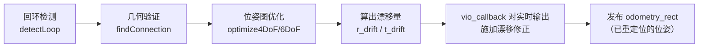
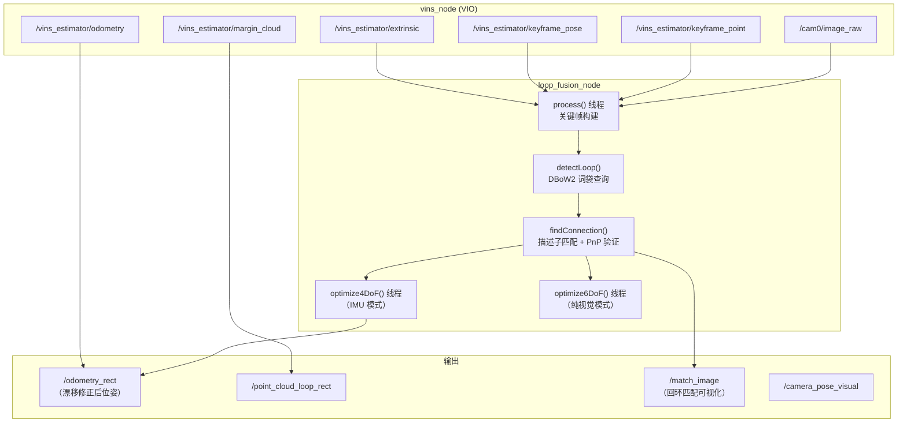
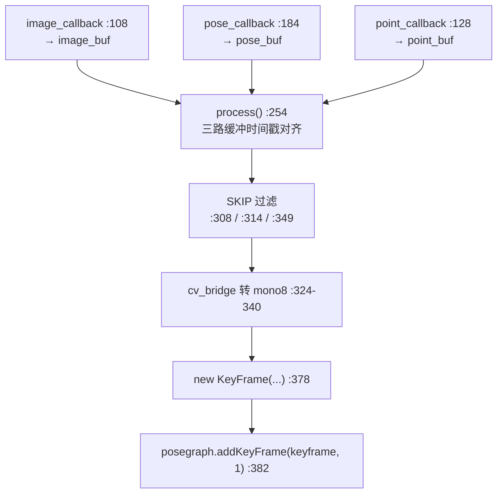
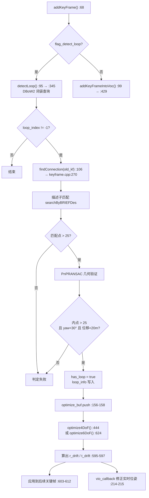
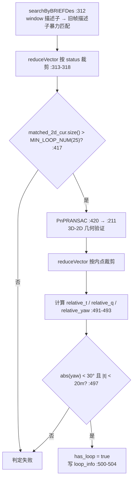

# 4. 回环检测与重定位 (Relocalization / loop_fusion)

> **系列导航**：[1.测量预处理](1.meapreprocess.md) → [2.系统初始化](2.systeminit.md) → [3.紧耦合VIO](3.tightvio.md) → **本文** → [5.全局PGO](5.globalPGO.md)
>
> **文档定位**：VIO 会累积漂移——跑了 1 公里之后回到起点，估计的位姿可能已经偏了几十米。本层的任务是**认出"我来过这里"**（回环检测），然后**把整条轨迹修正回来**（位姿图优化）。
>
> 对应 VINS-Fusion 论文第 VII 节 *Relocalization* + 第 VIII 节 *Global Pose Graph Optimization*（回环部分）。

---

## 0. ⚠️ 首先明确：本移植版的"重定位"实现方式

**这篇文档必须先把一个关键事实说清楚，否则读者会满仓库找一个不存在的函数。**

| 你可能在找 | 在本 ROS2 移植版中的实际情况 |
|---|---|
| `PoseGraph::relocalize()` | **不存在**。全仓库 `grep -rn "relocalize" loop_fusion/src` 无任何结果 |
| `PoseGraph::computeBOW()` | **不存在**。词袋向量在 `db.query()` 内部由 DBoW2 自动完成（`TemplatedDatabase.h:610-617`） |
| `PoseGraph::optimizeInitial()` / `optimizeInitialR()` | **不存在** |
| `KeyFrame::updateLoop()` | 有声明（`keyframe.h:80`）和实现（`keyframe.cpp:563-570`），但**从未被调用** |

**那么"重定位"这件事在本版本里是怎么完成的？**

原版 VINS-Mono 的 `relocalize()` 会做"用 PnP 恢复当前帧的全局位姿并回传给 VIO"。本移植版把这件事**做成了位姿图优化的副产物**：



也就是说：**没有独立的"重定位"函数，而是通过 `r_drift/t_drift` 对实时 VIO 输出做后处理偏移**（`pose_graph_node.cpp:211-215`）。效果上等价于重定位，实现上更简洁。

---

## 1. 处理流程总览

### 1.1 节点数据流

`loop_fusion_node` 是一个**独立进程**，通过 ROS2 话题与 `vins_node` 通信。



### 1.2 关键帧构建流程



### 1.3 回环检测与优化全流程



---

## 2. 关键帧构建

### 2.1 KeyFrame 的数据结构

`KeyFrame::KeyFrame(...)`（`keyframe.cpp:25-52`）：

```cpp
// keyframe.cpp:29-49 摘要
time_stamp / index                          // 时间戳与序号
vio_T_w_i / vio_R_w_i                       // ★ VIO 原始位姿（用于算 drift）
T_w_i / R_w_i                               // ★ 位姿图优化后的位姿
origin_vio_T / origin_vio_R                 // VIO 位姿副本（PnP 初值用）
image                                       // 图像（+80×60 缩略图 :38）
point_3d / point_2d_uv / point_2d_norm / point_id   // VIO 的特征点
has_loop / loop_index / loop_info           // 回环信息
keypoints / keypoints_norm                  // FAST 角点（:101-103 提取）
brief_descriptors / window_brief_descriptors // ★ BRIEF 描述子
bow_vector                                  // 词袋向量
computeWindowBRIEFPoint();                  // :48
computeBRIEFPoint();                        // :49
```

### 2.2 数据来源映射

| KeyFrame 字段 | 来源话题 | 解析位置 |
|---|---|---|
| `image` | `/cam0/image_raw` | `image_callback:108` → `process():324-340` |
| `vio_T_w_i/R_w_i` | `/vins_estimator/keyframe_pose` | `pose_callback:184` → `process():342-348` |
| `point_3d` | `/vins_estimator/keyframe_point` `.points` | `process():358-362` |
| `point_2d_normal` | 同上 channels `values[0..1]` | `process():366-367` |
| `point_2d_uv` | 同上 channels `values[2..3]` | `process():368-369` |
| `point_id` | 同上 channels `values[4]` | `process():370` |
| `tic/qic`（外参） | `/vins_estimator/extrinsic` | `extrinsic_callback:241-252` |

### 2.3 两种 BRIEF 描述子

这是理解回环匹配的关键——**一张关键帧有两套描述子，用途不同**：

| 描述子 | 提取方法 | 用途 | 位置 |
|---|---|---|---|
| `window_brief_descriptors` | 以 VIO 的 `point_2d_uv` 作为关键点提取 | **几何验证**（这些点有对应的 3D 坐标） | `computeWindowBRIEFPoint():86-96` |
| `brief_descriptors` | `cv::FAST` 角点（`fast_th = 20`）+ BRIEF | **词袋检索**（候选帧打分） | `computeBRIEFPoint():98-124` |

```cpp
// keyframe.cpp:101-115  computeBRIEFPoint()
cv::FAST(image, keypoints, fast_th, true);            // :101-103  fast_th = 20
...
extractor(image, keypoints, brief_descriptors);       // :115  BriefExtractor
// :116-123  用相机模型 liftProjective 归一化 → keypoints_norm
```

`BriefExtractor`（`keyframe.h:34-41`，实现 `keyframe.cpp:126-129`）加载 `brief_pattern.yml` 的 **256 组 test pairs**，与词袋训练时用的 pattern 必须一致，否则描述子不兼容。BRIEF 描述子长度 = **256 bit**（`DVision/BRIEF.h:44,61`）。

---

## 3. DBoW2 回环检测

`PoseGraph::detectLoop()`（`pose_graph.cpp:345-427`）。

### 3.1 检测步骤

```cpp
// pose_graph.cpp:358-393
QueryResults ret;
db.query(keyframe->brief_descriptors, ret, 4, frame_index - 50);   // :360 ★词袋查询
...
db.add(keyframe->brief_descriptors);                              // :365 先查后加，避免自匹配
...
if (ret.size() >= 1 && ret[0].Score > 0.05)                       // :389 最近邻得分阈值
    for (unsigned int i = 1; i < ret.size(); i++)
    {
        //if (ret[i].Score > ret[0].Score * 0.3)
        if (ret[i].Score > 0.015)                                 // :393 次近邻阈值
        {
            find_loop = true;
            ...
        }
    }
```

| 参数 | 值 | 含义 |
|---|---|---|
| 查询返回数 | `4` | 最多返回 4 个候选 |
| 排除最近帧 | `frame_index - 50` | 排除最近 50 帧（避免与刚经过的地方自匹配） |
| 最近邻阈值 | `0.05` | `ret[0].Score` 必须超过它才继续 |
| 次近邻阈值 | `0.015` | 其余候选中超过它的被认为是回环 |

**这两个阈值都是硬编码字面量**（没有命名变量），想调优就直接改 `pose_graph.cpp:389` 和 `:393`。

### 3.2 词袋查询内部做了什么

`db.query()` → `TemplatedDatabase::query(features, ...)` → `m_voc->transform(features, vec)`（`TemplatedDatabase.h:610-617`）生成 BowVector，再按 L1 范数打分：

| 项 | 值 | 位置 |
|---|---|---|
| 打分方式 | `L1_NORM` | `TemplatedVocabulary.h:51` |
| 权重方式 | `TF_IDF` | `TemplatedVocabulary.h:51` |
| 词袋文件 | `support_files/brief_k10L6.bin`（60MB） | **硬编码** `pose_graph_node.cpp:453-455` |
| k / L | 10 / 6（= 10⁶ 个叶子词） | 由 bin 文件内嵌 |
| 加载（direct index 关闭） | `db.setVocabulary(*voc, false, 0)` | `pose_graph.cpp:62-66` |

> ⚠️ **词袋路径是硬编码的**，不在 yaml 配置里：
> ```cpp
> // pose_graph_node.cpp:453-456
> std::string pkg_path = ament_index_cpp::get_package_share_directory("loop_fusion");
> string vocabulary_file = pkg_path + "/../support_files/brief_k10L6.bin";
> posegraph.loadVocabulary(vocabulary_file);
> ```
>
> 注意 `+ "/../support_files/"` —— 它要求这两个文件装在 **`share/support_files/`**，
> 即 `share/${PROJECT_NAME}` 的**兄弟**目录，而不是 `share/loop_fusion/` 里面。
> 对应的安装规则见 `loop_fusion/CMakeLists.txt`：
> ```cmake
> install(
>   FILES ../support_files/brief_k10L6.bin
>         ../support_files/brief_pattern.yml
>   DESTINATION share/support_files
> )
> ```
> 文件缺失时不会优雅报错：`VocabularyBinary::deserialize`
> （`ThirdParty/VocabularyBinary.cpp:27-35`）直接对读失败的长度做 `new Node[nNodes]`，
> 结果是崩溃或巨大内存分配。改完 CMake 记得 `colcon build --packages-select loop_fusion`。

> **启动方式**：`ros2 launch loop_fusion loop_fusion.launch.py`
> （`loop_fusion/launch/loop_fusion.launch.py`）。该 launch 会把输出话题重映射到
> `/pose_graph/*`，与 `config/vins_rviz_config.rviz` 里预置的 display 一致。
>
> ⚠️ 另有一处历史坑：`pose_graph_node.cpp` 原先用裸 `argc/argv` 取配置路径
> （不像 `vins/src/rosNodeTest.cpp:252` 那样先 `rclcpp::remove_ros_arguments`），
> 导致 **任何 `--ros-args`（任何重映射）都会让 `argc != 2`** → 误报用法并提前
> `return`，随后 `~PoseGraph()` 对从未启动的线程调 `detach()` 抛
> `std::system_error(invalid_argument)` 而 abort。即：**该节点原本无法被 launch 重映射**。
> 现已修正（`pose_graph_node.cpp:426` + `pose_graph.cpp:32`）。

### 3.3 候选筛选中的两个"兜底"判断

- 内层循环要求 `frame_index > 50`（`:414`）—— 前 50 帧不可能有回环
- 返回**最小的合法 `ret[i].Id`**（`:416-423`）—— 优先与**最早**的那个匹配建立回环

---

## 4. 几何验证 findConnection()

词袋只给出"看起来像"的候选，**必须几何验证**才能确认。核心在 `KeyFrame::findConnection()`（`keyframe.cpp:270-512`），这是本层最长的函数。

### 4.1 流程



### 4.2 描述子暴力匹配

```cpp
// keyframe.cpp:163-182  searchByBRIEFDes()
// 对每个 window_brief_descriptor，在旧帧的 brief_descriptors 中找汉明距离最小的
```

```cpp
// keyframe.cpp:140-153  searchInAera() 中的汉明距离阈值
int bestDist = 128;                 // :140  上界（256 位描述子的最大距离）
if(dis < bestDist) { bestDist = dis; ... }   // :146-148
...
if (bestIndex != -1 && bestDist < 80)        // :153  ★阈值 80
```

| 阈值 | 值 | 位置 |
|---|---|---|
| 汉明距离上界 | 80（初始 128） | `keyframe.cpp:140`, `:153` |
| 最少匹配点数 | `MIN_LOOP_NUM = 25` | `keyframe.h:27` |

### 4.3 PnP 几何验证（实际启用的方式）

```cpp
// keyframe.cpp:220-243  PnPRANSAC()
cv::Mat K = cv::Mat::eye(3, 3, CV_32F);        // :220  单位阵——因为输入已是归一化坐标
// :223-224  初值取当前帧的 VIO 位姿 + 外参
R_w_c = origin_vio_R * qic;
T_w_c = origin_vio_T + origin_vio_R * tic;
...
cv::solvePnPRansac(matched_3d, matched_2d_old_norm, K, D, rvec, t,
                   true, 100, 10.0 / 460.0, 0.99, inliers);      // :243
```

| 参数 | 值 | 位置 |
|---|---|---|
| 迭代次数 | `100` | `keyframe.cpp:237/241/243` |
| 重投影误差阈值 | `10.0 / 460.0`（归一化单位） | 同上 |
| 置信度 | `0.99` | 同上 |

> 注意 `:237`/`:241`/`:243` 三行是**按 OpenCV 版本分支**的三套调用（参数个数不同），实际只会走其中一条。

### 4.4 最终门限（最关键的一步）

```cpp
// keyframe.cpp:489-504
if ((int)matched_2d_cur.size() > MIN_LOOP_NUM)
{
    ...
    if (abs(relative_yaw) < 30.0 && relative_t.norm() < 20.0)   // :497  ★最终门限
    {
        has_loop = true;
        loop_index = old_kf->index;
        loop_info << relative_t.x(), relative_t.y(), relative_t.z(),
                     relative_q.w(), relative_q.x(), relative_q.y(), relative_q.z(),
                     relative_yaw;                              // :500-504
    }
}
```

**为什么还要 `|t| < 20m` 和 `|yaw| < 30°`？** 这是物理合理性检查——如果几何验证说"你瞬移了 100 米"，那几乎肯定是误匹配而非真回环。这两个阈值是抑制误回环的最后一道闸门。

### 4.5 另一种验证方式（已禁用）

```cpp
// keyframe.cpp:185-209  FundmantalMatrixRANSAC()
cv::findFundamentalMat(tmp_cur, tmp_old, cv::FM_RANSAC, 3.0, 0.9, status);   // :207
```

**该函数的调用点在 `keyframe.cpp:368-376` 被整段注释掉了**。所以本版本**只用 PnP 验证，F 矩阵验证未启用**。

### 4.6 阈值汇总表

| 阈值 | 值 | 位置 | 是否启用 |
|---|---|---|---|
| 回环最少匹配点 | `MIN_LOOP_NUM = 25` | `keyframe.h:27` | ✅ |
| 描述子汉明距离 | 80 | `keyframe.cpp:140,153` | ✅ |
| 最近邻 BoW 得分 | 0.05 | `pose_graph.cpp:389` | ✅ |
| 次近邻 BoW 得分 | 0.015 | `pose_graph.cpp:393,419` | ✅ |
| PnP 重投影误差 | 10.0/460.0 | `keyframe.cpp:237-243` | ✅ |
| 最终 yaw 门限 | 30.0° | `keyframe.cpp:497` | ✅ |
| 最终位移门限 | 20.0 m | `keyframe.cpp:497` | ✅ |
| F 矩阵 RANSAC | 3.0 / 0.9 | `keyframe.cpp:207` | ❌ 已注释 |

---

## 5. 位姿图优化

### 5.1 4-DoF vs 6-DoF 的选择

```cpp
// pose_graph.cpp:46-60
void PoseGraph::setIMUFlag(bool _use_imu)
{
    use_imu = _use_imu;
    if(use_imu) {
        threadOptimize = std::thread(&PoseGraph::optimize4DoF, this);    // :52  IMU 模式
    } else {
        threadOptimize = std::thread(&PoseGraph::optimize6DoF, this);    // :57  纯视觉模式
    }
}
```

由 config 的 `imu` 字段决定（`pose_graph_node.cpp:486-487`）：

| 配置 | 优化方式 | 理由 |
|---|---|---|
| `imu: 1` | **4-DoF**（yaw + 3 平移） | IMU 提供了可靠的 roll/pitch，只有 yaw 会漂移 |
| `imu: 0` | **6-DoF** | 纯视觉下所有 6 个自由度都可能漂移 |

### 5.2 残差因子

定义在 `pose_graph.h`：

| 类 | 行号 | 用途 | 残差维 |
|---|---|---|---|
| `AngleManifoldFunctor` | `:125-137` | 1 维角度流形（防止 yaw 跨 ±π 跳变） | — |
| `FourDOFError` | `:181-223` | 4-DoF **顺序边** | 4 |
| `FourDOFWeightError` | `:225-270` | 4-DoF **回环边**（带权重） | 4 |
| `RelativeRTError` | `:272-334` | 6-DoF 边（顺序 + 回环通用） | 6 |

**`FourDOFError`**（`:181-223`）：参数块 `(yaw_i[1], t_i[3], yaw_j[1], t_j[3])`
- 3 维平移残差：把世界系平移转到 i 系后相减（`:189-206`）
- 1 维 yaw 残差：`NormalizeAngle(yaw_j - yaw_i - relative_yaw)`（`:207`）

**`FourDOFWeightError`**（`:225-270`）：同上，但 yaw 残差额外 `/10.0` 加权（`:253`），用于回环边。

**`RelativeRTError`**（`:272-334`）：6 维残差 = 3 平移（`/t_var`）+ 3 旋转（`2*error_q[1..3]/q_var`）。

### 5.3 optimize4DoF() 逐段拆解

`pose_graph.cpp:444-621`：

```cpp
// pose_graph.cpp:468-484  参数化与求解配置
double t_array[max_length][3];          // :468  平移
Quaterniond q_array[max_length];        // :469  （定义但 4DoF 未用）
double euler_array[max_length][3];      // :470  ★ yaw 从这里取 euler_array[i][0]
double sequence_array[max_length];      // :471

ceres::Problem problem;
ceres::Solver::Options options;
options.linear_solver_type = ceres::SPARSE_NORMAL_CHOLESKY;   // :475
options.max_num_iterations = 5;                               // :478
ceres::LossFunction *loss_function;
loss_function = new ceres::HuberLoss(0.1);                    // :481
ceres::LocalParameterization* angle_manifold =
    AngleManifoldFunctor::Create();                           // :482-484  ★角度流形
```

```cpp
// pose_graph.cpp:511-518  参数块与首帧固定
problem.AddParameterBlock(euler_array[i], 1, angle_manifold);   // :511  只优化 yaw
problem.AddParameterBlock(t_array[i], 3);                       // :512

if ((*it)->index == first_looped_index || (*it)->sequence == 0)
{
    problem.SetParameterBlockConstant(euler_array[i]);          // :516  ★固定
    problem.SetParameterBlockConstant(t_array[i]);              // :517
}
```

**固定规则**：把**回环起点帧**和**第 0 段序列的帧**固定住——否则整个图有一个不可观的全局自由度（整体刚体变换）。

| 环节 | 行号 |
|---|---|
| 顺序边（与之前 1~4 帧连边） | `:520-536` |
| 回环边（`FourDOFWeightError`） | `:540-555` |
| `ceres::Solve` | `:563` |
| 写回优化结果 `updatePose` | `:573-588` |
| 计算 drift | `:590-598` |
| 应用到后续关键帧 | `:603-612` |
| `updatePath()` | `:614` |
| 循环节流 2000ms | `:617-618` |

### 5.4 漂移量计算 —— 把优化结果"传递"给 VIO

这是本层**最关键的一小段**，也是"重定位"效果的实际来源：

```cpp
// pose_graph.cpp:590-597
Vector3d cur_t, vio_t;
Matrix3d cur_r, vio_r;
cur_kf->getPose(cur_t, cur_r);          // :592  位姿图优化后的位姿
cur_kf->getVioPose(vio_t, vio_r);       // :593  VIO 原始位姿
m_drift.lock();
yaw_drift = Utility::R2ypr(cur_r).x() - Utility::R2ypr(vio_r).x();   // :595  ★只算 yaw 差
r_drift = Utility::ypr2R(Vector3d(yaw_drift, 0, 0));                 // :596
t_drift = cur_t - r_drift * vio_t;                                   // :597
m_drift.unlock();
```

**思路**：优化后的位姿与 VIO 原始位姿之间的差，就是"VIO 在这些帧上累积的漂移"。把这个漂移量算出来存成 `r_drift/t_drift`，就能应用到**任何** VIO 输出的帧上：

```cpp
// pose_graph.cpp:603-612  应用到滑窗中比回环帧更新的那些关键帧
for (; it != keyframelist.end(); it++)
{
    Vector3d P;
    Matrix3d R;
    (*it)->getVioPose(P, R);
    P = r_drift * P + t_drift;      // :610
    R = r_drift * R;                // :611
    (*it)->updatePose(P, R);
}
```

### 5.5 漂移量应用到实时 VIO 输出（等价的"重定位"）

```cpp
// pose_graph_node.cpp:209-215   vio_callback()
vio_t = posegraph.w_r_vio * vio_t + posegraph.w_t_vio;   // :211-212  先应用跨序列变换
vio_q = posegraph.w_r_vio * vio_q;
vio_t = posegraph.r_drift * vio_t + posegraph.t_drift;   // :214-215  ★再应用回环漂移修正
vio_q = posegraph.r_drift * vio_q;
...
pub_odometry_rect->publish(odometry);                    // :227  ★发布修正后的位姿
```

同样的修正也应用到点云（`pose_graph_node.cpp:153` 和 `:174`）。所以：

| 话题 | 内容 |
|---|---|
| `/vins_estimator/odometry` | VIO 原始输出（有漂移） |
| `/odometry_rect` | **回环修正后的输出**（"重定位"结果） |

### 5.6 optimize6DoF() 的差异

`pose_graph.cpp:624-790`，结构与 4DoF 相同，差异：

| | optimize4DoF | optimize6DoF |
|---|---|---|
| 旋转参数化 | `euler_array[i]`（1 维，角度流形） | `q_array[i]`（4 维，`QuaternionParameterization` `:662`） |
| 残差类 | `FourDOFError` / `FourDOFWeightError` | `RelativeRTError`（顺序+回环通用） |
| 边噪声方差 | — | `t_var = 0.1`, `q_var = 0.01`（`:708`, `:725`） |
| 首帧固定条件 | `:514-518` | `:690-694`（相同） |
| drift 计算 | 只更新 yaw（`:596`） | 完整旋转 `r_drift = cur_r * vio_r.transpose()`（`:766`） |

---

## 6. 位姿图持久化

### 6.1 保存 savePoseGraph()

`pose_graph.cpp:913-967`：

```cpp
// pose_graph.cpp:920
string file_path = POSE_GRAPH_SAVE_PATH + "pose_graph.txt";
```

主文件每行一个关键帧，**26 个字段**（`:937-945`）：

```
index, time_stamp,
VIO_Tx, VIO_Ty, VIO_Tz,           PG_Tx, PG_Ty, PG_Tz,
VIO_Qw, VIO_Qx, VIO_Qy, VIO_Qz,   PG_Qw, PG_Qx, PG_Qy, PG_Qz,
loop_index, loop_info[8],
keypoints_num
```

每个关键帧另存两个附属文件：

| 文件 | 内容 | 行号 |
|---|---|---|
| `<index>_briefdes.dat` | 二进制 BRIEF 描述子 | `:949-950, 956` |
| `<index>_keypoints.txt` | `pt.x pt.y norm.pt.x norm.pt.y` | `:951-953, 957-958` |
| `<index>_image.png` | 图像（仅 `DEBUG_IMAGE`） | `:927-931` |

### 6.2 加载 loadPoseGraph()

`pose_graph.cpp:968-1086`：

| 步骤 | 行号 |
|---|---|
| 打开 `pose_graph.txt` | `:972` |
| 逐行 `fscanf` 读 26 字段 | `:993-1001` |
| 重建 VIO / PG 的 T、R | `:1022-1036` |
| 读回描述子 / 关键点 | `:1047-1071` |
| `new KeyFrame(...)` | `:1075` |
| `loadKeyFrame(keyframe, 0)` | `:1076` —— **不触发回环检测**，只 `addKeyFrameIntoVoc` |

### 6.3 生效位置

```cpp
// pose_graph_node.cpp:481
LOAD_PREVIOUS_POSE_GRAPH = fsSettings["load_previous_pose_graph"];
...
// pose_graph_node.cpp:490-503   在启动订阅/线程之前加载
if (LOAD_PREVIOUS_POSE_GRAPH) {
    m_process.lock();
    posegraph.loadPoseGraph();
    m_process.unlock();
    load_flag = 1;
}
```

| 项 | 值 |
|---|---|
| 保存路径宏 | `POSE_GRAPH_SAVE_PATH`（`pose_graph_node.cpp:76`，读自 config `pose_graph_save_path`） |
| config 默认 | `pose_graph_save_path: "~/vins_output/pose_graph/"` |
| 交互保存 | 运行中按键盘 `s` → `savePoseGraph()` 后 shutdown（`command():399-405`） |
| 开启新序列 | 按键盘 `n` → `new_sequence()`（`:84-106`），`sequence++` |

---

## 7. 核心代码在哪里

### 7.1 文件职责表

| 文件 | 职责 | 核心函数（行号） |
|---|---|---|
| `loop_fusion/src/pose_graph_node.cpp` | ROS2 节点：收数据、同步、建关键帧 | `main:415`, `process:254`, `vio_callback:201`, `command:393` |
| `loop_fusion/src/pose_graph.cpp` | **位姿图核心** | `addKeyFrame:68`, `detectLoop:345`, `optimize4DoF:444`, `optimize6DoF:624`, `savePoseGraph:913`, `loadPoseGraph:968` |
| `loop_fusion/src/pose_graph.h` | 残差因子定义 | `FourDOFError:181`, `FourDOFWeightError:225`, `RelativeRTError:272`, `AngleManifoldFunctor:125` |
| `loop_fusion/src/keyframe.cpp` | **关键帧与几何验证** | `findConnection:270`, `PnPRANSAC:211`, `searchByBRIEFDes:163`, `searchInAera:132`, `computeBRIEFPoint:98` |
| `loop_fusion/src/keyframe.h` | KeyFrame 类、阈值 | `MIN_LOOP_NUM:27`, `BriefExtractor:34-41` |
| `loop_fusion/src/ThirdParty/DBoW/` | DBoW2 词袋库 | `TemplatedDatabase.h:610-617`（transform/query） |
| `loop_fusion/src/ThirdParty/DVision/BRIEF.h` | BRIEF 描述子 | `bitset:44`, 构造 `:61` |
| `support_files/brief_k10L6.bin` | 词袋文件（60MB） | 硬编码加载于 `pose_graph_node.cpp:453-456` |

### 7.2 调用链

```
pose_graph_node.cpp:415   main()
  ├ :419      posegraph.registerPub(n)
  ├ :453-456  加载词袋 brief_k10L6.bin
  ├ :486-487  setIMUFlag(USE_IMU)   → pose_graph.cpp:46  ┐
  ├ :490-503  loadPoseGraph()       → pose_graph.cpp:968 │ 优化线程在此启动
  ├ :505-510  订阅 6 个话题                               │
  ├ :513-517  发布 5 个话题                               │
  ├ :519-525  std::thread(process) + std::thread(command) │
  └ rclcpp::spin(n)                                       ┘

pose_graph_node.cpp:254   process() 线程主循环
  ├ :263-300  三路缓冲时间戳对齐（m_buf 锁）
  ├ :308      SKIP_FIRST_CNT = 10     跳过前 10 帧
  ├ :314      SKIP_CNT                周期跳过（main 里置 0）
  ├ :349      (T - last_t).norm() > SKIP_DIS   位移阈值（main 里置 0）
  ├ :324-340  cv_bridge → mono8
  ├ :342-348  取 T / R
  ├ :356-376  解析 point_3d / point_2d_uv / point_2d_normal / point_id
  ├ :378      new KeyFrame(...)
  └ :382      posegraph.addKeyFrame(keyframe, 1)          ★

pose_graph.cpp:68   addKeyFrame()
  ├ :95    detectLoop(cur_kf, cur_kf->index)   → pose_graph.cpp:345   ★
  │          ├ :360  db.query(..., 4, frame_index - 50)
  │          ├ :365  db.add(...)
  │          ├ :389  ret[0].Score > 0.05
  │          └ :393  ret[i].Score > 0.015
  ├ :106   cur_kf->findConnection(old_kf)      → keyframe.cpp:270    ★
  │          ├ :312  searchByBRIEFDes()
  │          │        └ searchInAera() → keyframe.cpp:132（汉明距离 < 80）
  │          ├ :417  matched_2d_cur.size() > MIN_LOOP_NUM(25)
  │          ├ :420  PnPRANSAC() → keyframe.cpp:211
  │          │        └ :243  cv::solvePnPRansac
  │          ├ :427-486  生成 match_image 可视化
  │          └ :497  abs(relative_yaw) < 30 && relative_t.norm() < 20   ★最终门限
  └ :156-158  optimize_buf.push(cur_kf->index)

pose_graph.cpp:444   optimize4DoF() 线程（while(true) + sleep 2000ms）
  ├ :468-484  参数化 + 求解配置
  ├ :489-509  填初值
  ├ :514-518  固定首帧
  ├ :520-536  顺序边 FourDOFError
  ├ :540-555  回环边 FourDOFWeightError
  ├ :563      ceres::Solve()
  ├ :573-588  updatePose()
  ├ :590-598  ★计算 yaw_drift / r_drift / t_drift
  ├ :603-612  应用到后续关键帧
  └ :614      updatePath()

pose_graph_node.cpp:201   vio_callback()   ← 每个 VIO 帧到达
  ├ :211-212  应用 w_r_vio / w_t_vio（跨序列对齐）
  ├ :214-215  ★应用 r_drift / t_drift（回环漂移修正 = "重定位"）
  └ :227      pub_odometry_rect->publish()
```

### 7.3 开发者如何快速定位核心代码

```bash
cd /home/ros/ros_ws/VINS_ROS2/src/VINS_ROS2/loop_fusion

# ① 位姿图所有方法（一次看全）
grep -n "^void PoseGraph::\|^int PoseGraph::\|^bool PoseGraph::" src/pose_graph.cpp

# ② 回环检测的全部阈值（都在一个函数里）
grep -n "db.query\|db.add\|0.05\|0.015\|frame_index - 50" src/pose_graph.cpp

# ③ 几何验证（匹配 + PnP + 最终门限）
grep -n "solvePnPRansac\|findFundamentalMat\|bestDist\|MIN_LOOP_NUM\|relative_yaw) < 30" src/keyframe.cpp src/keyframe.h

# ④ 残差因子定义
grep -n "struct FourDOF\|struct RelativeRTError\|AngleManifoldFunctor\|AutoDiffCostFunction" src/pose_graph.h

# ⑤ 优化函数定位 + 求解配置
grep -n "optimize4DoF\|optimize6DoF\|HuberLoss\|max_num_iterations\|SetParameterBlockConstant" src/pose_graph.cpp

# ⑥ 漂移量计算与传递（"重定位"的实际实现）
grep -n "r_drift\|t_drift\|yaw_drift\|w_r_vio" src/pose_graph.cpp src/pose_graph.h src/pose_graph_node.cpp

# ⑦ 确认某函数是否存在（relocalize/computeBOW 均无结果）
grep -rn "relocalize\|computeBOW\|optimizeInitial" src/
# → （无输出）

# ⑧ 持久化
grep -n "savePoseGraph\|loadPoseGraph\|POSE_GRAPH_SAVE_PATH\|pose_graph.txt\|briefdes" src/pose_graph.cpp src/pose_graph_node.cpp

# ⑨ 订阅/发布话题
grep -n "create_subscription\|create_publisher" src/pose_graph_node.cpp
```

### 7.4 推荐断点与观察变量

| 断点 | 观察变量 | 用途 |
|---|---|---|
| `pose_graph.cpp:360` | `ret`, `ret[0].Score` | 看词袋得分分布，判断为何漏检/误检 |
| `pose_graph.cpp:389` / `:393` | `ret[i].Score`, `ret[i].Id` | 调得分阈值时看实际分布 |
| `keyframe.cpp:417` | `matched_2d_cur.size()` | 描述子匹配后剩多少点 |
| `keyframe.cpp:243` | `inliers.size()` | PnP 内点数（几何验证强度） |
| **`keyframe.cpp:497`** | `relative_yaw`, `relative_t.norm()` | **最终门限是否拦掉了正确回环** |
| `pose_graph.cpp:514` | `first_looped_index`, `(*it)->sequence` | 确认哪帧被固定 |
| `pose_graph.cpp:563` | `summary`, `t_array[]`, `euler_array[]` | 优化是否收敛 |
| **`pose_graph.cpp:595-597`** | `yaw_drift`, `r_drift`, `t_drift` | **drift 量是否合理（回传 VIO 的关键）** |
| `pose_graph_node.cpp:214` | `vio_t`（修正前后） | 看"重定位"跳变是否平滑 |
| `pose_graph_node.cpp:349` | `(T - last_t).norm()` | 关键帧生成频率 |
| `pose_graph_node.cpp:453` | `vocabulary_file` | 确认词袋路径正确 |

---

## 8. 常见改造入口

| 想改什么 | 文件:行号 | 关键符号 |
|---|---|---|
| 回环最近邻得分阈值 | `pose_graph.cpp:389` | `ret[0].Score > 0.05` |
| 回环次近邻得分阈值 | `pose_graph.cpp:393` | `ret[i].Score > 0.015` |
| 词袋查询返回数 / 排除帧数 | `pose_graph.cpp:360` | `db.query(..., 4, frame_index - 50)` |
| 最少几何匹配点数 | `keyframe.h:27` | `MIN_LOOP_NUM = 25` |
| 描述子汉明距离阈值 | `keyframe.cpp:140`, `:153` | `bestDist`（80） |
| PnP 重投影误差 / 迭代 | `keyframe.cpp:237-243` | `10.0/460.0`, `100`, `0.99` |
| **最终 yaw / 位移门限** | `keyframe.cpp:497` | `30.0` / `20.0` |
| 启用 F 矩阵验证 | `keyframe.cpp:368-376`（取消注释） | `FundmantalMatrixRANSAC` |
| **切换 4-DoF / 6-DoF** | `pose_graph.cpp:46-60`（或 config `imu:`） | `setIMUFlag` |
| 优化迭代数 / 鲁棒核 | `pose_graph.cpp:478`, `:481` | `max_num_iterations=5`, `HuberLoss(0.1)` |
| 6-DoF 边噪声方差 | `pose_graph.cpp:708`, `:725` | `t_var=0.1`, `q_var=0.01` |
| 首帧固定条件 | `pose_graph.cpp:514` / `:690` | `index == first_looped_index \|\| sequence == 0` |
| 词袋文件路径 | `pose_graph_node.cpp:453-455` | 硬编码 `brief_k10L6.bin` |
| 关键帧生成间隔 | `pose_graph_node.cpp:349`（+ `:314`, `:308`） | `SKIP_DIS`, `SKIP_CNT`, `SKIP_FIRST_CNT` |
| 保存 / 加载路径 | `pose_graph_node.cpp:470` + config | `POSE_GRAPH_SAVE_PATH` |
| 是否加载旧图 | `pose_graph_node.cpp:481`, `:490-503` | `load_previous_pose_graph` |
| 优化线程节流 | `pose_graph.cpp:617-618` | `sleep_for(2000ms)` |

---

## 9. 实战排查清单

| 现象 | 优先检查 |
|---|---|
| **完全检测不到回环** | ① 词袋文件路径 (`pose_graph_node.cpp:453`)；② `ret[0].Score` 实际值 vs 阈值 0.05；③ 回环时视野是否重叠足够 |
| **误回环（轨迹突然扭曲）** | ① `keyframe.cpp:497` 的 yaw/位移门限是否太松；② `MIN_LOOP_NUM` 是否太小；③ 场景是否有重复纹理 |
| **回环检测到但轨迹没修正** | ① `optimize4DoF` 线程是否启动（看 `use_imu`）；② `r_drift/t_drift` 是否为 0；③ 优化是否被 `SetParameterBlockConstant` 固化了关键帧 |
| **轨迹修正后抖动** | `SKIP_DIS = 0` 导致关键帧过密（`pose_graph_node.cpp:424` 硬置 0），可改为按位移抽稀 |
| **内存持续增长** | 位姿图不清理旧关键帧；`image_pool` 在 `DEBUG_IMAGE` 下累积图像 |
| **回环后 VIO 发散** | 回环修正量与 VIO 输出冲突；检查 `keyframe.cpp:497` 是否放入了错误回环 |

---

## 10. 自测清单

- [ ] 本移植版为什么找不到 `relocalize()`？"重定位"效果通过什么机制实现？
- [ ] `KeyFrame` 为什么需要两套 BRIEF 描述子？各自用途是什么？
- [ ] 词袋只做"初筛"，为什么必须再做几何验证？
- [ ] `findConnection` 里 `|t| < 20m` 和 `|yaw| < 30°` 的作用是什么？
- [ ] IMU 模式下为什么可以只用 4-DoF，纯视觉必须 6-DoF？
- [ ] `r_drift` / `t_drift` 是怎么算出来的？又应用到了哪里？
- [ ] 为什么要把 `first_looped_index` 那一帧固定住？
- [ ] 位姿图优化线程为什么要 `sleep 2000ms`？

**参考答案要点**：⑥ `yaw_drift = R2ypr(cur_r).x() - R2ypr(vio_r).x()`（优化后位姿与 VIO 位姿的 yaw 差），`r_drift = ypr2R(yaw_drift,0,0)`，`t_drift = cur_t - r_drift * vio_t`（`pose_graph.cpp:595-597`）；应用到两处：① 位姿图中更新的关键帧（`:603-612`），② `vio_callback` 里对实时 VIO 输出的修正（`pose_graph_node.cpp:214-215`）。
