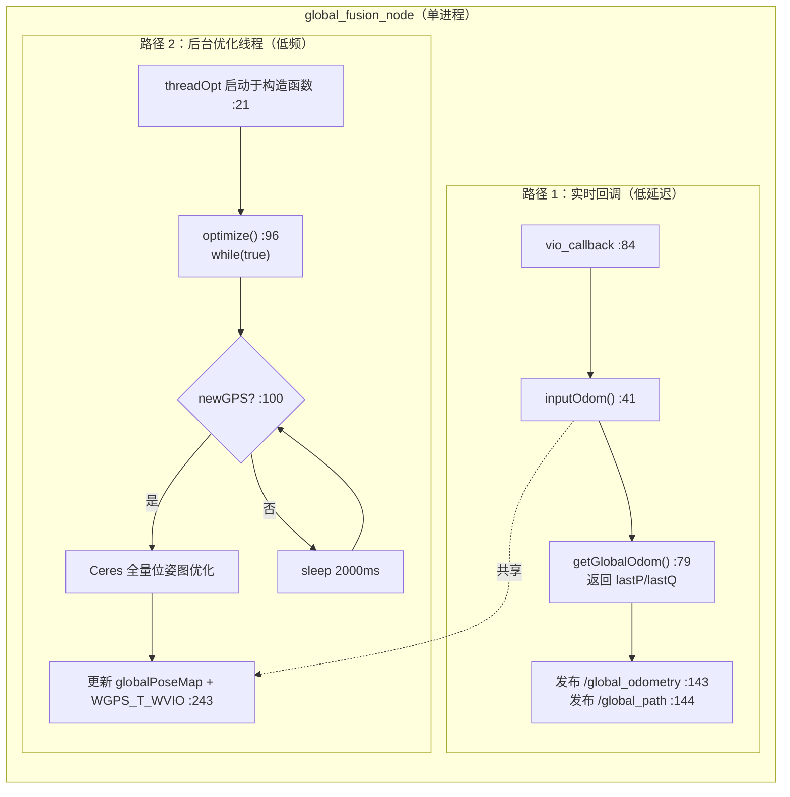
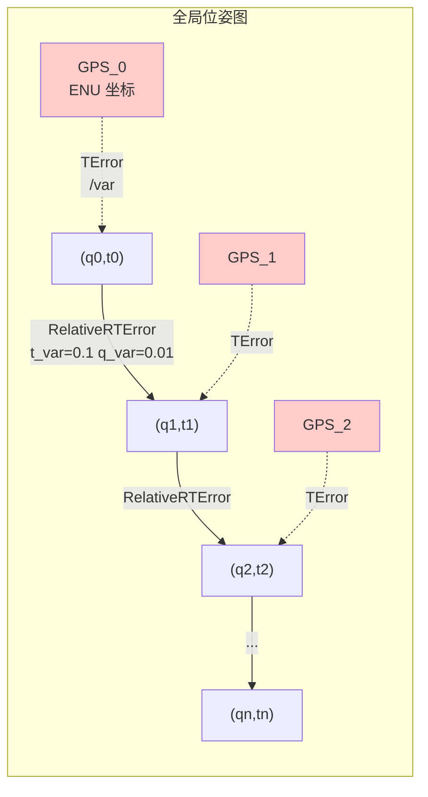

# 5. 全局位姿图优化 (Global PGO / GPS 融合)

> **系列导航**：[1.测量预处理](1.meapreprocess.md) → [2.系统初始化](2.systeminit.md) → [3.紧耦合VIO](3.tightvio.md) → [4.回环与重定位](4.relocalization.md) → **本文**
>
> **文档定位**：回环检测（第 4 篇）解决的是"**局部一致性**"——走过的路自己闭合。但整个轨迹仍然可能整体漂移（比如整段轨迹被"拉长"了 3%）。本文的 `global_fusion` 用 **GPS 绝对测量**把这个整体漂移钉死，得到**全局一致**的轨迹。
>
> 对应 VINS-Fusion 论文第 VIII 节 *Global Pose Graph Optimization*（GPS 部分）。

---

## 0. 这一层要解决什么问题

| | 回环检测（第 4 篇） | **GPS 全局融合（本篇）** |
|---|---|---|
| 输入 | 自己的历史关键帧 | 卫星定位（绝对坐标） |
| 解决 | 局部一致性（回到起点时闭合） | **全局一致性**（整条轨迹对齐到地球坐标系） |
| 局限 | 无法消除整体漂移 | GPS 有噪声/多路径/失锁 |
| 适用 | 室内外均可 | **室外大场景** |

**核心矛盾**：VIO 局部精确但有累积漂移；GPS 全局无漂移但噪声大、频率低。两者互补。

**注意**：本篇完全不依赖第 4 篇的 `loop_fusion`——两者是**并列的两个独立功能包**，可以单独运行，也可以同时运行。

---

## 0.1 ⚠️ 关于本篇的几个重要事实（先读，避免找错代码）

| 你可能以为 | 实际情况 |
|---|---|
| `global_fusion` 编译出两个可执行文件（`global_fusion_node` + `getGlobalOdom`） | **只有一个** `global_fusion_node`（`CMakeLists.txt:31`），节点名 `globalEstimator`（`globalOptNode.cpp:178`） |
| 有独立的"局部P / 全局P"成员变量 | 实际是 `localPoseMap` / `globalPoseMap`（`globalOpt.h:52-53`），`map<double, vector<double>>` |
| 有 `GlobalPath` 成员 | 实际是 `nav_msgs::msg::Path global_path`（`globalOpt.h:43`） |
| 优化是增量的（只优化新帧） | **每次都是全量批优化**（重新入图所有帧），见 §6.3 |
| 残差用解析 Jacobian | **两个因子都是 AutoDiff**（`Factors.h:43`, `:105`） |
| GPS 优化有专门的 launch 文件 | **没有任何 launch 文件引用它**，需手动 `ros2 run global_fusion global_fusion_node` |

**"两段式"指的是同一个进程内的两条数据通路**，不是两个进程：



**关键**：路径 1 用**上一次优化算出的外参 `WGPS_T_WVIO`** 直接变换 VIO 位姿，保证每次 VIO 帧到达都能立刻发布全局位姿（不等优化）。路径 2 的优化结果反过来更新 `WGPS_T_WVIO`。这是"低延迟输出"与"全局最优"之间的折中。

---

## 1. 处理流程总览

### 1.1 节点启动

```cpp
// globalOptNode.cpp:175-199
int main(int argc, char **argv)
{
    rclcpp::init(argc, argv);
    auto n = rclcpp::Node::make_shared("globalEstimator");        // :178  ★节点名

    n->declare_parameter<std::string>("world_frame_id", "world"); // :181
    n->declare_parameter<std::string>("body_frame_id", "body");   // :182

    auto sub_GPS = n->create_subscription<sensor_msgs::msg::NavSatFix>(
        "/gps", ..., GPS_callback);                               // :187
    auto sub_vio = n->create_subscription<nav_msgs::msg::Odometry>(
        "/vins_estimator/odometry", ..., vio_callback);           // :189

    pub_global_path     = n->create_publisher<nav_msgs::msg::Path>("global_path", 100);       // :191
    pub_global_odometry = n->create_publisher<nav_msgs::msg::Odometry>("global_odometry", 100); // :192
    pub_car             = n->create_publisher<visualization_msgs::msg::MarkerArray>("car_model", 1000); // :193

    global_path = &(globalEstimator.global_path);                 // :196
    rclcpp::spin(n);                                              // :197
}
```

**话题一览**（以代码为准）：

| 方向 | 话题 | 类型 | 位置 |
|---|---|---|---|
| 订阅 | `/gps` | `sensor_msgs/NavSatFix` | `:187` |
| 订阅 | `/vins_estimator/odometry` | `nav_msgs/Odometry` | `:189` |
| 发布 | `global_path` | `nav_msgs/Path` | `:191` |
| 发布 | `global_odometry` | `nav_msgs/Odometry` | `:192` |
| 发布 | `car_model` | `visualization_msgs/MarkerArray` | `:193` |

> 上游确认：`vins` 包发布 odometry 用相对话题名 `"odometry"`（`vins/src/utility/visualization.cpp:38`），由 `vins/launch/euroc.launch.py:30` remap 成 `/vins_estimator/odometry`。KITTI 的 GPS 由 `vins/src/KITTIGPSTest.cpp:37` 发布到 `/gps`。

### 1.2 驱动流程（vio_callback 是主驱动）

```cpp
// globalOptNode.cpp:84-162
void vio_callback(const nav_msgs::msg::Odometry::SharedPtr pose_msg)
{
    double t = pose_msg->header.stamp.sec;                        // :87
    last_vio_t = t;                                               // :88
    // 解析 vio_t / vio_q ...
    globalEstimator.inputOdom(t, vio_t, vio_q);                   // :95  ← 存入 localPoseMap/globalPoseMap

    m_buf.lock();
    while(!gpsQueue.empty())
    {
        auto GPS_msg = gpsQueue.front();
        double gps_t = GPS_msg->header.stamp.sec;
        if(gps_t >= t - 0.01 && gps_t <= t + 0.01)                // :105 ★10ms 时间同步容差
        {
            double latitude  = GPS_msg->latitude;                 // :108
            double longitude = GPS_msg->longitude;                // :109
            double altitude  = GPS_msg->altitude;                 // :110
            double pos_accuracy = GPS_msg->position_covariance[0];// :112 ★GPS 精度
            if(pos_accuracy <= 0) pos_accuracy = 1;               // :113-114
            globalEstimator.inputGPS(t, latitude, longitude, altitude, pos_accuracy);  // :117
            gpsQueue.pop();
            break;
        }
        else if(gps_t < t - 0.01) gpsQueue.pop();                 // :121-122 太旧 → 丢弃
        else if(gps_t > t + 0.01) break;                          // :123-124 太新 → 等下轮
    }
    m_buf.unlock();

    globalEstimator.getGlobalOdom(global_t, global_q);            // :130
    // ...
    pub_global_odometry->publish(odometry);                       // :143
    pub_global_path->publish(*global_path);                       // :144
    // ...
}
```

**流程要点**：

1. `GPS_callback`（`:165-170`）**只负责入队**，不做任何计算
2. `vio_callback` 是主驱动——每来一个 VIO 帧就尝试匹配一个 GPS
3. **时间同步容差只有 10ms**（`:105`）——GPS 和 VIO 时间戳必须很接近才能配对。这是本实现的一个脆弱点：如果 GPS 时间戳与 VIO 不对齐（或 GPS 频率远低于 VIO），大量 GPS 会被丢弃
4. 发布用的是 `getGlobalOdom()` 返回的 `lastP/lastQ`，**不是优化结果**——所以**优化还没跑之前也有输出**（此时 ≈ 原始 VIO 位姿）

### 1.3 优化触发条件

| 项 | 值 | 位置 |
|---|---|---|
| 触发标志 | `newGPS` | 由 `inputGPS` 置 true（`globalOpt.cpp:92`），在 `optimize()` 开头检查（`:100`） |
| 节流 | `sleep_for(2000ms)` | `globalOpt.cpp:250-251` |
| 实际频率上限 | **≈ 0.5 Hz** | 每 2 秒最多跑一次优化 |

---

## 2. 输入处理

### 2.1 VIO 里程计 inputOdom()

```cpp
// globalOpt.cpp:41-76
void GlobalOptimization::inputOdom(double t, Eigen::Vector3d OdomP, Eigen::Quaterniond OdomQ)
{
    mPoseMap.lock();
    vector<double> localPose{OdomP.x(), OdomP.y(), OdomP.z(),
                             OdomQ.w(), OdomQ.x(), OdomQ.y(), OdomQ.z()};   // :44-45
    localPoseMap[t] = localPose;                                            // :46 ★原始 VIO 位姿

    Eigen::Quaterniond globalQ;
    globalQ = WGPS_T_WVIO.block<3, 3>(0, 0) * OdomQ;                        // :50
    Eigen::Vector3d globalP = WGPS_T_WVIO.block<3, 3>(0, 0) * OdomP
                            + WGPS_T_WVIO.block<3, 1>(0, 3);                // :51
    vector<double> globalPose{globalP.x(), globalP.y(), globalP.z(),
                              globalQ.w(), globalQ.x(), globalQ.y(), globalQ.z()};  // :52-53
    globalPoseMap[t] = globalPose;                                          // :54 ★变换后位姿
    lastP = globalP;                                                        // :55
    lastQ = globalQ;                                                        // :56
    ...
    global_path.poses.push_back(pose_stamped);                              // :74
    mPoseMap.unlock();
}
```

**每个 VIO 帧存两份**：

| 容器 | 内容 | 格式 | 用途 |
|---|---|---|---|
| `localPoseMap[t]` | 原始 VIO 位姿 | `[tx,ty,tz,qw,qx,qy,qz]` | 优化时构造**相对约束** |
| `globalPoseMap[t]` | 经 `WGPS_T_WVIO` 变换后的位姿 | 同上 | 优化时的**顶点初值 & 结果** |

`lastP/lastQ` 保存"当前最新全局位姿"，供 `getGlobalOdom()`（`:79-83`）直接返回——这是低延迟输出的数据来源。

### 2.2 GPS 输入与经纬高 → ENU 转换

```cpp
// globalOpt.cpp:29-39
void GlobalOptimization::GPS2XYZ(double latitude, double longitude, double altitude, double* xyz)
{
    if(!initGPS)
    {
        geoConverter.Reset(latitude, longitude, altitude);      // :33 ★以第一个 GPS 为 ENU 原点
        initGPS = true;                                         // :34
    }
    geoConverter.Forward(latitude, longitude, altitude, xyz[0], xyz[1], xyz[2]);   // :36 ★经纬高 → ENU(米)
}
```

```cpp
// globalOpt.cpp:85-93
void GlobalOptimization::inputGPS(double t, double latitude, double longitude, double altitude, double posAccuracy)
{
    double xyz[3];
    GPS2XYZ(latitude, longitude, altitude, xyz);                // :88
    vector<double> tmp{xyz[0], xyz[1], xyz[2], posAccuracy};    // :89
    GPSPositionMap[t] = tmp;                                    // :91 ★[ENU_x, ENU_y, ENU_z, 精度]
    newGPS = true;                                              // :92 ★触发优化线程
}
```

**GeographicLib 的用法**：

| 项 | 说明 | 位置 |
|---|---|---|
| 成员 | `GeographicLib::LocalCartesian geoConverter` | `globalOpt.h:57` |
| 椭球 | WGS84（默认） | `LocalCartesian.hpp:64-67` |
| `Reset(lat0,lon0,h0)` | 记录原点并计算 ECEF→ENU 旋转 | `LocalCartesian.cpp:16-25` |
| `Forward(lat,lon,h,x,y,z)` | `x`=East, `y`=North, `z`=Up，单位米 | `LocalCartesian.cpp:37-48` |

> **坐标系语义**：所有 GPS 都投影到"**第一个 GPS 为原点的 ENU 局部坐标系**"。所以 `GPSPositionMap` 存的是 **ENU 局部坐标 + 位置精度**（4 元组 `[x, y, z, var]`）。其中 `var` 就是后面 `TError` 的权重参数（权重 = 1/var）。

---

## 3. 优化图构建

`GlobalOptimization::optimize()`（`globalOpt.cpp:96-254`）是后台线程主体。

### 3.1 求解器配置

```cpp
// globalOpt.cpp:106-115
ceres::Problem problem;                                        // :106
ceres::Solver::Options options;
options.linear_solver_type = ceres::SPARSE_NORMAL_CHOLESKY;     // :108
options.max_num_iterations = 5;                                 // :111  ★只迭代 5 次
ceres::LossFunction *loss_function;
loss_function = new ceres::HuberLoss(1.0);                      // :114  ★仅用于 GPS 因子
ceres::LocalParameterization* quaternion_manifold =
    new ceres::QuaternionParameterization();                    // :115
```

### 3.2 顶点：VIO 帧位姿入图

```cpp
// globalOpt.cpp:118-136
mPoseMap.lock();                                                // :118
int length = localPoseMap.size();                               // :119
double t_array[length][3];                                      // :121  平移顶点
double q_array[length][4];                                      // :122  旋转顶点
iter = globalPoseMap.begin();
for (int i = 0; i < length; i++, iter++)
{
    t_array[i][0] = iter->second[0];  // ... :127-129  初值 = 当前 globalPoseMap
    q_array[i][0] = iter->second[3];  // ... :130-133
    problem.AddParameterBlock(q_array[i], 4, quaternion_manifold);   // :134  四元数带流形
    problem.AddParameterBlock(t_array[i], 3);                        // :135  平移普通块
}
```

**顶点 = 每个 VIO 帧的全局位姿** `(q_array[i], t_array[i])`，初值取自 `globalPoseMap`（上一次优化结果 / 初始 `WGPS_T_WVIO * VIO`）。

> ⚠️ **每一帧 VIO 都入图，没有抽稀**。这意味着跑 10 分钟（约 20Hz → 12000 帧）后，每次优化要解一个上万顶点的图。这是本实现的主要扩展性瓶颈。

### 3.3 相对位姿约束（VIO 因子）

```cpp
// globalOpt.cpp:143-163
iterVIONext = iterVIO; iterVIONext++;                           // :143-144  取相邻帧
if(iterVIONext != localPoseMap.end())
{
    // 用 localPoseMap 的原始 VIO 位姿构造 wTi / wTj  (:147-154)
    Eigen::Matrix4d iTj = wTi.inverse() * wTj;                  // :155 ★相对变换
    Eigen::Quaterniond iQj;  iQj = iTj.block<3,3>(0,0);         // :157
    Eigen::Vector3d iPj = iTj.block<3,1>(0,3);                  // :158
    ceres::CostFunction* vio_function = RelativeRTError::Create(
        iPj.x(), iPj.y(), iPj.z(),
        iQj.w(), iQj.x(), iQj.y(), iQj.z(),
        0.1, 0.01);                                             // :160-162  t_var=0.1, q_var=0.01
    problem.AddResidualBlock(vio_function, NULL,
        q_array[i], t_array[i], q_array[i+1], t_array[i+1]);    // :163
}
```

**这个约束的作用**：保持轨迹的**形状**（相对关系）不变。相对位姿由 `localPoseMap` 的原始 VIO 位姿算出，是**已知的测量值**，不参与优化。

### 3.4 GPS 绝对约束

```cpp
// globalOpt.cpp:194-201
double t = iterVIO->first;                                      // :194  用 VIO 时间戳作 key
iterGPS = GPSPositionMap.find(t);                               // :195  ★按时间戳配对
if (iterGPS != GPSPositionMap.end())
{
    ceres::CostFunction* gps_function = TError::Create(
        iterGPS->second[0], iterGPS->second[1],
        iterGPS->second[2], iterGPS->second[3]);                // :198-199
    problem.AddResidualBlock(gps_function, loss_function, t_array[i]);   // :201 ★只连平移
}
```

**GPS 因子的特点**：
- 只约束**平移** `t_array[i]`，**不动旋转**（GPS 不提供姿态）
- 通过**时间戳相等**与 VIO 帧配对（两者用同一个 `t` 作 map key）
- 带 `HuberLoss(1.0)`（`:114`），而 VIO 因子不带（`:163` 传 `NULL`）——**这是有意的**：GPS 外点多（多路径、失锁），需要鲁棒核；VIO 相对测量是可信的

### 3.5 图结构示意



**两类约束的分工**：
- VIO 相对约束 → 保持轨迹局部形状（高频、可信、无绝对参考）
- GPS 绝对约束 → 把轨迹钉在地球坐标系（低频、有噪声、绝对参考）

---

## 4. 残差因子（Factors.h）

> **重要**：本文件中的两个因子**都使用 Ceres AutoDiff**，没有手写解析 Jacobian。文件里注释掉的 `Evaluate` 调试代码只是用来打印数值 Jacobian 的。

### 4.1 TError —— GPS 平移残差

```cpp
// Factors.h:26-50
struct TError
{
    TError(double t_x, double t_y, double t_z, double var)
        :t_x(t_x), t_y(t_y), t_z(t_z), var(var){}

    template <typename T>
    bool operator()(const T* tj, T* residuals) const
    {
        residuals[0] = (tj[0] - T(t_x)) / T(var);      // :34 ★逐分量 ÷ var
        residuals[1] = (tj[1] - T(t_y)) / T(var);      // :35
        residuals[2] = (tj[2] - T(t_z)) / T(var);      // :36
        return true;
    }

    static ceres::CostFunction* Create(const double t_x, const double t_y,
                                       const double t_z, const double var)
    {
        return (new ceres::AutoDiffCostFunction<TError, 3, 3>(
                new TError(t_x, t_y, t_z, var)));      // :43-45
    }
    double t_x, t_y, t_z, var;
};
```

| 属性 | 值 |
|---|---|
| 残差维度 | **3** |
| 参数块 | **1 个**（`t` 平移，3 维） |
| 残差表达式 | `(t - gps_enu) / var` |
| 权重 | `1/var`，`var = posAccuracy`（`position_covariance[0]`） |
| 求导 | `AutoDiffCostFunction<TError, 3, 3>`（`:43`） |

**`var` 的语义**：来自 GPS 消息的 `position_covariance[0]`。协方差越大 → `var` 越大 → 权重越小 → 该 GPS 在优化中越不被信任。这实现了**按 GPS 精度自适应加权**。

### 4.2 RelativeRTError —— 相邻帧相对位姿残差

```cpp
// Factors.h:52-114（摘要）
struct RelativeRTError
{
    // 构造：接收相对测量 (t_x,t_y,t_z, q_w,q_x,q_y,q_z) 与噪声 (t_var, q_var)

    template <typename T>
    bool operator()(const T* const w_q_i, const T* ti,
                    const T* const w_q_j, const T* tj, T* residuals) const
    {
        // —— 平移残差 ——
        T t_w_ij[3];
        t_w_ij[0] = tj[0] - ti[0];  t_w_ij[1] = tj[1] - ti[1];  t_w_ij[2] = tj[2] - ti[2];   // :64-66
        T i_q_w[4];
        QuaternionInverse(w_q_i, i_q_w);                                                     // :68-70
        T t_i_ij[3];
        QuaternionRotatePoint(i_q_w, t_w_ij, t_i_ij);                                        // :72-74
        residuals[0] = (t_i_ij[0] - T(t_x)) / T(t_var);                                      // :75-77
        residuals[1] = (t_i_ij[1] - T(t_y)) / T(t_var);
        residuals[2] = (t_i_ij[2] - T(t_z)) / T(t_var);

        // —— 旋转残差 ——
        T relative_q[4] = {T(q_w), T(q_x), T(q_y), T(q_z)};                                  // :79-82
        T q_i_j[4];
        QuaternionProduct(i_q_w, w_q_j, q_i_j);                                              // :84-86
        T q_inverse[4];
        QuaternionInverse(relative_q, q_inverse);                                            // :88-90
        T error_q[4];
        QuaternionProduct(q_inverse, q_i_j, error_q);                                        // :92-94
        residuals[3] = T(2) * error_q[1] / T(q_var);                                         // :95-96 ★
        residuals[4] = T(2) * error_q[2] / T(q_var);
        residuals[5] = T(2) * error_q[3] / T(q_var);
        return true;
    }

    static ceres::CostFunction* Create(...)
    {
        return (new ceres::AutoDiffCostFunction<RelativeRTError, 6, 4, 3, 4, 3>(...));       // :105-107
    }
};
```

| 属性 | 值 |
|---|---|
| 残差维度 | **6**（3 平移 + 3 旋转） |
| 参数块 | **4 个**：`(w_q_i[4], t_i[3], w_q_j[4], t_j[3])` |
| 平移残差 | `(R_i^T(t_j - t_i) - t_ij_measured) / t_var` |
| 旋转残差 | `2 · [q_ij_measured^{-1} ⊗ (q_i^{-1} q_j)]_{xyz} / q_var` |
| 权重 | 调用处传 `t_var = 0.1`, `q_var = 0.01`（`globalOpt.cpp:162`） |
| 求导 | `AutoDiffCostFunction<RelativeRTError, 6, 4, 3, 4, 3>`（`:105`） |

**为什么旋转残差乘 2、只取虚部？** 单位四元数 `q = [cos(θ/2), sin(θ/2)·n̂]`，当误差角很小时 `q_xyz ≈ (θ/2)·n̂`。乘 2 得到旋转向量 `θ·n̂`，量纲与角度一致，且**自动只约束 3 个自由度**（`q_w` 由单位约束决定）。

辅助函数 `QuaternionInverse`（`Factors.h:16-23`）：对单位四元数取共轭即逆（w 不变，xyz 取反）。

---

## 5. 优化结果写回

```cpp
// globalOpt.cpp:221-248
ceres::Solve(options, &problem, &summary);                      // :221
iter = globalPoseMap.begin();
for (int i = 0; i < length; i++, iter++)
{
    vector<double> globalPose{t_array[i][0], t_array[i][1], t_array[i][2],
                              q_array[i][0], q_array[i][1], q_array[i][2], q_array[i][3]};  // :229-230
    iter->second = globalPose;                                  // :231 ★写回 globalPoseMap
    if(i == length - 1)                                         // :232 ★只对最后一帧重算外参
    {
        Eigen::Matrix4d WVIO_T_body, WGPS_T_body;               // :234-235
        // 用最后一帧的 localPoseMap 与优化后 globalPose 构造两个 T  (:237-242)
        WGPS_T_WVIO = WGPS_T_body * WVIO_T_body.inverse();      // :243 ★更新 VIO→GPS 外参
    }
}
updateGlobalPath();                                             // :246
mPoseMap.unlock();                                              // :248
```

### 5.1 外参 `WGPS_T_WVIO` 的更新逻辑（关键设计）

**只用最后一帧**反解外参（`:232-243`）：

$$
\mathbf{T}_{WGPS \leftarrow WVIO} = \mathbf{T}_{WGPS \leftarrow body}^{last} \cdot \left(\mathbf{T}_{WVIO \leftarrow body}^{last}\right)^{-1}
$$

**为什么？** 因为 `WGPS_T_WVIO` 要用于**下一帧实时输出**（`inputOdom` 的 `:50-51`）。用最新一次优化的末帧结果，是最"新鲜"的估计。

**初始值**：`WGPS_T_WVIO = Identity`（`globalOpt.cpp:20`）。所以**第一次优化完成之前，发布的全局位姿 ≈ 原始 VIO 位姿**——启动初期轨迹会有一个"跳变"，这是正常的。

### 5.2 全局路径更新

```cpp
// globalOpt.cpp:257-280  updateGlobalPath()
global_path.poses.clear();          // :259
// 遍历 globalPoseMap（按时间戳升序）重新生成每个 PoseStamped  (:263-278)
```

所以 `/global_path` 每次优化后变成**优化后的整条全局轨迹**。

### 5.3 ⚠️ 本实现的重要局限：全量批优化

| 现象 | 代码证据 | 影响 |
|---|---|---|
| 每次优化**重新入图所有帧** | `length = localPoseMap.size()`（`:119`），循环全部帧 | 轨迹越长越慢，O(n) 增长 |
| **没有任何帧被 Fix** | 全文无 `SetParameterBlockConstant` | 老帧位姿会被后续 GPS 不断修改，历史轨迹可能"跳动" |
| `GPSPositionMap` **从不清理** | 无 `erase` 调用 | 内存与计算量随运行时间无限增长 |
| `localPoseMap/globalPoseMap` **从不清理** | 同上 | 同上 |
| 唯一的"增量"性质 | `WGPS_T_WVIO` 让实时输出保持与上次优化一致 | 只是输出层面的平滑，非优化层面的增量 |

> **对比**：一些 VINS-Fusion 变体会"固定已优化过的旧关键帧 + 清理旧 GPS 点"实现滑动窗口式的增量优化。**本 ROS2 移植版没有做这件事**。如果要做长时间（>30 分钟）的室外运行，需要自行添加这部分逻辑。

---

## 6. 核心代码在哪里

### 6.1 文件职责表

| 文件 | 职责 | 核心函数（行号） |
|---|---|---|
| `global_fusion/src/globalOptNode.cpp` | ROS2 节点：收数据、时间同步、发布 | `main:175`, `vio_callback:84`, `GPS_callback:165` |
| `global_fusion/src/globalOpt.cpp` | **优化核心** | `optimize:96`, `inputOdom:41`, `inputGPS:85`, `GPS2XYZ:29`, `getGlobalOdom:79`, `updateGlobalPath:257` |
| `global_fusion/src/globalOpt.h` | 类定义、数据容器 | `localPoseMap:52`, `globalPoseMap:53`, `GPSPositionMap:54`, `geoConverter:57`, `WGPS_T_WVIO:59` |
| `global_fusion/src/Factors.h` | **残差因子** | `QuaternionInverse:16`, `TError:26`, `RelativeRTError:52` |
| `global_fusion/ThirdParty/GeographicLib/` | 经纬高 → ENU | `LocalCartesian.cpp:16`（Reset）, `:37`（Forward） |
| `vins/src/KITTIGPSTest.cpp` | KITTI 上发布 `/gps` 的测试节点 | `main:33`, GPS 发布 `:37, :175` |

### 6.2 调用链

```
globalOptNode.cpp:175  main()
  ├ :178      Node("globalEstimator")
  ├ :187-189  订阅 /gps + /vins_estimator/odometry
  ├ :191-193  发布 global_path / global_odometry / car_model
  └ :197      rclcpp::spin(n)

  ← 构造 GlobalOptimization 时就已经启动了优化线程
  globalOpt.cpp:14-22  GlobalOptimization::GlobalOptimization()
      └ :21  threadOpt = std::thread(&GlobalOptimization::optimize, this)   ★后台线程

globalOptNode.cpp:165  GPS_callback()      ← 只入队
  └ gpsQueue.push(GPS_msg)                                             :168

globalOptNode.cpp:84   vio_callback()      ← 主驱动
  ├ :95    inputOdom(t, vio_t, vio_q)   → globalOpt.cpp:41
  │          ├ :46   localPoseMap[t] = 原始 VIO 位姿
  │          ├ :50-51  用 WGPS_T_WVIO 变换
  │          ├ :54   globalPoseMap[t] = 变换后位姿
  │          └ :74   global_path.poses.push_back()
  ├ :98-126  时间同步（10ms 容差 :105）
  │    └ :117  inputGPS(...)            → globalOpt.cpp:85
  │             ├ :88   GPS2XYZ()       → :29（Reset :33 / Forward :36）
  │             ├ :91   GPSPositionMap[t] = [x,y,z,var]
  │             └ :92   newGPS = true   ★触发优化
  ├ :130   getGlobalOdom()              → globalOpt.cpp:79-83（返回 lastP/lastQ）
  └ :143-145  发布 /global_odometry /global_path /car_model

globalOpt.cpp:96   optimize()  线程（while(true) + sleep 2000ms）
  ├ :100   if (!newGPS) ... 检查触发标志
  ├ :106-115  Ceres 配置（SPARSE_NORMAL_CHOLESKY :108, 5 次迭代 :111, HuberLoss :114）
  ├ :118-136  顶点入图（t_array :121, q_array :122, AddParameterBlock :134-135）
  ├ :143-163  相对位姿约束（iTj :155, RelativeRTError::Create :160-162, AddResidualBlock :163）
  ├ :194-201  GPS 约束（find :195, TError::Create :198-199, AddResidualBlock :201）
  ├ :221      ceres::Solve()                                        ★
  ├ :229-231  写回 globalPoseMap
  ├ :232-243  ★用末帧反解 WGPS_T_WVIO
  ├ :246      updateGlobalPath()        → :257
  ├ :248      mPoseMap.unlock()
  └ :250-251  sleep_for(2000ms)
```

### 6.3 开发者如何快速定位核心代码

```bash
cd /home/ros/ros_ws/VINS_ROS2/src/VINS_ROS2/global_fusion/src

# ① 优化器所有方法（一次看全）
grep -n "^void GlobalOptimization::\|^Eigen::" globalOpt.cpp

# ② Ceres 求解相关（配置 + 加块 + 求解）
grep -n "ceres::\|AddParameterBlock\|AddResidualBlock\|Solve\|max_num_iterations\|HuberLoss" globalOpt.cpp

# ③ 两个残差因子
grep -n "struct TError\|struct RelativeRTError\|AutoDiffCostFunction\|residuals\[" Factors.h
# → TError:26（残差 :34-36, AutoDiff :43）
# → RelativeRTError:52（平移残差 :64-77, 旋转残差 :79-96, AutoDiff :105）

# ④ 权重（想改 GPS 信任度就看这里）
grep -n "t_var\|q_var\|pos_accuracy\|posAccuracy" globalOpt.cpp Factors.h
# → globalOpt.cpp:112 (pos_accuracy 取值)  :89 (存 var)  :162 (t_var/q_var)
# → Factors.h:34-36 (/var)

# ⑤ 触发时机与节流
grep -n "newGPS\|sleep_for\|threadOpt\|while(true)" globalOpt.cpp globalOpt.h
# → globalOpt.cpp:21（线程启动） :92（newGPS=true） :100（检查） :250-251（2s 节流）

# ⑥ 坐标转换
grep -n "geoConverter\|GPS2XYZ\|Reset\|Forward" globalOpt.cpp globalOpt.h

# ⑦ 话题接口
grep -n "create_subscription\|create_publisher\|make_shared" globalOptNode.cpp

# ⑧ 数据容器与外参
grep -n "localPoseMap\|globalPoseMap\|GPSPositionMap\|WGPS_T_WVIO\|lastP\|lastQ" globalOpt.cpp globalOpt.h

# ⑨ 确认没有帧被 Fix（验证全量批优化）
grep -n "SetParameterBlockConstant" globalOpt.cpp
# → （无输出）★ 证实：没有任何顶点被固定

# ⑩ 确认 GPS 点从不清理
grep -n "GPSPositionMap.erase\|localPoseMap.erase" globalOpt.cpp
# → （无输出）★ 证实：容器只增不减
```

### 6.4 推荐断点与观察变量

| 断点 | 观察变量 | 用途 |
|---|---|---|
| `globalOpt.cpp:92` | `t`, `newGPS` | 确认 GPS 是否与 VIO 时间对齐（对不上就永远不触发优化） |
| `globalOptNode.cpp:105` | `t`, `gps_t` | 看 10ms 同步窗口是否过严 |
| `globalOptNode.cpp:117` | `pos_accuracy` 原始值 | 看 GPS 精度是否合理（`<=0` 被置 1 的情况） |
| `globalOpt.cpp:119` | `length` | **入图顶点数** —— 监控计算量增长 |
| `globalOpt.cpp:134`（`AddParameterBlock` 后） | `length` | 同上 |
| `globalOpt.cpp:163` | `iPj`, `iQj` | 相对测量是否合理（不应有跳变） |
| `globalOpt.cpp:201` | `iterGPS->second` | GPS 的 ENU 坐标与 var 是否正确 |
| **`globalOpt.cpp:221`（`Solve` 后）** | `summary.final_cost`, `summary.iterations` | **优化是否收敛**（`BriefReport()` 在 `:222` 被注释，可临时打开） |
| **`globalOpt.cpp:243`** | `WGPS_T_WVIO` | **外参是否稳定收敛**（跳变说明 GPS 有问题） |
| `globalOptNode.cpp:130` | `global_t`, `global_q` | 实时输出的位姿是否在优化瞬间跳变 |
| `globalOpt.cpp:259` | `global_path.poses.size()` | 路径点数量（= 帧数，验证无清理） |

---

## 7. 常见改造入口

| 想改什么 | 文件:行号 | 关键符号 |
|---|---|---|
| **GPS 权重**（信任度） | `globalOpt.cpp:112`（取值）、`:89`（存入）、`Factors.h:34-36`（`/var`） | `pos_accuracy`, `TError::var` |
| **VIO 相对约束权重** | `globalOpt.cpp:160-162` | `RelativeRTError::Create(..., 0.1, 0.01)` 的 `t_var` / `q_var` |
| 相对残差定义 | `Factors.h:64-96` | `RelativeRTError::operator()` |
| **优化频率 / 节流** | `globalOpt.cpp:250-251`（sleep）、`:100`（触发判断） | `sleep_for(2000ms)`, `newGPS` |
| 迭代次数 / 线性求解器 | `globalOpt.cpp:108`, `:111` | `SPARSE_NORMAL_CHOLESKY`, `max_num_iterations=5` |
| 鲁棒核（GPS 因子） | `globalOpt.cpp:114` | `HuberLoss(1.0)` |
| 四元数流形 | `globalOpt.cpp:115`, `:134` | `QuaternionParameterization` |
| GPS 连到哪个顶点 | `globalOpt.cpp:201` | `AddResidualBlock(gps_function, loss_function, t_array[i])` |
| **GPS 时间同步容差** | `globalOptNode.cpp:105` | `t ± 0.01` |
| 外参更新逻辑 | `globalOpt.cpp:232-243` | `WGPS_T_WVIO = WGPS_T_body * WVIO_T_body.inverse()` |
| 经纬高 → ENU | `globalOpt.cpp:29-39` | `geoConverter.Reset/Forward` |
| 发布频率/内容 | `globalOptNode.cpp:143-145` | `pub_global_odometry`, `pub_global_path` |
| **新增约束/顶点** | `globalOpt.cpp:96-254` + `Factors.h` | 仿照 `TError` / `RelativeRTError` |
| **改成增量优化**（固定旧帧） | `globalOpt.cpp:118-136` 中加 `SetParameterBlockConstant` | 当前**没有**任何帧被固定 |

---

## 8. 实战排查清单

| 现象 | 优先检查 |
|---|---|
| **轨迹完全不修正（≈原始 VIO）** | ① `/gps` 是否有数据；② `globalOptNode.cpp:105` 的 10ms 同步是否配对成功（打印 `vio t / gps t` 对比）；③ `newGPS` 是否被置 true（`globalOpt.cpp:92` 断点） |
| **轨迹在优化瞬间剧烈跳变** | ① GPS 有粗差（多路径）——检查 `pos_accuracy`；② `HuberLoss(1.0)` 阈值是否够紧；③ GPS 与 VIO 的**时间戳是否真的对齐**（10ms 配对可能有错配） |
| **轨迹整体旋转/平移错位** | `WGPS_T_WVIO` 初始为 Identity（`globalOpt.cpp:20`），首次优化前有偏差是正常的；若一直错位，检查 ENU 原点是否合理（第一个 GPS 点质量） |
| **运行越久越卡** | **已知设计局限**：全量批优化 + 容器不清理（§5.3）。需自行加"固定旧帧 + 清理旧 GPS"逻辑 |
| **程序启动即崩溃/无输出** | `globalOptNode.cpp:149` 写死了 `/home/tony-ws1/output/vio_global.csv`（原作者的路径），目录不存在时 `ofstream` 静默失败——**不影响功能，但建议改掉** |
| **找不到 launch 启动方式** | 本包**没有 launch 文件**，用 `ros2 run global_fusion global_fusion_node`（注意节点名是 `globalEstimator`） |

---

## 9. KITTI 上的完整用法

GPS 融合在 KITTI 数据集上的闭环用法（`vins/src/KITTIGPSTest.cpp`）：

```bash
# 1. 启动全局融合（订阅 /vins_estimator/odometry 和 /gps）
ros2 run global_fusion global_fusion_node

# 2. 启动 KITTI 测试节点（同时跑 VIO 并发布 /gps）
ros2 run vins kitti_gps_test \
  <config_file> <data_folder>
# 例：
# ros2 run vins kitti_gps_test \
#   install/vins/share/vins/config/kitti_raw/kitti_10_03_config.yaml \
#   /path/to/2011_10_03_drive_0027_sync/
```

`KITTIGPSTest.cpp` 做的事：
- 读 KITTI 的 `image_00/timestamps.txt`（`:56`）与 `oxts/timestamps.txt`（`:77`），对齐图像与 GPS
- 每帧读 `oxts/data/<idx>.txt`（`:131-154`），把 `lat/lon/alt/roll/pitch/yaw` 与 `pos_accuracy` 填进 `NavSatFix`（`:160-173`）
- **`position_covariance[0] = pos_accuracy`**（`:173`）← 这正好对应 `globalOptNode.cpp:112` 的读取
- 发布 `/gps`（`:37`, `:175`），再 `estimator.inputImage(...)`（`:177`）跑 VIO

---

## 10. 自测清单

- [ ] 为什么 `global_fusion_node` 里"实时输出"和"优化"是两条独立通路？各有什么作用？
- [ ] `localPoseMap` 和 `globalPoseMap` 分别存什么？为什么需要两份？
- [ ] GPS 因子为什么只约束平移、不约束旋转？
- [ ] GPS 因子加 HuberLoss 而 VIO 因子不加，为什么？
- [ ] `TError` 里的 `var` 从哪来？它如何实现"按 GPS 精度自适应加权"？
- [ ] `WGPS_T_WVIO` 是怎么更新的？为什么只用最后一帧？
- [ ] 旋转残差为什么乘 2 且只取虚部？
- [ ] 本实现为什么不适合长时间运行？需要怎么改？

**参考答案要点**：④ GPS 含真实外点（多路径、失锁），需要鲁棒核抑制；VIO 的相对测量来自预积分和视觉追踪，可信度高、且加了鲁棒核会削弱其约束力。⑦ 单位四元数 `q=[cos(θ/2), sin(θ/2)·n̂]`，小角度时虚部 ≈ θ/2·n̂，乘 2 后得到旋转向量 `θ·n̂`（量纲为角度）；只取虚部是因为三个虚部已完整表达旋转的 3 个自由度，实部由单位约束确定。

---

## 附：与第 4 篇（回环）的关系

这两个功能包**互相独立**，但理念相同——都是"**位姿图优化**"，只是约束来源不同：

| | 第 4 篇 loop_fusion | 本篇 global_fusion |
|---|---|---|
| 约束来源 | 历史关键帧（视觉回环） | GPS 绝对测量 |
| 顶点 | 关键帧（抽稀后） | **每一帧 VIO**（不抽稀） |
| 优化自由度 | 4-DoF（IMU）/ 6-DoF | 6-DoF |
| 触发 | 检测到回环 | 收到新 GPS |
| 结果去向 | `r_drift/t_drift` → `/odometry_rect` | `WGPS_T_WVIO` → `/global_odometry` |
| 是否清理旧数据 | 是（关键帧抽稀） | **否**（全量累积） |

**可以同时运行**：`loop_fusion` 修正局部一致性、`global_fusion` 约束全局一致性，两者在输出层面叠加。
